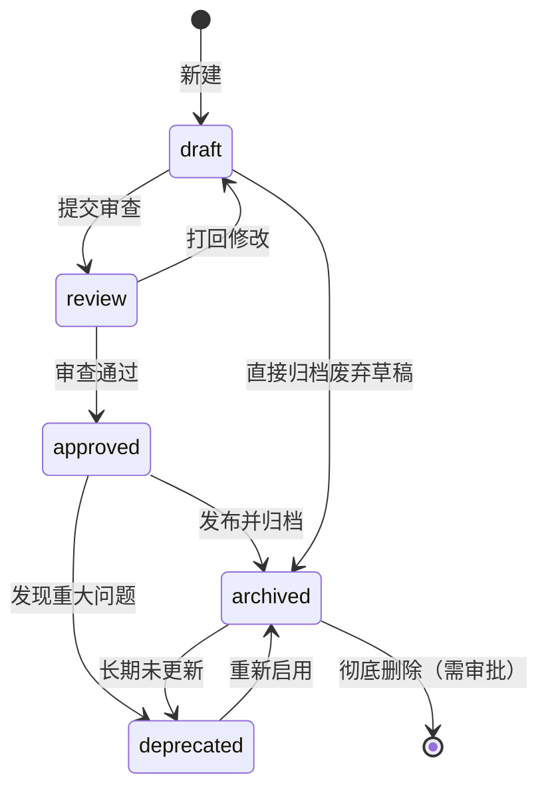
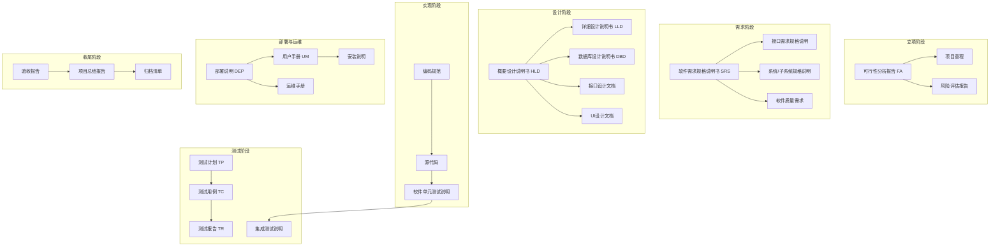
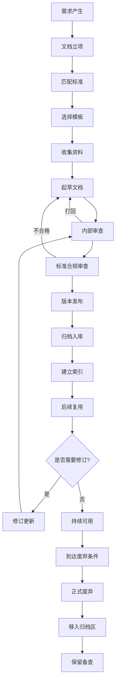
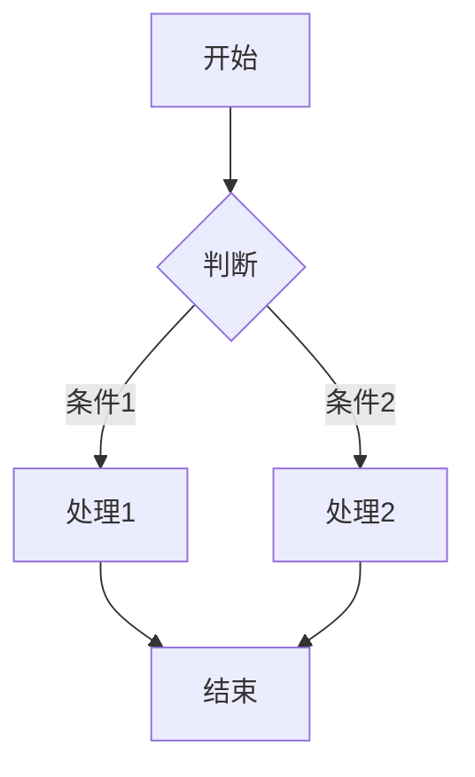
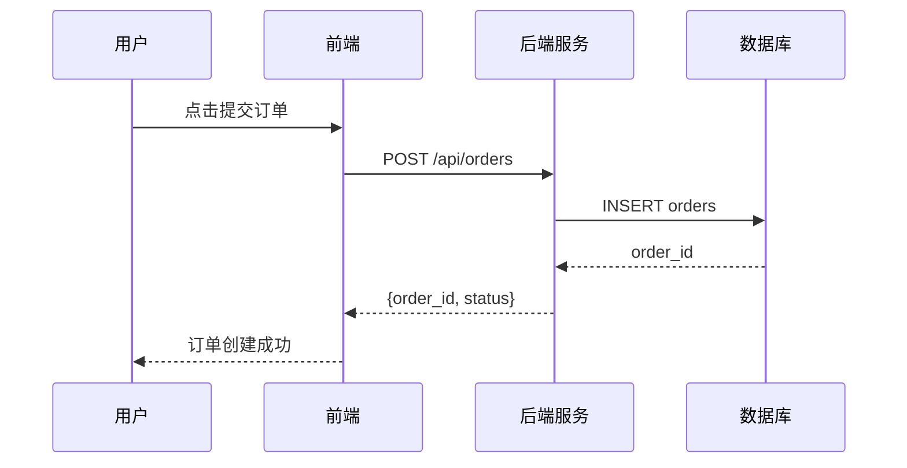
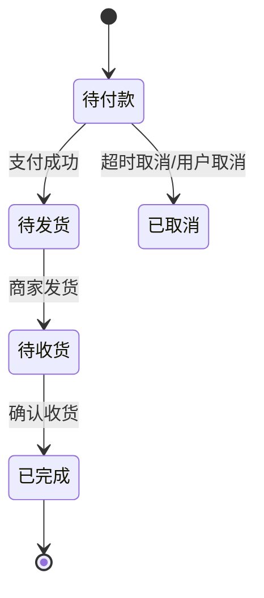
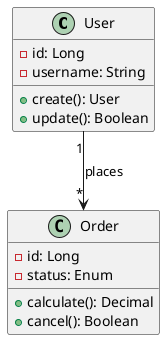
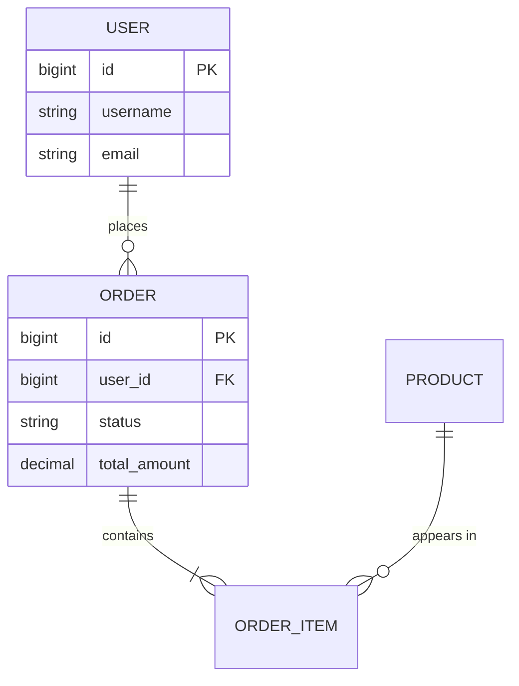
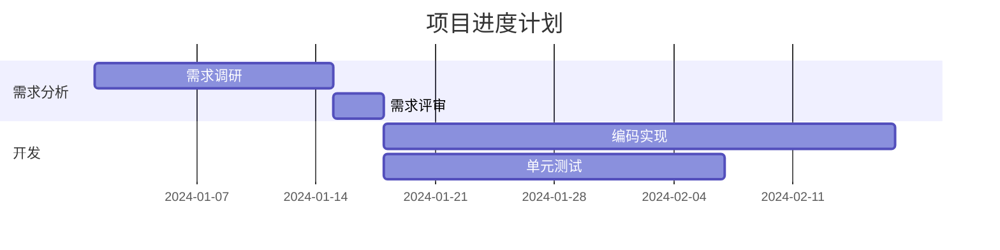

# 文档管理与工程化写作规范

> **版本**：v2.0.0 | **依据**：GB/T 8567—2006、GB/T 9385—2008、GB/T 7713.1—2025、GB/T 7714—2015、ISO/IEC/IEEE 12207/29148 等

---

## 一、Skill 定位与目标

本 Skill 为**软件工程全生命周期**建立标准驱动的文档生产体系，覆盖：

- 课程作业 / 实验报告
- 毕业设计论文
- 软件工程课程项目 / 工程项目
- 软件需求规格说明（SRS）、设计文档、测试文档
- 技术方案 / 架构文档
- 产品需求文档（PRD）
- 项目管理文档
- 团队协作文档

**核心目标**：使文档具备 **可溯源（标准引用）→ 可审查（检查清单）→ 可复用（命名+元数据）→ 可交付（符合标准）→ 可归档（版本+生命周期）** 的工业级品质。

**九大核心原则**：

| 序号 | 原则 | 说明 |
|---|---|---|
| 1 | 标准优先 | 先确定适用的国家/行业标准，再按标准框架撰写 |
| 2 | 读者优先 | 明确目标读者，调整内容深度 |
| 3 | 证据可溯源 | 每个重要结论必须有引用来源，无来源不入正式文档 |
| 4 | 单一职责 | 一份文档解决一个问题 |
| 5 | 模板化生产 | 优先使用本 Skill 提供的模板 |
| 6 | 检查清单验收 | 文档完成后必须过检查清单 |
| 7 | 版本可维护 | 每份正式文档必须有版本号和变更记录 |
| 8 | 链接优先 | 引用已有文档用链接，而非复制内容 |
| 9 | 归档优先 | 正式文档发布后立即归档 |

---

## 二、国家标准索引

> 所有标准信息均基于知识库整理，正式引用前请通过 [全国标准信息公共服务平台](https://std.samr.gov.cn) 和 [国家标准全文公开系统](https://openstd.samr.gov.cn) 核验现行状态。

### 2.1 必依标准清单（软件工程）

| 标准编号 | 标准名称 | 发布日期 | 实施日期 | 当前状态 | 对 Skill 用途 |
|---|---|---|---|---|---|
| **GB/T 8567—2006** | 计算机软件文档编制规范 | 2006-07-27 | 2006-10-01 | **现行** | 软件工程文档总基线 |
| **GB/T 9385—2008** | 计算机软件需求规格说明规范 | 2008-06-06 | 2008-11-01 | **现行**（2022-01-10 复审继续有效） | SRS 编写标准 |
| GB/T 14394—2008 | 计算机软件可靠性和可维护性管理 | 2008-06-06 | 2008-11-01 | **现行**（待核验） | 大型系统可选参考 |
| GB/T 16260.1—2006 | 软件工程 产品质量 第1部分：质量模型 | 2006-01-09 | 2006-07-01 | **现行**（等效 ISO/IEC 25000） | 质量需求说明参考 |

### 2.2 必依标准清单（学术写作）

| 标准编号 | 标准名称 | 发布日期 | 实施日期 | 当前状态 | 对 Skill 用途 |
|---|---|---|---|---|---|
| **GB/T 7713.1—2025** | 信息与文献 编写规则 第1部分：学位论文 | 2025-08-01 | **2026-02-01**（即将实施） | 现行（发布） | 毕业论文结构基线（本科/硕士必依）；在此之前参照 GB/T 7713.1—2006 |
| **GB/T 7713.2—2022** | 学术论文编写规则 | 2022-03-01 | 2022-07-01 | **现行** | 学术论文、课程论文、调研报告标准基线 |
| **GB/T 7714—2015** | 信息与文献 参考文献著录规则 | 2015-05-15 | 2015-12-01 | **现行** | 所有正式文档引用格式基线，**必依** |
| GB/T 15834—2011 | 标点符号用法 | 2011-12-30 | 2012-02-01 | **现行** | 中文正式文档基础规范 |
| GB/T 15835—2011 | 出版物上数字用法 | 2011-12-30 | 2012-02-01 | **现行** | 正式文档数字使用规范 |
| GB/T 3100—2022 | 国际单位制及其应用 | 2022-12-30 | 2023-07-01 | **现行** | 理工科论文/实验报告/技术文档量和单位规范 |
| GB/T 1.1—2020 | 标准化工作导则 第1部分：标准化文件的结构和起草规则 | 2020-03-31 | 2020-10-01 | **现行** | 涉及标准编写时参考 |

### 2.3 国际标准索引（参考）

| 标准编号 | 标准名称 | 当前状态 | 对 Skill 用途 |
|---|---|---|---|
| ISO/IEC/IEEE 12207:2017 | 软件生命周期过程 | **现行** | 软件工程文档国际参考基线 |
| ISO/IEC/IEEE 29148:2018 | 需求工程 | **现行** | 需求工程国际参考，可与 GB/T 9385 配合 |
| ISO/IEC/IEEE 15288:2015 | 系统生命周期过程 | **现行** | 系统级文档参考（软硬件结合系统） |
| IEEE 1016—2009 | 软件设计描述 | **现行** | 软件设计文档参考（对应 GB/T 8567 详细设计章节） |
| IEEE 829—2008 | 软件测试文档 | **现行** | 测试文档参考（对应 GB/T 8567 测试文档章节） |

### 2.4 标准速查表（按文档类型）

| 文档类型 | 主标准 | 辅助标准 |
|---|---|---|
| 毕业论文 | GB/T 7713.1—2025（或 GB/T 7713.1—2006 直至 2026-02-01） | GB/T 7714—2015、GB/T 15834—2011 |
| 学术论文 / 课程论文 | GB/T 7713.2—2022 | GB/T 7714—2015 |
| 可行性分析报告 | GB/T 8567—2006 | ISO/IEC/IEEE 12207 |
| 软件需求规格说明书 SRS | GB/T 9385—2008 | ISO/IEC/IEEE 29148 |
| 概要设计说明书 | GB/T 8567—2006 | IEEE 1016、ISO/IEC/IEEE 12207 |
| 详细设计说明书 | GB/T 8567—2006 | IEEE 1016 |
| 测试计划 / 测试用例 / 测试报告 | GB/T 8567—2006 | IEEE 829 |
| 用户手册 | GB/T 8567—2006 | ISO/IEC/IEEE 26515（可选） |
| API 接口文档 | OpenAPI/Swagger 规范 | RESTful 设计最佳实践 |
| 技术方案 / 架构文档 | GB/T 8567—2006 | ISO/IEC/IEEE 12207 |

---

## 三、文档分类体系

### 3.1 一级分类总表

| 一级分类 | 二级文档类型 | 适用标准 | 核心模板 |
|---|---|---|---|
| **学术文档** | 课程论文、实验报告、文献综述、开题报告、毕业论文、调研报告 | GB/T 7713.1/2、GB/T 7714 | 毕业论文模板、课程论文模板 |
| **软件工程文档** | 可行性分析、SRS、概要设计、详细设计、数据库设计、接口文档、测试文档、部署文档、用户手册、运维手册 | GB/T 8567、GB/T 9385、IEEE 829/1016 | SRS 模板、HLD/LLD 模板 |
| **产品文档** | PRD、MRD、BRD、用户故事、竞品分析、产品路线图 | 行业实践（无强制标准） | PRD 模板 |
| **项目管理文档** | 项目章程、WBS、进度计划、风险登记册、会议纪要、复盘报告 | PMBOK（参考，非强制） | 项目计划模板、复盘模板 |
| **技术知识文档** | 技术方案、源码分析、框架学习、故障排查、SOP | 无强制标准（推荐 GB/T 8567 作为框架参考） | 技术方案模板 |
| **交付验收文档** | 答辩 PPT、验收报告、用户指南、演示脚本、归档清单 | 甲方/导师要求 | 验收报告模板 |
| **会议协作文档** | 会议纪要、决策记录、头脑风暴记录、评审记录 | 无强制标准 | 会议纪要模板 |
| **运维与部署文档** | 部署手册、运维手册、故障响应流程、环境配置说明 | 无强制标准（运维实践） | 部署说明模板 |

### 3.2 文档元数据规范

每份正式文档必须在文档头部声明元数据：

```markdown
---
title: [文档标题]
type: [文档类型 如 SRS/HLD/论文/会议纪要]
author: [作者姓名]
reviewer: [审核人姓名]
created_date: [YYYY-MM-DD]
updated_date: [YYYY-MM-DD]
version: [语义化版本 如 v1.0.0]
status: [draft / review / approved / archived / deprecated]
scope: [适用范围 如 团队内部 / 项目级 / 公开]
related_project: [关联项目名称]
standards: [参考标准 如 GB/T 9385—2008]
tags: [标签1, 标签2, 标签3]
storage_path: [归档路径]
---
```

### 3.3 文档状态机



---

## 四、软件工程文档体系

> 依据 GB/T 8567—2006 和 GB/T 9385—2008 建立。区分**轻量版（课程项目/毕设）**和**完整版（企业项目）**，避免将 Skill 做得过重。

### 4.1 软件工程文档全景图



### 4.2 各阶段文档速查

| 阶段 | 轻量版文档 | 完整版文档（额外产出） | 主标准 |
|---|---|---|---|
| 立项 | 可行性分析（1-3页） | 项目章程、风险评估报告 | GB/T 8567 |
| 需求 | SRS（5-15页） | 接口需求规格、质量需求规格 | GB/T 9385 |
| 设计 | 概要设计（5-10页）+ 详细设计（10-20页） | 数据库设计、接口设计、UI设计 | GB/T 8567 |
| 实现 | 编码规范 + 单元测试说明 | 集成测试说明 | GB/T 8567 |
| 测试 | 测试计划（3-5页）+ 测试用例 + 测试报告 | 测试过程详细记录、缺陷报告 | GB/T 8567/IEEE 829 |
| 部署运维 | 部署说明（2-5页）+ 用户手册 | 运维手册、故障处理 SOP | GB/T 8567 |
| 收尾 | 验收报告 + 项目总结 | 归档清单、项目复盘 | GB/T 8567 |

---

## 五、软件生命周期文档详细规范

### 5.1 可行性分析报告（FA）

**参考标准**：GB/T 8567—2006

**轻量版章节（课程/毕设，1-3页）：**
```
1. 技术可行性
   - 现有技术栈是否支持
   - 关键技术难点及对策
2. 经济可行性
   - 开发成本估算
   - 预期收益/价值
3. 操作可行性
   - 用户是否易于使用
4. 结论
```

### 5.2 软件需求规格说明书（SRS）

**参考标准**：GB/T 9385—2008《计算机软件需求规格说明规范》（对应 ISO/IEC/IEEE 29148）

**SRS 核心检查项（GB/T 9385）：**
- [ ] 功能需求完整覆盖系统行为
- [ ] 每条需求可验证
- [ ] 不含实现细节（实现属于设计阶段）
- [ ] 需求无歧义（无"大约""可能"等模糊词）
- [ ] 需求可追踪（每条需求有唯一标识，如 `FR-001`、`NFR-001`）

**轻量版 SRS 章节结构（毕设）：**
```
1. 引言
   1.1 目的
   1.2 范围
   1.3 定义与缩略语
2. 总体描述
   2.1 产品背景
   2.2 用户特征
   2.3 约束条件
   2.4 假设与依赖
3. 需求规格
   3.1 功能需求
       3.1.1 功能需求A
       3.1.2 功能需求B
   3.2 非功能需求
       3.2.1 性能需求（如：响应时间 < 2s）
       3.2.2 安全性需求
       3.2.3 可靠性需求
       3.2.4 可维护性需求
       3.2.5 用户界面需求
4. 附录
```

### 5.3 概要设计说明书（HLD）

**参考标准**：GB/T 8567—2006（对应 IEEE 1016）

**轻量版章节（毕设）：**
```
1. 系统架构设计
   1.1 总体架构图（推荐 PlantUML componentDiagram 或 Mermaid）
   1.2 技术选型（技术栈、版本）
   1.3 模块划分
2. 模块设计
   2.1 模块A职责与接口
   2.2 模块B职责与接口
3. 数据库设计（概要）
4. 接口设计（概要）
5. 关键算法设计
```

### 5.4 详细设计说明书（LLD）

**参考标准**：GB/T 8567—2006（对应 IEEE 1016）

**轻量版章节（毕设）：**
```
1. 模块详细设计
   1.1 模块A
       - 类/函数设计（含伪代码或核心逻辑）
       - 输入/输出
       - 处理逻辑
       - 异常处理
2. 数据库详细设计
   - 表结构（字段、类型、主键、索引）
   - 约束条件
   - ER 图（Mermaid erDiagram）
```

### 5.5 测试文档

**参考标准**：GB/T 8567—2006、IEEE 829

**测试用例模板：**

| 用例编号 | TC_{模块}_{序号} | 前置条件 | 测试步骤 | 预期结果 | 优先级 |
|---|---|---|---|---|---|
| TC_登录_001 | 用户使用正确账号密码登录 | 用户已注册 | 1. 输入账号密码；2. 点击登录 | 登录成功，跳转首页 | P0 |
| TC_登录_002 | 用户使用错误密码登录 | 用户已注册 | 1. 输入正确账号+错误密码；2. 点击登录 | 提示"密码错误"，留在登录页 | P0 |

**测试计划轻量版章节（3-5页）：**
```
1. 测试范围
2. 测试策略
   2.1 单元测试
   2.2 集成测试
   2.3 系统测试
3. 测试用例设计
4. 缺陷管理
5. 风险与对策
```

---

## 六、文档生命周期

### 6.1 文档生命周期流程



### 6.2 文档命名规范

**通用规则**：`{类型}_{项目名}_{版本}_{日期}.{扩展名}`

**软件工程文档缩写对照：**

| 文档类型 | 缩写 | 示例 |
|---|---|---|
| 可行性分析报告 | FA | `FA_常工生鲜_v1.0_20240401.md` |
| 软件需求规格说明书 | SRS | `SRS_常工生鲜_v1.0_20240401.md` |
| 概要设计说明书 | HLD | `HLD_常工生鲜_v1.2_20240420.md` |
| 详细设计说明书 | LLD | `LLD_常工生鲜_v1.0_20240425.md` |
| 数据库设计说明书 | DBD | `DBD_常工生鲜_v1.0_20240420.md` |
| 测试计划 | TP | `TP_常工生鲜_v1.0_20240501.md` |
| 测试用例 | TC | `TC_订单模块_v1.0_20240510.xlsx` |
| 测试报告 | TR | `TR_常工生鲜_v1.0_20240520.md` |
| 部署说明 | DEP | `DEP_常工生鲜_v1.0_20240515.md` |
| 用户手册 | UM | `UM_常工生鲜_v1.0_20240515.md` |
| 会议纪要 | MM | `MM_常工生鲜_20240415.md` |

**学术文档命名**：`论文_{课程/项目名}_{标题关键词}_{年份}.{pdf/docx}`

---

## 七、图表绘制规范

### 7.1 图表类型选择指南

| 图表类型 | 适用场景 | 不适用场景 | 推荐工具 |
|---|---|---|---|
| **流程图** | 业务流程、算法流程、决策流程 | 并发行为、时序关系 | Mermaid |
| **活动图** | 复杂业务流程（含分支/循环/并发）、用例行为 | 简单线性流程 | Mermaid / PlantUML |
| **状态图** | 实体状态变迁（订单/用户/任务状态机） | 多对象交互 | Mermaid (stateDiagram-v2) |
| **时序图** | 系统模块间交互、API 调用链 | 静态结构（用类图） | Mermaid / PlantUML |
| **用例图** | 系统功能全景、用户与系统交互 | 实现细节、界面设计 | Mermaid / PlantUML |
| **类图** | 面向对象设计、数据库概念模型、模块接口 | 业务流程 | PlantUML |
| **组件图** | 系统架构、模块划分、依赖关系 | 部署细节 | PlantUML / draw.io |
| **部署图** | 硬件/软件部署架构、服务器配置 | 逻辑功能设计 | PlantUML / draw.io |
| **E-R 图** | 数据库概念设计、实体关系建模 | 详细表结构 | Mermaid / draw.io |
| **数据流图 DFD** | 信息系统需求分析、功能建模 | 面向对象设计 | draw.io |
| **架构图** | 系统整体架构、技术栈图、微服务架构 | 精确接口定义 | draw.io / C4 Model |
| **甘特图** | 项目进度计划、任务排期、里程碑 | 精确资源调度 | Mermaid / Excel |
| **思维导图** | 头脑风暴、知识整理、需求拆解 | 正式交付文档 | XMind / Obsidian |
| **UI 流程图** | 页面跳转流程、用户操作路径 | 精确界面设计 | Figma / draw.io |
| **原型图** | 界面设计验证、需求确认 | 实现细节 | Figma / Axure |
| **数据可视化** | 实验数据、统计结果、趋势分析 | 精确数值展示（用表格） | Python(Matplotlib) / ECharts |

### 7.2 图表编号与题注规范

| 类型 | 编号格式 | 题注位置 |
|---|---|---|
| 图 | 图 X-Y（第X章第Y张） | 图下方居中 |
| 表 | 表 X-Y（第X章第Y张） | 表上方居中 |
| 公式 | (X-Y)（第X章第Y个） | 编号位于公式右侧居中 |
| 代码块 | 代码 X-Y（第X章第Y段） | 上方或标题 |

**正文引用示例**：
- ✅ `由图 2-3 可知，当参数 α > 0.5 时，系统吞吐量提升 40%。`
- ❌ `如图 2-3 所示。`

### 7.3 Mermaid 核心语法速查

**流程图：**
````markdown

````

**时序图：**
````markdown

````

**状态图：**
````markdown

````

**类图（PlantUML）：**
````markdown

````

**E-R 图：**
````markdown

````

**甘特图：**
````markdown

````

---

## 八、引用与参考文献规范

> 依据 **GB/T 7714—2015《信息与文献 参考文献著录规则》**。

### 8.1 资料来源分级

| 等级 | 来源类型 | 可信度 | 使用场景 |
|---|---|---|---|
| **L1 权威** | 国家标准（GB）、国际标准（ISO/IEC/IEEE）、法规政策、政府白皮书 | ⭐⭐⭐⭐⭐ | 论文正文、正式报告 |
| **L2 学术** | 同行评审期刊论文、学位论文（A类/B类期刊）、学术专著 | ⭐⭐⭐⭐ | 论文正文、文献综述 |
| **L3 技术** | 知名技术文档、知名开源项目官方文档、行业白皮书、有 ISBN/ISSN 书籍 | ⭐⭐⭐ | 技术方案、调研报告 |
| **L4 参考** | 知名作者技术博客、StackOverflow（有来源）、CSDN（有出处的文章） | ⭐⭐ | 辅助说明，不可作为主要依据 |
| **L5 不可靠** | 匿名文章、无来源博客、停服平台内容、AI 生成内容（无来源）、社交媒体 | ❌ | 不可引用 |

### 8.2 GB/T 7714—2015 引用格式速查

| 文献类型 | 著录格式 | 示例 |
|---|---|---|
| 期刊文章 | `[序号] 作者. 题名[J]. 刊名, 出版年, 卷(期): 起止页码.` | `[1] Zhang S, Li H. Deep learning approach[J]. IEEE Trans, 2023, 45(3): 1128-1140.` |
| 图书 | `[序号] 作者. 书名[M]. 出版地: 出版者, 出版年.` | `[2] Pressman R S. Software Engineering[M]. 9th ed. New York: McGraw-Hill, 2020.` |
| 学位论文 | `[序号] 作者. 题名[D]. 城市: 学位授予单位, 年份.` | `[3] 张伟. 图像识别研究[D]. 北京: 清华大学, 2021.` |
| 国家标准 | `[序号] 发布机构. 标准编号 标准名称[S]. 发布日期.` | `[4] 中华人民共和国国家质量监督检验检疫总局. GB/T 8567—2006 计算机软件文档编制规范[S]. 2006-07-27.` |
| 国际标准 | `[序号] 发布机构. 标准编号 标准名称[S]. 发布年.` | `[5] ISO/IEC/IEEE. ISO/IEC/IEEE 12207:2017[S]. 2017.` |
| 网页资源 | `[序号] 作者. 题名[EB/OL]. (更新日期)[访问日期]. URL.` | `[6] 国家标准全文公开系统. GB/T 7714—2015[EB/OL]. (2023-01-01)[2024-04-01]. https://openstd.samr.gov.cn/.` |

### 8.3 证据链规范

每个放入正式文档的结论，必须能回答：

```
结论：[主张的结论]
  ↓ 来源是什么？
证据：[支持该结论的具体数据/事实/理论]
  ↓ 引用是什么？
引用：[GB/T XXX—XXXX] / [论文标题] / [URL]
```

### 8.4 AI 辅助写作引用规则

- ✅ 允许：润色语言表达、总结非核心参考资料（仍需核实）
- ❌ 禁止：将 AI 生成内容作为事实依据、将 AI 生成内容作为引用来源、直接提交未经修改的 AI 生成文字

---

## 九、文档版本控制规范

### 9.1 语义化版本号

```
v{MAJOR}.{MINOR}.{PATCH}

示例：v1.2.3
  → MAJOR=1：做了不兼容的重大结构调整
  → MINOR=2：新增了功能/章节（向后兼容）
  → PATCH=3：修复了缺陷/错误（向后兼容）
```

| 触发条件 | 版本变更 |
|---|---|
| 新增章节/重大功能 | minor +1, patch=0 |
| 修改已有内容（不破坏结构） | patch +1 |
| 删除内容/修改格式/不兼容变更 | major +1 |
| 正式发布（从草稿到正式） | v1.0.0 |

### 9.2 变更记录格式

```markdown
## 变更记录

### v1.2.0 (2024-04-20)
**新增：**
- 添加第4章系统安全设计

**修改：**
- 修正第3章接口定义，补充错误码说明

**作者：** 张三
**审核：** 李四

---

### v1.0.0 (2024-04-01) - 正式发布
**首次正式发布。**

**作者：** 张三
**审核：** 李四
```

---

## 十、文档质量审查清单

### 10.1 评分模型（10分制）

| 等级 | 总分 | 说明 |
|---|---|---|
| 优秀 | 9.0-10 | 达到正式交付标准，可直接使用 |
| 良好 | 7.0-8.9 | 基本达标，有小问题需修复 |
| 及格 | 5.0-6.9 | 勉强可用，需较大修改 |
| 不及格 | <5.0 | 不可用，需重写 |

**评分维度权重**：

| 维度 | 权重 | 说明 |
|---|---|---|
| 内容准确性 | 20% | 事实正确、无技术错误 |
| 结构完整性 | 15% | 章节齐全、必要元素不缺 |
| 逻辑连贯性 | 15% | 章节衔接自然、论述严密 |
| 标准符合性 | 15% | 符合 GB/T 等适用标准 |
| 证据充分性 | 10% | 引用规范、有数据支撑 |
| 可执行性 | 10% | 可直接指导下一步行动 |
| 可维护性 | 5% | 版本清晰、易于更新 |
| 可读性 | 5% | 表达精准、无歧义 |
| 版本可追踪性 | 5% | 变更记录完整、可回溯 |

### 10.2 一票否决项

以下问题出现**任意一项**，直接判定为**不合格**：

| 序号 | 否决项 |
|---|---|
| 1 | 抄袭/大段复制未标注 |
| 2 | 引用虚假/不存在的标准 |
| 3 | 核心章节内容严重缺失 |
| 4 | 技术方案包含明显错误 |
| 5 | 参考文献格式完全不统一（>50% 错误） |
| 6 | 未完成文档冒充完成 |
| 7 | 严重违反对应国家标准章节要求 |
| 8 | AI 生成内容作为事实来源 |

### 10.3 发布前检查清单

**A. 格式检查**
- [ ] 字体、字号、行距符合模板/标准要求
- [ ] 图表编号连续，无重复无跳跃
- [ ] 所有图表有题注
- [ ] 公式有编号

**B. 内容检查**
- [ ] 正文内容与标题一致
- [ ] 各章节内容饱满（无凑字数章节）
- [ ] 重要结论有数据/引用支撑
- [ ] 无自相矛盾的内容
- [ ] 无抄袭（大段复制须标注）

**C. 引用检查**
- [ ] 所有引用在正文中标注了编号
- [ ] 所有正文引用在参考文献中有对应条目
- [ ] 参考文献格式符合 GB/T 7714—2015
- [ ] 引用来源可信（L1-L3）
- [ ] 无 AI 生成内容作为事实来源

**D. 标准检查**
- [ ] 文档类型匹配了正确的标准
- [ ] 结构符合标准章节要求
- [ ] 非功能需求可量化

**E. 元数据检查**
- [ ] 有完整的元数据头（title/type/author/version/status/standards）
- [ ] 版本号正确
- [ ] 变更记录完整

**F. 可执行性检查（需求/设计文档）**
- [ ] 需求规格可测试（不含"大约""可能"等模糊词）
- [ ] 设计文档可指导编码
- [ ] 测试用例可执行（有输入输出）

---

## 十一、文档模板

### 11.1 软件需求规格说明书（SRS）模板

```markdown
---
title: [系统名称] 软件需求规格说明书
type: SRS
author: [作者]
reviewer: [审核人]
created_date: [YYYY-MM-DD]
updated_date: [YYYY-MM-DD]
version: v1.0.0
status: draft
standards: GB/T 9385—2008
---

# [系统名称] 软件需求规格说明书

## 1. 引言

### 1.1 目的
[说明编写本 SRS 的目的。]

### 1.2 范围
[说明本 SRS 适用的系统/项目范围。]

### 1.3 定义与缩略语
| 术语 | 定义 |
|---|---|
| SRS | 软件需求规格说明书 |

## 2. 总体描述

### 2.1 产品背景
[描述产品背景和来源。]

### 2.2 用户特征
[描述目标用户的特征。]

### 2.3 约束条件
[列出对系统的约束条件（硬件/软件/法规等）。]

### 2.4 假设与依赖
[列出本 SRS 的假设条件和外部依赖。]

## 3. 需求规格

### 3.1 功能需求

#### 3.1.1 [功能模块A]

**功能描述：** [简要描述。]

**用户故事：**
> 作为 [角色]，我希望 [功能]，以便 [收益]。

**验收标准：**
- Given [前置条件] When [操作] Then [预期结果]
- Given [前置条件] When [操作] Then [预期结果]

**需求ID：** FR-001
**优先级：** P0/P1/P2/P3
**接口需求：** [如有]

### 3.2 非功能需求

#### 3.2.1 性能需求
[如：响应时间 < 2s；并发用户数 ≥ 100。]

#### 3.2.2 安全性需求
[描述安全要求。]

#### 3.2.3 可靠性需求
[描述可靠性要求（如可用性 ≥ 99.9%）。]

#### 3.2.4 可维护性需求
[描述可维护性要求。]

#### 3.2.5 用户界面需求
[如有 UI 需求。]

## 4. 附录

## 变更记录

### v1.0.0 (YYYY-MM-DD) - 初始版本
**作者：** [姓名]
```

### 11.2 会议纪要模板

```markdown
# 会议纪要

## 会议基本信息
- **会议主题**：
- **日期**：YYYY-MM-DD HH:MM - HH:MM
- **地点**：/ 线上链接
- **主持人**：
- **记录人**：
- **参会人**：

## 1. 会议议程
1. [议题A]
2. [议题B]

## 2. 讨论内容

### 2.1 [议题A]
- **结论**：
- **行动项**：

## 3. 行动项清单
| 行动项 | 负责人 | 截止日期 | 状态 |
|---|---|---|---|
| | | | |

## 4. 下次会议
- **时间**：
- **议题**：
```

### 11.3 项目复盘模板

```markdown
# 项目复盘报告

## 1. 项目基本信息
- **项目名称**：
- **复盘日期**：
- **复盘人**：
- **项目周期**：

## 2. 项目回顾
### 2.1 预期目标
### 2.2 实际成果
### 2.3 关键指标对比
| 指标 | 目标值 | 实际值 | 偏差 |
|---|---|---|---|
| 交付日期 | | | |

## 3. 做得好
| 方面 | 具体表现 | 可复用经验 |
|---|---|---|
| | | |

## 4. 需改进
| 问题 | 根本原因 | 改进措施 | 负责人 | 完成日期 |
|---|---|---|---|---|
| | | | | |

## 5. 核心教训
[总结最重要的 3 条教训。]

## 6. 变更记录
```

---

## 十二、关联技能

- [[01_个人文件夹与PARA管理范式]] — 项目文件组织规范
- [[05_LaTeX参考文献生命周期管理]] — 学术文档编写规范（LaTeX 输出）
- [[01_项目三层规训框架]] — 项目管理方法论

---

## 参考资源

- [全国标准信息公共服务平台](https://std.samr.gov.cn)
- [国家标准全文公开系统](https://openstd.samr.gov.cn)
- [Mermaid 官方文档](https://mermaid.js.org/)
- [PlantUML 官方文档](https://plantuml.com/)
- [Google 技术文档写作指南](https://developers.google.com/tech-writing)
- GB/T 8567—2006《计算机软件文档编制规范》
- GB/T 9385—2008《计算机软件需求规格说明规范》
- GB/T 7713.1—2025《信息与文献 编写规则 第1部分：学位论文》
- GB/T 7713.2—2022《学术论文编写规则》
- GB/T 7714—2015《信息与文献 参考文献著录规则》
