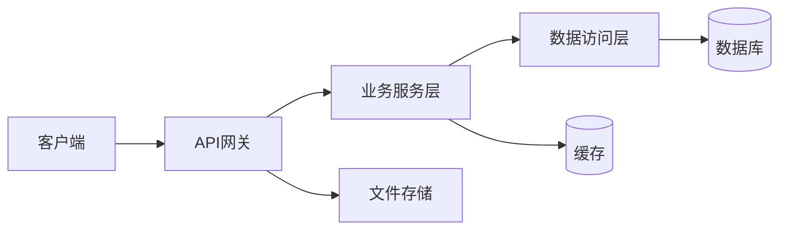
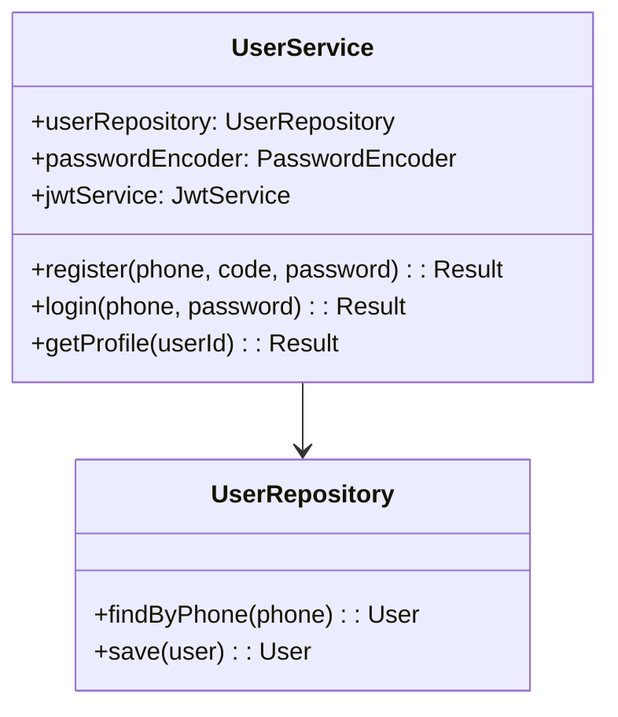

# 软件工程文档规范

> 本模块依据 GB/T 8567—2006、GB/T 9385—2008、ISO/IEC/IEEE 12207、ISO/IEC/IEEE 29148、IEEE 830、IEEE 1016、IEEE 829 建立软件工程文档体系，区分**轻量版（课程项目/毕设）**和**完整版（企业项目）**两个层级。轻量版适用于 1-4 人学期项目/本科毕业设计，完整版适用于企业级正式项目或研究生高水平项目。

---

## 一、软件工程文档全景图

### 1.1 全生命周期文档流（Mermaid flowchart）

```mermaid
flowchart TD
    %% 立项阶段
    subgraph立项["📋 立项阶段"]
        A1[可行性分析报告] --> A2[项目章程/计划书]
        A1 --> A3[风险评估表]
        A3 --> A4[项目日历与里程碑]
    end

    %% 需求阶段
    subgraph需求["🔍 需求阶段"]
        B1[软件需求规格说明书<br/>SRS] --> B2[接口需求规格说明 IRS]
        B2 --> B3[系统/子系统规格说明]
        B1 --> B4[软件质量需求说明]
        B1 --> B5[用户需求调研报告]
        B5 --> B1
    end

    %% 设计阶段
    subgraph设计["✏️ 设计阶段"]
        C1[软件概要设计说明书<br/>HLD] --> C2[软件详细设计说明书<br/>LLD]
        C1 --> C3[数据库设计说明书]
        C1 --> C4[接口设计文档]
        C1 --> C5[UI/UX设计文档]
        C2 --> C6[模块接口定义]
    end

    %% 实现阶段
    subgraph实现["🔨 实现阶段"]
        D1[编码规范文档] --> D2[源代码库]
        D2 --> D3[软件单元测试说明]
        D3 --> D4[代码审查报告]
    end

    %% 测试阶段
    subgraph测试["🧪 测试阶段"]
        E1[测试计划] --> E2[测试用例]
        E2 --> E3[测试报告]
        E1 --> E4[集成测试说明]
        E4 --> E3
        E3 --> E5[缺陷报告]
    end

    %% 部署运维阶段
    subgraph部署运维["🚀 部署运维阶段"]
        F1[部署说明文档] --> F2[安装说明]
        F1 --> F3[运维手册]
        F3 --> F4[应急预案]
        F2 --> F5[用户手册]
        F5 --> F6[在线帮助/FAQ]
    end

    %% 收尾阶段
    subgraph收尾["📦 收尾阶段"]
        G1[验收报告] --> G2[项目总结报告]
        G2 --> G3[归档清单]
        G1 --> G4[结项评审记录]
    end

    %% 贯穿阶段
    subgraph贯穿["🔗 贯穿全生命周期"]
        H1[变更控制记录]
        H2[项目周/月报]
        H3[沟通记录]
    end

    A2 --> B1
    B1 --> C1
    C2 --> D2
    D3 --> E4
    E3 --> F1
    F1 -.-> G1

    style 立项 fill:#e1f5fe,stroke:#0277bd
    style 需求 fill:#f3e5f5,stroke:#6a1b9a
    style 设计 fill:#e8f5e9,stroke:#2e7d32
    style 实现 fill:#fff3e0,stroke:#e65100
    style 测试 fill:#ffebee,stroke:#b71c1c
    style 部署运维 fill:#e0f7fa,stroke:#006064
    style 收尾 fill:#f1f8e9,stroke:#33691e
    style 贯穿 fill:#f5f5f5,stroke:#757575
```

### 1.2 各阶段产出文档总览

| 阶段 | 轻量版（课程/毕设）必须产出 | 完整版（企业）必须产出 |
|---|---|---|
| **立项** | 可行性分析报告、项目计划书 | 可行性分析报告、项目章程、风险登记册、项目日历、环境评估报告 |
| **需求** | SRS（简版）、用户调研记录 | SRS、IRS、系统规格说明、质量需求说明、需求变更记录、接口需求说明 |
| **设计** | 概要设计、数据库概要设计 | HLD、LLD、数据库设计、接口设计、UI设计、架构决策记录 |
| **实现** | 编码规范、单元测试说明 | 编码规范、源码、单元测试、代码审查、构建脚本 |
| **测试** | 测试计划、测试用例（核心功能） | 测试计划、测试用例集、测试报告、缺陷报告、测试就绪评审记录 |
| **部署运维** | 部署说明（3-5页）、用户手册（简版） | 部署文档、安装手册、运维手册、应急预案、升级说明 |
| **收尾** | 验收报告（简版）、项目总结 | 验收报告、项目总结、归档清单、资产清单、经验教训报告 |

---

## 二、每类文档详细规范

### 2.1 可行性分析报告

#### 基本信息

| 项目 | 内容 |
|---|---|
| **目的** | 评估软件项目在技术、经济、操作、法律层面的可行性，为立项决策提供依据 |
| **读者** | 项目发起人、管理层、投资方、课程答辩评委 |
| **输入** | 初步需求说明、项目约束条件（时间、预算、技术栈偏好） |
| **输出** | 可行性结论（可行/不可行/有条件可行）+ 推荐建议 |
| **主标准** | GB/T 8567—2006 立项阶段要求；无直接等同国际标准，但参照 ISO/IEC/IEEE 12207 立项过程 |
| **生命周期位置** | 立项阶段最开始，优先于所有其他活动 |

#### 轻量版模板（课程/毕设，1-3页）

```markdown
# 可行性分析报告

## 1. 项目概述
### 1.1 项目名称
### 1.2 项目背景（为什么做这件事）
### 1.3 预期目标（用一句话描述）

## 2. 技术可行性分析
### 2.1 现有技术栈是否满足需求
### 2.2 关键技术难点识别
### 2.3 技术方案备选（列出 1-2 个可行方案）

## 3. 经济可行性分析
### 3.1 开发成本估算（人力、设备、工具、学习成本）
### 3.2 预期收益/价值（学术价值或实用价值）
### 3.3 成本-收益对比结论

## 4. 操作可行性分析
### 4.1 目标用户群特征
### 4.2 用户接受度预测
### 4.3 运行环境可行性

## 5. 风险初步评估
| 风险项 | 可能性 | 影响度 | 应对策略 |
|---|---|---|---|
| 技术实现难度高 | 中 | 高 | 预留缓冲时间、分阶段实现 |
| 开发周期不足 | 高 | 高 | 裁剪非核心功能 |

## 6. 结论
[ ] 可行，建议立项
[ ] 有条件可行，需要解决以下问题：...
[ ] 不可行，原因：...
```

#### 完整版模板（企业，5-15页）

```markdown
# 可行性分析报告

## 1. 执行摘要（1页）
## 2. 项目背景与业务动机
### 2.1 业务问题/机会描述
### 2.2 约束条件与假设
## 3. 技术可行性分析
### 3.1 技术现状评估
### 3.2 技术方案对比（含原型实验/技术验证结果）
### 3.3 技术风险识别
## 4. 经济可行性分析
### 4.1 成本估算（人员、设备、工具、许可、基础设施、培训）
### 4.2 收益估算（收入提升、成本节约、品牌价值等）
### 4.3 ROI / 投资回收期分析
### 4.4 敏感性分析
## 5. 法律/合规可行性
## 6. 操作可行性分析
### 6.1 用户接受度评估
### 6.2 组织准备度
## 7. 风险评估综合矩阵
## 8. 可行性结论与建议
### 8.1 结论
### 8.2 立项建议
### 8.3 后续行动
## 附录：技术验证报告、市场调研数据
```

#### 可行性分析报告检查清单

- [ ] 每个可行性维度（技术/经济/操作/法律）均有独立章节
- [ ] 关键技术难点有具体说明，无泛泛而谈
- [ ] 成本估算有数量级依据（非"大约 10 万"这种无依据估算）
- [ ] 风险识别覆盖主要风险，不遗漏显而易见的高影响风险
- [ ] 结论明确，不模糊（避免"基本可行""可以考虑"等模糊表述）
- [ ] 如结论为"有条件可行"，必须列出前置条件

---

### 2.2 软件需求规格说明书（SRS）

#### 基本信息

| 项目 | 内容 |
|---|---|
| **目的** | 完整、无歧义地描述软件的功能和非功能需求，作为设计、验证、确认的基准 |
| **读者** | 设计人员、开发者、测试人员、项目经理、客户/用户代表、质量保证人员 |
| **输入** | 可行性分析报告、用户需求调研记录、业务规则文档、接口约束 |
| **输出** | 经过评审确认的需求基线，后续所有变更通过变更控制流程处理 |
| **主标准** | GB/T 9385—2008《计算机软件需求规格说明规范》/ IEEE 830-1998 |
| **辅助标准** | ISO/IEC/IEEE 29148-2011（需求工程）、ISO/IEC/IEEE 12207（需求获取活动） |
| **生命周期位置** | 需求阶段核心产出，是设计阶段输入；需求变更必须触发变更评审 |

#### GB/T 9385—2008 / IEEE 830 核心要求

SRS 必须满足以下质量属性：

| 质量属性 | 说明 | 轻量版要求 | 完整版要求 |
|---|---|---|---|
| **完整性** | 所有需求均已列出，无遗漏 | 核心功能覆盖 | 全功能覆盖 |
| **一致性** | 需求之间无冲突 | 检查主要冲突 | 全量冲突检查 |
| **无歧义** | 每条需求只有唯一解释 | 主要术语已定义 | 全部术语已定义 |
| **可验证** | 每条需求可通过测试/分析验证 | 主要需求可验证 | 全部需求可验证 |
| **可修改** | 文档结构便于变更管理 | 章节编号清晰 | 有索引和交叉引用 |
| **可追踪** | 每条需求可溯源到来源，可展开到设计/测试 | 主要需求可追踪 | 全部可追踪 |

#### 轻量版模板（课程/毕设，5-15页）

```markdown
# 软件需求规格说明书（SRS）

**文档编号：** SRS-{项目名}-{版本}
**日期：** {YYYY-MM-DD}
**版本：** v1.0
**作者：**

---

## 1. 引言

### 1.1 目的
> 说明编写本SRS的目的，描述预期读者。

### 1.2 范围
> 说明本SRS所属项目的名称，简述软件的功能和覆盖范围。
> 说明哪些是本项目包含的，哪些是明确不包含的（项目边界）。

### 1.3 定义与缩略语

| 术语 | 定义 |
|---|---|
| SRS | 软件需求规格说明书 |
| ... | ... |

### 1.4 参考资料
- GB/T 9385—2008
- IEEE 830-1998
- [相关需求调研报告]

## 2. 总体描述

### 2.1 产品背景
> 描述产品背景，阐明与相邻系统/产品的关系。

### 2.2 用户特征

| 用户类型 | 描述 | 使用频率 | 技能水平 |
|---|---|---|---|
| 普通用户 | ... | 高 | 低 |
| 管理员 | ... | 低 | 中高 |

### 2.3 约束条件
> 列出所有对软件的约束（法规、硬件限制、接口要求、并发用户数等）。

### 2.4 假设与依赖
> 列出项目依赖的外部组件或假设条件。

## 3. 需求规格

### 3.1 功能需求

> 每条功能需求格式：
> **FR-ID: 功能名称**
> - **描述：** 详细描述该功能做什么
> - **输入：** 输入数据/触发条件
> - **处理：** 处理逻辑描述
> - **输出：** 输出结果
> - **优先级：** 高/中/低
> - **来源：** 来源用户/场景

#### 3.1.1 用户管理模块

**FR-001: 用户注册**
- **描述：** 新用户通过手机号注册账号
- **输入：** 手机号、验证码、密码
- **处理：** 验证手机号格式→发送短信验证码→校验验证码→密码加密存储
- **输出：** 注册成功/失败提示，返回用户ID
- **优先级：** 高
- **来源：** 用户访谈-张三

**FR-002: 用户登录**
...

#### 3.1.2 核心业务模块
...

### 3.2 非功能需求

#### 3.2.1 性能需求

| 指标 | 要求值 | 测量条件 |
|---|---|---|
| 响应时间 | ≤ 2s（95%请求） | 并发100用户 |
| 系统吞吐量 | ≥ 50 TPS | 峰值负载 |
| 数据库查询时间 | ≤ 500ms | 常规查询 |

#### 3.2.2 安全性需求
- 用户密码加密存储（bcrypt）
- 敏感数据传输使用HTTPS
- 防止SQL注入、XSS攻击
- Session超时时间≤30分钟

#### 3.2.3 可靠性需求
- 系统可用性 ≥ 99.5%（按月计算）
- 数据丢失率 = 0
- 单节点故障不影响整体服务

#### 3.2.4 可维护性需求
- 代码注释覆盖率 ≥ 70%
- 关键模块有完整单元测试（覆盖率≥80%）
- 关键业务流程有文档说明

#### 3.2.5 可移植性需求
- 支持主流浏览器：Chrome/Firefox/Safari/Edge最新两个版本
- 移动端适配：iOS 14+、Android 10+

#### 3.2.6 用户界面需求
> 描述UI/UX整体风格要求、响应式布局要求、辅助功能要求（无障碍）。

### 3.3 接口需求

#### 3.3.1 外部接口

**用户接口：** 描述与用户交互的界面要求（GUI/Web/CLI）
**硬件接口：** 如涉及硬件交互
**软件接口：** 描述与其他系统/组件的接口（如API、数据库连接）

#### 3.3.2 内部接口
> 描述模块间接口（模块名、调用方式、参数、返回值、错误码）。

| 接口ID | 模块A→模块B | 参数 | 返回值 | 异常处理 |
|---|---|---|---|---|
| IF-001 | UserService→OrderService | userId: string | Order[] | 抛出AuthException |

## 4. 其他需求（可选）

### 4.1 数据验收标准
### 4.2 安装需求
### 4.3 验收条件

## 5. 附录

### 5.1 需求追踪矩阵

| 需求ID | 来源 | 设计对应 | 测试用例 |
|---|---|---|---|
| FR-001 | 用户访谈-张三 | D-001 | TC-001, TC-002 |
| FR-002 | 用户访谈-李四 | D-002 | TC-003 |

### 5.2 需求变更记录

| 版本 | 日期 | 变更描述 | 批准人 |
|---|---|---|---|
| v0.9 | 2024-03-01 | 初稿 | - |
| v1.0 | 2024-03-15 | 评审后修订：删除FR-010，合并FR-005和FR-006 | 张三 |
```

#### 完整版模板补充内容（超出轻量版的章节）

在轻量版基础上，完整版还需包含：

```markdown
## 6. 产品定量需求（完整版额外章节）
### 6.1 精确的性能指标（数值+测量方法+允收标准）
### 6.2 可用性指标（MTBF、MTTR等）
### 6.3 容量规划指标（用户数、数据量、存储量）
### 6.4 可用性/可访问性合规要求（如WCAG 2.1 AA）

## 7. 需求优先级与版本规划
### 7.1 MoSCoW优先级分类
### 7.2 分阶段（MVP/Phase2/Phase3）交付计划

## 8. 需求验收测试策略
### 8.1 每个功能需求的验收测试方法说明
### 8.2 回归测试策略说明

## 9. 子系统规格说明（完整版）
> 如果项目规模大，需要为每个子系统单独写规格说明，作为本SRS的下游文档。
```

#### SRS 检查清单

- [ ] 文档标题包含"软件需求规格说明书"字样
- [ ] 有文档编号、版本、日期、作者信息
- [ ] 1.1 明确说明本SRS的目的（不要照抄标准文字）
- [ ] 1.2 明确说明项目范围，包含和不包含的内容都已说明
- [ ] 所有专业术语在 1.3 中定义
- [ ] 功能需求章节：每条需求有唯一ID（如FR-001）、清晰的输入/处理/输出描述
- [ ] 非功能需求章节：每条需求可量化（数值+测量条件），避免"尽可能快""尽量安全"等模糊词
- [ ] 接口需求章节：外部接口（API、UI、文件格式）和内部接口（模块间）均有说明
- [ ] 需求之间无冲突（同名功能未被描述为不同行为）
- [ ] 每条需求可测试（可在有限时间内通过有限步骤验证）
- [ ] 有需求追踪矩阵（需求→设计→测试用例可对应）
- [ ] 有附录：术语表、参考资料
- [ ] 文档已通过正式评审，评审记录存于附录
- [ ] 变更记录完整，每次变更有版本号、日期、变更描述、批准人

---

### 2.3 概要设计说明书（HLD）

#### 基本信息

| 项目 | 内容 |
|---|---|
| **目的** | 描述软件的系统架构、模块划分、关键技术方案，作为详细设计的基础 |
| **读者** | 开发团队、技术负责人、测试负责人、项目经理 |
| **输入** | SRS、项目计划、架构约束（技术栈、性能要求） |
| **输出** | 架构设计决策、模块接口定义、技术选型结论 |
| **主标准** | GB/T 8567—2006；参考 IEEE 1016-2009《软件设计描述》 |
| **生命周期位置** | 设计阶段初期，在详细设计之前完成 |

#### 轻量版模板（课程/毕设，5-10页）

```markdown
# 软件概要设计说明书（HLD）

**文档编号：** HLD-{项目名}-{版本}
**依据SRS版本：** SRS-{项目名}-v1.x
**版本：** v1.0

---

## 1. 引言

### 1.1 目的
### 1.2 范围
### 1.3 参考文档

## 2. 技术架构设计

### 2.1 系统架构图
> 提供系统架构图（可用Mermaid flowchart或ASCII图），标注主要组件。



### 2.2 技术选型

| 层次 | 技术选型 | 选型理由 |
|---|---|---|
| 前端 | Vue 3 + TypeScript | 上手快，生态好 |
| 后端 | Spring Boot 3 | 社区成熟，适合企业级 |
| 数据库 | MySQL 8.0 | 轻量，满足需求 |
| 缓存 | Redis | 社区成熟，配套完善 |
| 部署 | Docker + Docker Compose | 简化部署 |

### 2.3 分层架构说明
> 说明各层的职责、层间交互规则。

## 3. 模块设计

### 3.1 模块划分总览

| 模块名 | 职责描述 | 开放接口数 |
|---|---|---|
| UserModule | 用户注册、登录、信息管理 | 5 |
| OrderModule | 订单创建、查询、取消 | 8 |
| ... | ... | ... |

### 3.2 模块职责与接口

#### UserModule（用户模块）
- **职责：** 负责用户生命周期管理
- **对外接口：**
  - `UserService.register(phone, code, password): Result<User>`
  - `UserService.login(phone, password): Result<Token>`
  - `UserService.getProfile(userId): Result<UserProfile>`
  - ...

#### OrderModule（订单模块）
...

## 4. 数据库概要设计

### 4.1 ER图（简要）
> 提供核心实体关系图。

### 4.2 主要数据表

| 表名 | 主要字段 | 用途 |
|---|---|---|
| users | id, phone, password_hash, created_at | 用户主表 |
| orders | id, user_id, amount, status, created_at | 订单主表 |

## 5. 接口设计（概要）

### 5.1 REST API 设计

| 方法 | 路径 | 功能 | 认证 |
|---|---|---|---|
| POST | /api/v1/users/register | 用户注册 | 否 |
| POST | /api/v1/users/login | 用户登录 | 否 |
| GET | /api/v1/orders | 查询订单列表 | 是 |

### 5.2 错误码规范

| 错误码 | 含义 | HTTP状态码 |
|---|---|---|
| 10001 | 用户已存在 | 409 |
| 10002 | 参数校验失败 | 400 |
| ... | ... | ... |

## 6. 关键设计决策

| 决策 | 选项 | 选择 | 理由 |
|---|---|---|---|
| 认证方式 | JWT / Session | JWT | 无状态，扩展性好 |
| 文件存储 | 本地 / OSS | OSS | 可靠性高 |

## 7. 部署架构（可选）
> 说明部署方式（单机/集群）、依赖服务。

## 8. 后续章节索引
> 说明详细设计、测试计划等下游文档的位置。
```

#### 完整版补充内容

```markdown
## 9. 架构决策记录（ADR）
> 记录每个重大架构决策的上下文、决策、后果。

## 10. 安全架构设计
> 认证/授权方案、数据加密方案、安全加固措施。

## 11. 性能设计
> 缓存策略、异步处理、数据库优化、CDN策略。

## 12. 可用性设计
> 负载均衡、故障转移、灾备方案。

## 13. 模块详细接口定义
> 每个模块的完整接口规范（含参数类型、返回值结构、错误码、调用示例）。

## 14. 设计权衡分析（Trade-off Analysis）
> 每个技术选型的备选方案及未选理由。
```

#### HLD 检查清单

- [ ] 文档标题为"软件概要设计说明书"或"系统设计说明书"
- [ ] 有依据的SRS版本号引用（设计应与需求对应）
- [ ] 系统架构图清晰，组件、组件间关系可见
- [ ] 技术选型有明确理由（非"流行"或"大家都在用"这类理由）
- [ ] 模块划分合理，符合高内聚低耦合原则
- [ ] 每个模块的对外接口有定义（接口名、输入、输出）
- [ ] 数据库设计与SRS中的数据需求一致
- [ ] API设计与SRS中的接口需求一致
- [ ] 关键设计决策有记录（为何选A不选B）
- [ ] 安全相关设计（认证、授权、数据保护）已考虑
- [ ] 每个接口具备需求追踪编号、认证/授权、错误码或异常处理说明
- [ ] 接口矩阵未把详细 API 手册塞入单张超长表；长表已拆分或使用 `longtable` 正确分页
- [ ] 文中不存在未验证的第三方集成、性能指标或产品能力被写成既成事实
- [ ] 正文无营销化、夸张化、AI 腔表述；所有关键判断有 SRS、代码或外部资料支撑
- [ ] LaTeX 编译后未出现表格截断、重复表题、内容重叠、undefined citation 或横向溢出

#### HLD 接口设计附加规则

HLD 的接口章节应体现系统边界与模块契约，而不是替代详细 API 文档。接口概览表建议采用以下字段：接口编号、追踪需求、请求方法、路由路径、输入对象、输出对象、授权角色、异常说明。若某一接口尚未在代码中实现，应在状态列标注“待实现”或“候选”，不得与已实现接口混写为同等事实。接口路径应与后端实际路由保持一致，前缀、版本号、HTTP 方法和路径参数必须逐项核验；存在 `/api/v1`、`/users/me` 等前缀不一致时，应先统一口径再进入正文。

---

### 2.4 详细设计说明书（LLD）

#### 基本信息

| 项目 | 内容 |
|---|---|
| **目的** | 描述每个模块的内部实现设计，包括类/函数设计、数据结构、算法、异常处理 |
| **读者** | 开发人员、测试人员（理解实现细节） |
| **输入** | HLD、SRS |
| **输出** | 详细的实现规范，作为编码和单元测试的直接依据 |
| **主标准** | GB/T 8567—2006；参考 IEEE 1016-2009 |
| **生命周期位置** | 设计阶段后期，是编码的直接指导 |

#### 轻量版模板（课程/毕设，10-20页）

```markdown
# 软件详细设计说明书（LLD）

**文档编号：** LLD-{项目名}-{版本}
**依据HLD版本：** HLD-{项目名}-v1.x
**版本：** v1.0

---

## 1. 引言
### 1.1 目的
### 1.2 范围
### 1.3 参考文档
### 1.4 命名约定

## 2. 程序设计

### 2.1 模块A：用户管理模块（UserModule）

#### 2.1.1 模块概述
- **职责：** 实现用户注册、登录、信息管理功能
- **前置条件：** 数据库连接正常、Redis可用
- **后置条件：** 操作结果写入数据库/缓存

#### 2.1.2 类设计

**UserService（用户服务类）**

| 类成员 | 类型 | 描述 |
|---|---|---|
| `userRepository` | UserRepository | 用户数据访问 |
| `passwordEncoder` | PasswordEncoder | 密码加密工具 |
| `jwtService` | JwtService | Token生成服务 |

| 方法 | 签名 | 描述 |
|---|---|---|
| `register` | `register(phone: string, code: string, password: string): Promise<Result<User>>` | 用户注册 |
| `login` | `login(phone: string, password: string): Promise<Result<LoginResponse>>` | 用户登录 |
| `getProfile` | `getProfile(userId: string): Promise<Result<UserProfile>>` | 获取用户资料 |

**register() 方法详细设计：**

```
输入：phone (string), code (string), password (string)
处理：
  1. 参数校验：
     - phone: /^1[3-9]\d{9}$/，不合法抛出ValidationException(20001)
     - code: 6位数字，4分钟有效，不合法抛出ValidationException(20002)
     - password: 8-20位，含大小写字母和数字，不合法抛出ValidationException(20003)
  2. 检查用户是否已存在（userRepository.findByPhone）
     - 已存在抛出BusinessException(10001)
  3. 密码加密：bcrypt(password, 12) → passwordHash
  4. 创建用户记录：User { id: uuid(), phone, passwordHash, createdAt: now() }
  5. 写入数据库
  6. 返回 Result.ok(user)
输出：Result<User>

异常场景：
  - ValidationException(20001): 手机号格式错误
  - ValidationException(20002): 验证码错误/过期
  - ValidationException(20003): 密码不符合要求
  - BusinessException(10001): 用户已存在
```

**类图（可选）：**


### 2.2 模块B：订单管理模块

...

## 3. 数据库详细设计

### 3.1 users 表

```sql
CREATE TABLE users (
    id          VARCHAR(36)  PRIMARY KEY COMMENT '用户ID，UUID',
    phone       VARCHAR(11)  NOT NULL UNIQUE COMMENT '手机号',
    password_hash VARCHAR(100) NOT NULL COMMENT 'bcrypt加密后密码',
    nickname    VARCHAR(50)  DEFAULT '' COMMENT '昵称',
    avatar_url  VARCHAR(500) DEFAULT '' COMMENT '头像URL',
    created_at  DATETIME     NOT NULL DEFAULT CURRENT_TIMESTAMP COMMENT '创建时间',
    updated_at  DATETIME     NOT NULL DEFAULT CURRENT_TIMESTAMP ON UPDATE CURRENT_TIMESTAMP COMMENT '更新时间',
    INDEX idx_phone (phone)
) ENGINE=InnoDB DEFAULT CHARSET=utf8mb4 COMMENT='用户主表';
```

### 3.2 orders 表

...

## 4. 异常处理设计

| 异常类型 | 异常码 | HTTP状态码 | 处理策略 |
|---|---|---|---|
| ValidationException | 2xxxx | 400 | 返回详细校验错误信息 |
| BusinessException | 1xxxx | 4xx | 业务逻辑错误，返回业务描述 |
| SystemException | 5xxxx | 500 | 记录日志，返回通用错误 |

## 5. 日志设计

| 日志级别 | 使用场景 |
|---|---|
| ERROR | 未捕获异常、关键流程失败 |
| WARN | 业务异常（如登录失败3次） |
| INFO | 关键业务流程节点（注册成功、下单成功） |
| DEBUG | 开发调试信息（含参数详情） |

## 6. 安全设计

### 6.1 密码存储：bcrypt，cost=12
### 6.2 接口认证：JWT，过期时间7天
### 6.3 参数校验：全局拦截，校验失败返回400
### 6.4 SQL注入防护：参数化查询，禁止字符串拼接SQL
```

#### 完整版补充内容

```markdown
## 7. 算法详细设计
> 复杂业务算法（排序、搜索、推荐等）的伪代码/Python实现。

## 8. 数据结构设计
> 核心数据结构的类图、字段说明、关系映射。

## 9. 状态机设计
> 实体状态流转图（如订单状态机：待支付→已支付→已发货→已完成/已取消）。

## 10. 时序图
> 关键业务流程的时序图（用户注册时序、下单支付时序等）。

## 11. 模块间依赖关系图
> 全模块依赖关系，便于理解代码结构。
```

#### LLD 检查清单

- [ ] 文档标题为"软件详细设计说明书"或"详细设计说明"
- [ ] 每个模块都有独立的章节，章节结构一致
- [ ] 每个类/函数的职责有说明
- [ ] 关键方法的算法有详细描述（含分支、循环、边界处理）
- [ ] 参数校验规则有说明（合法值范围、格式要求）
- [ ] 异常场景有覆盖（错误码、异常类型、处理方式）
- [ ] 数据库表结构与HLD中的概要设计一致
- [ ] SQL语句规范（有注释、有索引说明）
- [ ] 安全设计有覆盖（认证、授权、加密、参数校验）
- [ ] 有日志设计（关键节点记录、敏感数据脱敏）
- [ ] 代码风格与编码规范一致（如有）

---

### 2.5 数据库设计说明书

#### 基本信息

| 项目 | 内容 |
|---|---|
| **目的** | 描述数据库的概念结构、逻辑结构、物理结构、表设计、索引设计 |
| **读者** | 后端开发人员、DBA、测试人员 |
| **输入** | SRS、HLD |
| **输出** | 完整的数据库设计文档 |
| **参考标准** | GB/T 8567—2006（设计阶段输出物）；无独立国际标准，等同于IEEE 1016设计描述一部分 |
| **生命周期位置** | 设计阶段，与HLD并行或作为HLD的子文档 |

#### 模板结构

```markdown
# 数据库设计说明书

## 1. 引言
### 1.1 目的
### 1.2 设计原则
- 第三范式（3NF）为基础
- 避免数据冗余
- 支持扩展性

## 2. 概念结构设计（ER图）

```mermaid
erDiagram
    USER ||--o{ ORDER : places
    USER {
        string id PK
        string phone UK
        string password_hash
        datetime created_at
    }
    ORDER ||--|{ ORDER_ITEM : contains
    ORDER {
        string id PK
        string user_id FK
        decimal amount
        string status
        datetime created_at
    }
}
```

## 3. 逻辑结构设计

### 3.1 表清单

| 表名 | 中文名 | 用途 | 预计数据量 |
|---|---|---|---|
| users | 用户表 | 存储用户基本信息 | ≤10万 |
| orders | 订单表 | 存储订单主信息 | ≤100万 |

### 3.2 字段命名规范
- 统一使用 snake_case
- 主键统一命名为 `id`（VARCHAR(36)，UUID）
- 外键命名：`{表名}_id`（如 `user_id`）
- 时间字段：`created_at`、`updated_at`
- 状态字段：`status`（TINYINT 或 ENUM）

## 4. 物理结构设计

### 4.1 users 表设计

```sql
CREATE TABLE users (
    id          VARCHAR(36)  PRIMARY KEY COMMENT '用户ID，UUID v4',
    phone       VARCHAR(11)  NOT NULL UNIQUE COMMENT '手机号，11位',
    password_hash VARCHAR(100) NOT NULL COMMENT 'bcrypt加密密码，cost=12',
    nickname    VARCHAR(50)  DEFAULT '' COMMENT '昵称，最多50字符',
    avatar_url  VARCHAR(500) DEFAULT '' COMMENT '头像URL',
    status      TINYINT      NOT NULL DEFAULT 1 COMMENT '状态：1正常 0禁用',
    created_at  DATETIME     NOT NULL DEFAULT CURRENT_TIMESTAMP COMMENT '注册时间',
    updated_at  DATETIME     NOT NULL DEFAULT CURRENT_TIMESTAMP ON UPDATE CURRENT_TIMESTAMP COMMENT '更新时间',
    INDEX idx_phone (phone),
    INDEX idx_status (status)
) ENGINE=InnoDB DEFAULT CHARSET=utf8mb4 COLLATE=utf8mb4_unicode_ci COMMENT='用户主表';
```

**字段说明：**

| 字段 | 类型 | 约束 | 说明 |
|---|---|---|---|
| id | VARCHAR(36) | PK | UUID，使用UUID v4确保唯一性 |
| phone | VARCHAR(11) | UK, NOT NULL | 手机号，唯一索引，用于登录 |
| password_hash | VARCHAR(100) | NOT NULL | bcrypt加密后60字符，实际存100留余量 |
| nickname | VARCHAR(50) | DEFAULT '' | 昵称，最长50字符（含中文） |
| status | TINYINT | DEFAULT 1 | 1=正常，0=禁用 |

### 4.2 orders 表设计

```sql
CREATE TABLE orders (
    id          VARCHAR(36)  PRIMARY KEY COMMENT '订单ID',
    user_id     VARCHAR(36)  NOT NULL COMMENT '下单用户ID',
    order_no    VARCHAR(32)  NOT NULL UNIQUE COMMENT '订单号，用于外部展示',
    total_amount DECIMAL(10,2) NOT NULL COMMENT '订单总额，单位元',
    status      TINYINT      NOT NULL DEFAULT 1 COMMENT '状态：1待支付 2已支付 3已发货 4已完成 5已取消',
    created_at  DATETIME     NOT NULL DEFAULT CURRENT_TIMESTAMP,
    paid_at     DATETIME     DEFAULT NULL COMMENT '支付时间',
    shipped_at  DATETIME     DEFAULT NULL COMMENT '发货时间',
    completed_at DATETIME    DEFAULT NULL COMMENT '完成时间',
    INDEX idx_user_id (user_id),
    INDEX idx_order_no (order_no),
    INDEX idx_status (status),
    INDEX idx_created_at (created_at),
    FOREIGN KEY (user_id) REFERENCES users(id)
) ENGINE=InnoDB DEFAULT CHARSET=utf8mb4 COLLATE=utf8mb4_unicode_ci COMMENT='订单主表';
```

### 4.3 索引设计

| 表 | 索引名 | 字段 | 类型 | 用途 |
|---|---|---|---|---|
| users | idx_phone | phone | UNIQUE | 快速查询用户 |
| users | idx_status | status | INDEX | 按状态筛选用户 |
| orders | idx_user_id | user_id | INDEX | 查询某用户所有订单 |
| orders | idx_order_no | order_no | UNIQUE | 订单号精确查询 |

### 4.4 分库分表策略（完整版）
> 预估数据量超过千万级时的分库分表方案。

## 5. 数据迁移策略（完整版）

## 6. 数据库安全设计

| 措施 | 说明 |
|---|---|
| 最小权限原则 | 应用账户只有 DML 权限（SELECT/INSERT/UPDATE/DELETE），无 DDL 权限 |
| 密码加密 | 所有密码字段加密存储 |
| SQL审计 | 开启慢查询日志，定位性能问题 |

## 7. 备份与恢复策略（完整版）
```

#### 数据库设计检查清单

- [ ] ER图与表设计一致（所有实体有对应表，关系正确）
- [ ] 主键设计统一（优先使用无意义主键UUID，避免业务相关主键）
- [ ] 字段命名符合命名规范，语义清晰
- [ ] 每个字段有注释说明用途
- [ ] 有外键约束说明（或说明为何不建外键）
- [ ] 索引设计有理由（高频查询字段有索引，避免冗余索引）
- [ ] 数据类型选择合理（不浪费空间，如TINYINT够用不用INT）
- [ ] 有状态字段的表有状态值说明文档
- [ ] 时间字段有DEFAULT和ON UPDATE说明
- [ ] 考虑了数据量增长，字段长度留有余量
- [ ] 敏感字段有加密或脱敏说明

---

### 2.6 测试文档体系

#### 基本信息

| 项目 | 内容 |
|---|---|
| **目的** | 描述测试策略、测试用例、测试结果，作为软件质量验证的依据 |
| **读者** | 测试人员、开发人员、项目经理、质量保证人员、客户 |
| **主标准** | GB/T 8567—2006、IEEE 829-2008《软件测试文档标准》 |

#### 2.6.1 测试计划

**轻量版模板（3-5页）：**

```markdown
# 测试计划

## 1. 测试范围与目标

### 1.1 测试范围

| 测试类型 | 覆盖范围 | 占比 |
|---|---|---|
| 单元测试 | 核心业务逻辑 | 覆盖率≥80% |
| 集成测试 | 模块间交互 | 关键路径覆盖 |
| 系统测试 | 全功能端到端 | 核心功能100%覆盖 |

### 1.2 测试目标
- 功能测试：核心功能正确率 ≥ 95%
- 性能测试：响应时间 ≤ 2s（95th percentile）
- 无阻塞性缺陷遗留到上线前

## 2. 测试策略

### 2.1 测试方法
- 黑盒测试：基于SRS的功能验证
- 白盒测试：关键模块逻辑覆盖

### 2.2 测试准入准出标准

**准入标准：**
- 开发完成，代码通过静态分析
- 测试用例已评审
- 测试环境准备完毕

**准出标准：**
- 测试用例执行率 = 100%
- 致命/严重缺陷修复率 = 100%
- 遗留缺陷有记录且可接受

## 3. 测试资源

| 资源 | 说明 |
|---|---|
| 测试人员 | 2人 |
| 测试环境 | 本地Docker环境 |
| 测试工具 | Postman（API测试）、Playwright（E2E测试） |

## 4. 测试进度安排

| 阶段 | 时间 | 内容 |
|---|---|---|
| 单元测试 | 第X周 | 核心模块测试 |
| 集成测试 | 第X+1周 | 模块集成测试 |
| 系统测试 | 第X+2周 | 全系统测试 |
| 回归测试 | 第X+3周 | 修复后回归 |

## 5. 风险与对策

| 风险 | 影响 | 对策 |
|---|---|---|
| 测试环境不稳定 | 中 | 预留2天环境调试时间 |
| 测试人力不足 | 高 | 优先测试核心功能，非核心延后 |
```

**完整版补充内容：**

```markdown
## 6. 测试环境详细要求

## 7. 测试数据管理策略

## 8. 缺陷管理流程

## 9. 测试自动化策略

## 10. 回归测试策略

## 11. 非功能测试详细计划
### 11.1 性能测试计划
### 11.2 安全测试计划
### 11.3 兼容性测试计划
```

#### 2.6.2 测试用例

**模板（Excel/Markdown）：**

| 字段 | 说明 | 示例 |
|---|---|---|
| 用例编号 | 唯一标识，格式：TC_{模块}_{序号} | TC_User_001 |
| 测试标题 | 简洁描述，含被测功能和验证点 | 用户注册-手机号已存在-注册失败 |
| 用例类型 | 功能/性能/安全/边界 | 功能 |
| 优先级 | P0/P1/P2/P3 | P0 |
| 前置条件 | 执行前必须满足的条件 | 用户未登录，已进入注册页面 |
| 测试步骤 | 1. ... 2. ... 3. ... | 1. 输入已注册手机号 2. 输入正确验证码 3. 输入符合要求密码 4. 点击注册 |
| 预期结果 | 每步的预期输出/系统行为 | 4. 系统提示"手机号已存在"，不创建账号 |
| 实际结果 | 测试后填写 | （留空） |
| 测试人 | 执行人 | 张三 |
| 执行日期 | 填写日期 | （留空） |
| 是否通过 | 通过/不通过/阻塞 | （留空） |
| 备注 | 失败时的错误信息截图位置 | - |

**测试用例编写规范（IEEE 829）：**

1. **可重复性**：相同环境下，相同步骤应得到相同结果
2. **可判定性**：预期结果明确，测试结果只有通过/不通过两种状态
3. **完整性**：覆盖正向、逆向、边界、异常场景

#### 2.6.3 测试报告

**轻量版模板（3-5页）：**

```markdown
# 测试报告

## 1. 测试概要

| 项目 | 数据 |
|---|---|
| 测试时间 | 2024-04-01 ~ 2024-04-10 |
| 测试环境 | Docker / 本地 |
| 测试人员 | 张三、李四 |
| 总用例数 | 50 |
| 执行用例数 | 48 |
| 通过数 | 45 |
| 失败数 | 3 |

## 2. 测试结果统计

### 2.1 按模块统计

| 模块 | 用例数 | 通过 | 失败 | 通过率 |
|---|---|---|---|---|
| 用户管理 | 15 | 15 | 0 | 100% |
| 订单管理 | 20 | 18 | 2 | 90% |
| 商品管理 | 13 | 12 | 1 | 92.3% |

### 2.2 按缺陷严重程度统计

| 严重程度 | 数量 |
|---|---|
| 致命 | 0 |
| 严重 | 1 |
| 一般 | 2 |
| 轻微 | 0 |

## 3. 遗留缺陷

| 缺陷ID | 模块 | 描述 | 严重程度 | 状态 | 备注 |
|---|---|---|---|---|---|
| BUG-001 | 订单 | 订单取消后库存未返还 | 严重 | 待修复 | 预计下版本修复 |
| BUG-002 | 商品 | 商品列表分页计数有误 | 一般 | 待修复 | 影响用户体验 |
| BUG-003 | 商品 | 图片上传失败无提示 | 一般 | 待修复 | 可接受延后 |

## 4. 测试结论

> 测试是否通过，准出条件是否满足。

## 5. 建议

> 对后续开发、运维的建议。
```

#### 测试文档检查清单

- [ ] 测试计划有测试范围说明（测什么、不测什么）
- [ ] 测试策略明确（用什么方法、什么工具）
- [ ] 准入准出标准有量化指标
- [ ] 测试用例有唯一编号（TC_模块_序号）
- [ ] 每个用例有清晰的前置条件、步骤、预期结果
- [ ] 用例覆盖正向（正常流程）和逆向（错误/异常）场景
- [ ] 边界条件有覆盖（空值、最大值、特殊字符）
- [ ] 测试报告有数据统计（执行数、通过率、缺陷数）
- [ ] 缺陷描述清晰（可复现），有严重程度评级
- [ ] 遗留缺陷有影响说明和处理计划

---

### 2.7 用户手册

#### 基本信息

| 项目 | 内容 |
|---|---|
| **目的** | 帮助最终用户正确、高效地使用软件产品 |
| **读者** | 最终用户、运维人员（部署相关章节） |
| **输入** | SRS、最终产品 |
| **输出** | 用户操作指南 |
| **主标准** | GB/T 8567—2006；参考 ISO/IEC/IEEE 12207（运营支持过程） |
| **生命周期位置** | 部署运维阶段，与产品发布同步 |

#### 轻量版模板（5-10页）

```markdown
# 用户手册

## 1. 产品简介
### 1.1 产品概述
> 一段话说明产品是什么、做什么。

### 1.2 主要功能
- 功能A：...
- 功能B：...

### 1.3 系统要求
| 环境要求 | 最低配置 | 推荐配置 |
|---|---|---|
| 操作系统 | Windows 10 / macOS 10.15+ | Windows 11 / macOS 12+ |
| 浏览器 | Chrome 90+ | Chrome最新版 |
| 网络 | 2Mbps以上 | 10Mbps以上 |

## 2. 快速开始
### 2.1 注册与登录
> 配合截图（3-5步完成注册）

### 2.2 首次使用引导
> 新用户打开后的引导流程。

## 3. 功能操作指南

### 3.1 功能A（模块名）
**操作步骤：**
1. 进入[位置]（配合截图）
2. 填写/选择[内容]
3. 点击[按钮]
4. 确认结果

**示例：**
> 创建订单：
> 1. 点击顶部导航"订单管理"
> 2. 点击"新建订单"按钮
> 3. 选择客户、填写商品明细
> 4. 点击"提交"按钮
> 5. 系统显示"订单创建成功"

### 3.2 功能B
...

## 4. 常见问题FAQ

| 问题 | 答案 |
|---|---|
| 登录失败，提示"账号密码错误"？ | 请确认账号无误，如忘记密码可点击"忘记密码"重置 |
| 订单提交失败？ | 请检查网络连接，或联系管理员 |

## 5. 术语表

| 术语 | 定义 |
|---|---|
| 订单号 | 系统自动生成的唯一订单标识，共18位 |
| ... | ... |
```

#### 完整版补充内容

```markdown
## 6. 高级功能使用指南
## 7. 配置指南（管理员功能）
## 8. 故障排查与诊断
## 9. 服务支持与联系方式
```

#### 用户手册检查清单

- [ ] 目录结构清晰，用户能快速找到所需内容
- [ ] 每个操作步骤有截图或示意图（标注步骤序号）
- [ ] 截图与实际产品版本一致（发布前需更新）
- [ ] 截图有编号和说明（如"图3-1：进入订单管理页面"）
- [ ] 错误提示有对应解决方案（FAQ章节）
- [ ] 专业术语有解释（术语表）
- [ ] 操作结果有说明（操作成功/失败如何判断）
- [ ] 快捷键有说明（如有）
- [ ] 语言简洁易懂，避免技术术语（面向最终用户）
- [ ] 有目录页和索引

---

### 2.8 部署说明文档

#### 基本信息

| 项目 | 内容 |
|---|---|
| **目的** | 指导运维/部署人员将软件正确部署到目标环境 |
| **读者** | 运维人员、开发人员、DBA |
| **输入** | HLD、软件包、配置文件 |
| **主标准** | GB/T 8567—2006（部署相关章节）；ISO/IEC/IEEE 12207（部署过程） |
| **生命周期位置** | 部署运维阶段 |

#### 模板结构

```markdown
# 部署说明文档

## 1. 环境要求

### 1.1 硬件要求
| 资源 | 最低配置 | 推荐配置 |
|---|---|---|
| CPU | 2核 | 4核+ |
| 内存 | 4GB | 8GB+ |
| 磁盘 | 50GB SSD | 100GB+ SSD |

### 1.2 软件依赖
| 软件 | 版本要求 | 用途 |
|---|---|---|
| Docker | 20.10+ | 容器化部署 |
| Docker Compose | 1.29+ | 多容器编排 |
| MySQL | 8.0+ | 数据库 |
| Redis | 6.0+ | 缓存 |
| Nginx | 1.20+ | 反向代理 |

### 1.3 网络要求
- 服务器需开放端口：22（SSH）、80/443（HTTP/HTTPS）、3306（MySQL仅内网）、6379（Redis仅内网）
- 域名已备案（如需公网访问）

## 2. 部署前准备

### 2.1 服务器初始化
```bash
# 1. 更新系统
sudo apt update && sudo apt upgrade -y

# 2. 安装Docker
curl -fsSL https://get.docker.com | sh

# 3. 安装Docker Compose
sudo curl -L "https://github.com/docker/compose/releases/download/v2.20.0/docker-compose-$(uname -s)-$(uname -m)" -o /usr/local/bin/docker-compose
sudo chmod +x /usr/local/bin/docker-compose
```

### 2.2 数据库初始化
```bash
# 连接MySQL
mysql -u root -p

# 创建数据库和用户
CREATE DATABASE myapp CHARACTER SET utf8mb4 COLLATE utf8mb4_unicode_ci;
CREATE USER 'myapp'@'%' IDENTIFIED BY 'StrongPassword123!';
GRANT ALL PRIVILEGES ON myapp.* TO 'myapp'@'%';
FLUSH PRIVILEGES;
```

## 3. 部署步骤

### 3.1 项目目录结构
```
/opt/myapp/
├── docker-compose.yml
├── .env
├── app/
│   └── (应用代码)
├── nginx/
│   └── nginx.conf
└── mysql/
    └── init.sql
```

### 3.2 配置文件说明

**.env 文件配置：**
```bash
# 应用配置
APP_ENV=production
APP_DEBUG=false
APP_SECRET=your-256-bit-secret

# 数据库配置
DB_HOST=mysql
DB_PORT=3306
DB_DATABASE=myapp
DB_USERNAME=myapp
DB_PASSWORD=StrongPassword123!

# Redis配置
REDIS_HOST=redis
REDIS_PORT=6379
```

### 3.3 启动服务
```bash
# 1. 进入项目目录
cd /opt/myapp

# 2. 拉取代码/复制代码
git clone https://github.com/your-org/myapp.git app

# 3. 启动所有服务
docker-compose up -d

# 4. 查看服务状态
docker-compose ps

# 5. 查看日志
docker-compose logs -f app
```

## 4. 验证部署

### 4.1 服务健康检查

| 检查项 | 预期结果 | 检查命令 |
|---|---|---|
| 应用启动 | HTTP 200 | `curl -I http://localhost:8080/health` |
| 数据库连接 | 连接成功 | `docker exec -it myapp-mysql mysql -u myapp -p -e "SELECT 1"` |
| Redis连接 | PONG响应 | `docker exec -it myapp-redis redis-cli ping` |

### 4.2 业务验证
- [ ] 访问 http://域名/ 查看首页可正常加载
- [ ] 注册一个测试账号，收到验证邮件
- [ ] 登录后查看个人中心数据正常

## 5. 常用运维操作

### 5.1 日志查看
```bash
# 查看应用日志（实时）
docker-compose logs -f app

# 查看Nginx日志
docker-compose logs -f nginx
```

### 5.2 数据备份
```bash
# 数据库备份
docker exec myapp-mysql mysqldump -u myapp -p myapp > backup_$(date +%Y%m%d).sql

# 配置备份
tar -czf config_backup_$(date +%Y%m%d).tar.gz /opt/myapp/.env /opt/myapp/nginx/
```

### 5.3 回滚方案

**版本回滚（代码）：**
```bash
# 查看历史版本
git tag

# 回滚到指定版本
git checkout v1.0.0
docker-compose up -d --build app
```

**数据库回滚：**
```bash
# 恢复到指定备份
mysql -u myapp -p myapp < backup_20240401.sql
```

## 6. 故障排查

| 症状 | 可能原因 | 解决方法 |
|---|---|---|
| 应用无法启动 | 端口冲突 | 检查端口占用：`lsof -i :8080` |
| 数据库连接失败 | 用户名/密码错误 | 检查.env配置，或重新创建MySQL用户 |
| 502 Bad Gateway | Nginx无法连接到后端 | 检查app容器状态和端口映射 |
| 前端资源加载失败 | 静态文件路径错误 | 检查Nginx配置中的root路径 |

## 7. 安全加固建议

- [ ] 修改数据库root密码
- [ ] 配置防火墙，只开放必要端口
- [ ] 启用HTTPS（Let's Encrypt免费证书）
- [ ] 定期更新系统包和Docker镜像
- [ ] 配置日志rotate，防止磁盘满
```

#### 部署文档检查清单

- [ ] 覆盖所有部署场景（开发/测试/生产环境）
- [ ] 每步命令有注释说明用途
- [ ] 敏感配置项有占位符说明（如`DB_PASSWORD`需填写），无硬编码明文密码
- [ ] 有健康检查方法（如何判断部署成功）
- [ ] 有回滚方案（升级失败如何恢复）
- [ ] 有故障排查表（常见问题和解决方案）
- [ ] 有备份策略说明
- [ ] 目录结构与实际部署一致（发布前需同步）
- [ ] 端口号与实际配置一致
- [ ] 安全加固建议已包含（权限最小化、密码要求、HTTPS等）

---

### 2.9 验收报告

#### 基本信息

| 项目 | 内容 |
|---|---|
| **目的** | 确认软件产品是否满足合同/SRS要求，是否可以交付 |
| **读者** | 客户、项目发起人、管理层、评审委员会 |
| **输入** | SRS、测试报告、用户手册、部署文档 |
| **输出** | 验收结论（通过/有条件通过/不通过） |
| **主标准** | GB/T 8567—2006；ISO/IEC/IEEE 12207（确认过程） |
| **生命周期位置** | 收尾阶段，产品发布前 |

#### 轻量版模板（课程/毕设，1-3页）

```markdown
# 验收报告

**项目名称：** {项目名}
**验收日期：** {YYYY-MM-DD}
**验收委员会：** {成员列表}

---

## 1. 验收范围

本验收针对《软件需求规格说明书（SRS）》中定义的所有功能需求和非功能需求进行验证。

## 2. 验收依据

| 文档 | 版本 | 日期 |
|---|---|---|
| 软件需求规格说明书（SRS） | v1.0 | 2024-03-15 |
| 测试报告 | v1.0 | 2024-04-10 |
| 用户手册 | v1.0 | 2024-04-08 |

## 3. 验收测试结果

| 需求类型 | 需求数 | 测试通过数 | 通过率 |
|---|---|---|---|
| 功能需求 | 20 | 20 | 100% |
| 非功能需求-性能 | 3 | 3 | 100% |
| 非功能需求-安全 | 2 | 2 | 100% |

## 4. 遗留问题

| 问题 | 严重程度 | 处理方式 |
|---|---|---|
| 订单导出功能性能待优化（>5s） | 轻微 | 已记录，计划下版本优化 |

## 5. 验收结论

**结论：** [ ] 通过  [ ] 有条件通过  [ ] 不通过

**理由：**
> 简述结论理由。

**签字：**
- 验收委员会代表：__________ （签字） 日期：__________
- 项目负责人：__________ （签字） 日期：__________
```

#### 完整版补充内容

```markdown
## 6. 详细验收测试记录
> 每条需求的验收测试结果明细。

## 7. 验收环境说明
> 测试环境的软硬件配置。

## 8. 缺陷验收标准说明
> 哪些缺陷属于"可接受遗留"。

## 9. 交付物清单
> 所有交付物的清单和存放位置。

## 10. 验收后的支持承诺
> 质保期、运维支持安排。
```

#### 验收报告检查清单

- [ ] 验收依据明确（SRS版本、测试报告版本）
- [ ] 所有功能需求都有对应测试结果
- [ ] 非功能需求有量化验证结果（不能只说"已满足"）
- [ ] 遗留问题有严重程度说明和处理计划
- [ ] 验收结论明确（有签字）
- [ ] 交付物清单完整（代码、文档、部署包等）

---

## 三、文档输出规范对照表（完整版）

| 文档类型 | 主标准 | 辅助标准 | 轻量版篇幅 | 完整版篇幅 | 产出时机 |
|---|---|---|---|---|---|
| 可行性分析报告 | GB/T 8567 | ISO/IEC/IEEE 12207 | 1-3页 | 5-15页 | 立项初期 |
| SRS | GB/T 9385/IEEE 830 | ISO/IEC/IEEE 29148 | 5-15页 | 20-50页 | 需求阶段 |
| 接口需求规格说明 | GB/T 9385 | IEEE 830 | 2-5页 | 5-15页 | 需求阶段 |
| 质量需求说明 | GB/T 9385 | ISO/IEC 25000 | 1-2页 | 3-8页 | 需求阶段 |
| 概要设计说明书 | GB/T 8567/IEEE 1016 | 无 | 5-10页 | 15-30页 | 设计初期 |
| 详细设计说明书 | GB/T 8567/IEEE 1016 | 无 | 10-20页 | 30-80页 | 设计后期 |
| 数据库设计说明书 | GB/T 8567 | 无 | 3-8页 | 10-25页 | 设计阶段 |
| 接口设计文档 | GB/T 8567 | REST/API设计最佳实践 | 3-5页 | 8-20页 | 设计阶段 |
| 编码规范 | 无 | 团队实践 | 1-2页 | 3-10页 | 实现初期 |
| 单元测试说明 | GB/T 8567 | IEEE 829 | 2-5页 | 5-15页 | 实现阶段 |
| 测试计划 | GB/T 8567/IEEE 829 | 无 | 3-5页 | 10-20页 | 测试阶段 |
| 测试用例 | GB/T 8567/IEEE 829 | 无 | 5-15页 | 20-60页 | 测试阶段 |
| 测试报告 | GB/T 8567/IEEE 829 | 无 | 3-5页 | 10-25页 | 测试阶段 |
| 缺陷报告 | 无 | 缺陷管理实践 | 1-3页 | 3-10页 | 测试阶段 |
| 部署说明文档 | GB/T 8567 | ISO/IEC/IEEE 12207 | 3-5页 | 5-15页 | 部署阶段 |
| 用户手册 | GB/T 8567 | 无 | 5-10页 | 15-40页 | 部署阶段 |
| 运维手册 | GB/T 8567 | ISO/IEC/IEEE 12207 | 2-5页 | 5-20页 | 运维阶段 |
| 验收报告 | GB/T 8567 | ISO/IEC/IEEE 12207 | 1-3页 | 3-10页 | 收尾阶段 |
| 项目总结报告 | GB/T 8567 | 无 | 1-2页 | 3-10页 | 收尾阶段 |

---

## 四、国家标准与国际标准映射表

| 国标编号 | 国标名称 | 对应国际标准 | 国际标准全称 | 映射说明 |
|---|---|---|---|---|
| GB/T 8567—2006 | 计算机软件文档编制规范 | ISO/IEC/IEEE 12207:2008+E2010 | 系统和软件工程——软件生命周期过程 | GB/T 8567覆盖软件生命周期各阶段的文档编制要求，与ISO/IEC/IEEE 12207的过程定义对应，但GB/T 8567更侧重于文档内容规范，ISO 12207更侧重于过程活动 |
| GB/T 9385—2008 | 计算机软件需求规格说明规范 | IEEE 830-1998 (R2008) | IEEE Recommended Practice for Software Requirements Specifications | GB/T 9385非等效采用IEEE 830，在结构和章节要求上基本一致，GB/T 9385更详细地说明了软件系统的特性要求 |
| GB/T 9385—2008 | 同上 | ISO/IEC/IEEE 29148:2011 | 系统和软件工程——生命周期过程——需求工程 | ISO 29148扩展了IEEE 830的需求工程实践，增加了需求管理、需求变更、需求追踪等内容 |
| 无独立国标 | 软件设计描述 | IEEE 1016-2009 | IEEE Standard for Software Design Descriptions | 软件设计文档的国际标准，描述设计视图和设计描述的组织方式，GB/T 8567中设计文档章节参考了该标准 |
| 无独立国标 | 软件测试文档 | IEEE 829-2008 | IEEE Standard for Software and System Test Documentation | 测试文档的国际标准，定义了测试计划、测试用例、测试报告等的结构和内容，GB/T 8567中的测试文档章节参考了该标准 |
| GB/T 14394—2008 | 计算机软件可靠性和可维护性管理 | ISO/IEC/IEEE 12207:2008 (可靠性/可维护性相关章节) | 系统和软件工程——软件生命周期过程 | GB/T 14394针对软件可靠性和可维护性管理，ISO 12207中相关过程（可靠性过程、可用性过程）可与之对应 |
| GB/T 16260.1—2006 | 软件工程产品质量第1部分：质量模型 | ISO/IEC 25000:2014 (SQuaRE) | 系统和软件工程——系统和软件质量要求和评价(SQuaRE) | GB/T 16260.1定义了软件质量模型（功能性、可靠性、可用性、效率、维护性、可移植性），ISO 25000系列（继承自ISO/IEC 9126和ISO/IEC 14598）是其国际对应标准，内容更加系统和完整 |
| GB/T 18492—2001 | 信息技术——软件生存周期过程——采办 | ISO/IEC/IEEE 15288:2008+E2014 | 系统和软件工程——系统生命周期过程 | 采办过程标准，适用于甲方/采购方场景，GB/T 18492与ISO 15288在采办过程定义上对应 |
| GB/T 20114—2006 | 计算机软件文档管理和控制规范 | 无直接对应 | 文档管理和控制是ISO 12207的支撑性活动 | 该标准规定了软件文档管理的要求，与ISO 12207中的文档管理活动对应，但无独立的国际等同标准 |
| GB/T 19001—2016 | 质量管理体系要求（部分软件适用） | ISO 9001:2015 | 质量管理体系——要求 | 软件企业质量管理体系认证的国标依据，与ISO 9001等同 |
| 无 | 软件配置管理 | IEEE 828-2012 | IEEE Standard for Configuration Management in Systems and Software Engineering | 软件配置管理的国际标准，GB/T 8567中提及配置管理要求但无独立等同标准 |
| 无 | 软件项目计划 | IEEE 1058-1999 (R2018) | IEEE Standard for Software Project Management Plans | 软件项目管理计划的标准，GB/T 8567中的项目计划文档章节参考了该标准 |

---

## 五、软件工程文档命名规范

### 5.1 命名原则

1. **唯一性**：文件名在全项目内唯一，不重名
2. **可读性**：从文件名可推断文档内容和版本
3. **可排序**：支持按名称排序，优先按项目→类型→版本→日期
4. **避免空格和特殊字符**：只用字母、数字、下划线、中划线、点号
5. **统一编码格式**：全部使用UTF-8编码，无BOM

### 5.2 标准命名格式

```
{文档类型}_{项目名}_{版本}_{日期}.{扩展名}
```

| 字段 | 说明 | 格式要求 |
|---|---|---|
| 文档类型 | 英文缩写，统一使用下表中的标准缩写 | 大驼峰 |
| 项目名 | 项目英文名（或拼音缩写），不含下划线 | 小写，用中划线连接多词 |
| 版本 | v主版本.次版本，如v1.0、v2.1 | v开头 |
| 日期 | 文件版本日期，格式YYYYMMDD | 8位数字 |
| 扩展名 | .md/.docx/.pdf/.xlsx等 | 含点号 |

### 5.3 文档类型标准缩写

| 文档类型 | 缩写 | 说明 |
|---|---|---|
| 软件需求规格说明书 | SRS | Software Requirements Specification |
| 概要设计说明书 | HLD | High-Level Design |
| 详细设计说明书 | LLD | Low-Level Design |
| 数据库设计说明书 | DBD | Database Design |
| 接口需求规格说明 | IRS | Interface Requirements Specification |
| 测试计划 | TP | Test Plan |
| 测试用例 | TC | Test Case |
| 测试报告 | TR | Test Report |
| 用户手册 | UM | User Manual |
| 部署说明 | DD | Deployment Document |
| 运维手册 | OM | Operations Manual |
| 验收报告 | AC | Acceptance Report |
| 项目总结报告 | PS | Project Summary |
| 可行性分析报告 | FAR | Feasibility Analysis Report |
| 项目章程 | PC | Project Charter |
| 风险登记册 | RR | Risk Register |

### 5.4 命名示例

| 场景 | 正确示例 | 错误示例 |
|---|---|---|
| 毕设需求文档 | `SRS_gongsheng-canteen_v1.0_20240401.md` | `需求文档-常工食堂-最终版.docx` |
| 企业项目设计文档 | `HLD_inventory-management_v2.1_20240515.md` | `概要设计v2.1.docx` |
| 测试用例（Excel） | `TC_order-module_v1.0_20240501.xlsx` | `测试用例订单模块.xlsx` |
| 部署说明（PDF） | `DD_gongsheng-canteen_v1.0_20240601.pdf` | `部署说明.pdf` |
| 用户手册 | `UM_gongsheng-canteen_v1.0_20240601.md` | `用户手册最终版.md` |
| 数据库设计 | `DBD_gongsheng-canteen_v1.0_20240420.md` | `数据库设计说明书.docx` |

### 5.5 多版本管理

```
# 版本演进示例
SRS_gongsheng-canteen_v0.9-draft_20240301.md   # 初稿
SRS_gongsheng-canteen_v0.9_20240315.md         # 评审后修订
SRS_gongsheng-canteen_v1.0_20240401.md         # 基线版本
SRS_gongsheng-canteen_v1.1_20240510.md         # 变更后版本

# 按版本归档
archive/
├── v1.0/
│   ├── SRS_gongsheng-canteen_v1.0_20240401.md
│   ├── HLD_gongsheng-canteen_v1.0_20240410.md
│   └── ...
└── v1.1/
    └── ...
```

### 5.6 文件夹结构规范

```
{项目根目录}/
├── 00_立项/
│   ├── FAR_{项目名}_v1.0_YYYYMMDD.md
│   ├── PC_{项目名}_v1.0_YYYYMMDD.md
│   └── RR_{项目名}_v1.0_YYYYMMDD.md
├── 01_需求/
│   ├── SRS_{项目名}_v1.0_YYYYMMDD.md
│   ├── IRS_{项目名}_v1.0_YYYYMMDD.md
│   └── 需求追踪矩阵_{项目名}_v1.0_YYYYMMDD.xlsx
├── 02_设计/
│   ├── HLD_{项目名}_v1.0_YYYYMMDD.md
│   ├── LLD_{项目名}_v1.0_YYYYMMDD.md
│   └── DBD_{项目名}_v1.0_YYYYMMDD.md
├── 03_实现/
│   ├── 编码规范_{项目名}_v1.0_YYYYMMDD.md
│   └── 代码审查报告_{项目名}_v1.0_YYYYMMDD.md
├── 04_测试/
│   ├── TP_{项目名}_v1.0_YYYYMMDD.md
│   ├── TC_{模块名}_v1.0_YYYYMMDD.xlsx
│   └── TR_{项目名}_v1.0_YYYYMMDD.md
├── 05_部署运维/
│   ├── DD_{项目名}_v1.0_YYYYMMDD.md
│   ├── OM_{项目名}_v1.0_YYYYMMDD.md
│   └── UM_{项目名}_v1.0_YYYYMMDD.md
└── 06_收尾/
    ├── AC_{项目名}_v1.0_YYYYMMDD.md
    └── PS_{项目名}_v1.0_YYYYMMDD.md
```

---

## 六、软件工程文档质量检查清单（综合版）

### 6.1 通用检查项（适用于所有文档）

- [ ] 文档有唯一编号（格式：{文档类型}_{项目名}_v{版本}_{日期}）
- [ ] 文档有版本号、日期、作者信息
- [ ] 文档有目录（标题层级清晰）
- [ ] 文档无拼写错误、语法错误
- [ ] 文档内容与相应标准一致（GB/T 8567、IEEE 830等）
- [ ] 文档已通过评审，评审记录在附录
- [ ] 文档中的截图/图表有编号和说明
- [ ] 文档中的术语在术语表/定义章节中统一解释
- [ ] 文档使用UTF-8编码，无乱码
- [ ] 文档中无硬编码敏感信息（密码、密钥等使用占位符）
- [ ] 文档结构适合变更管理（有变更记录、版本追踪）

### 6.2 需求文档检查项

- [ ] 功能需求覆盖SRS所有功能点
- [ ] 非功能需求可量化（数值+测量方法）
- [ ] 无歧义需求（无"大约""可能""应该"等模糊词）
- [ ] 需求可验证（每条需求可通过测试/分析验证）
- [ ] 需求可追踪（需求→设计→测试用例有对应关系）
- [ ] 接口需求完整（输入、输出、错误码、边界）
- [ ] 约束条件已说明（性能、预算、时间、技术限制）

### 6.3 设计文档检查项

- [ ] 架构设计与需求一致（所有需求可追踪到架构实现）
- [ ] 模块划分合理（高内聚低耦合）
- [ ] 模块接口定义完整（参数、返回值、异常、依赖）
- [ ] 数据库设计与需求一致（所有数据实体有对应表）
- [ ] 关键算法有说明（复杂逻辑有伪代码或流程图）
- [ ] 设计权衡有记录（选A不选B的原因）
- [ ] 安全设计有覆盖（认证、授权、数据保护）

### 6.4 测试文档检查项

- [ ] 测试用例覆盖所有功能需求
- [ ] 正向（正常）+ 逆向（异常）场景均有覆盖
- [ ] 边界条件有覆盖（空值、最大值、特殊字符）
- [ ] 测试用例可重复执行
- [ ] 测试用例有优先级标注
- [ ] 测试报告有数据统计（执行数、通过率、缺陷数）
- [ ] 缺陷描述清晰，可复现（步骤、环境、预期vs实际）

### 6.5 部署运维文档检查项

- [ ] 部署步骤完整，每步有命令和说明
- [ ] 配置文件有占位符说明（无硬编码明文密码）
- [ ] 有健康检查方法
- [ ] 有回滚方案（升级失败如何恢复）
- [ ] 有故障排查表（常见问题和解决方案）
- [ ] 目录结构与实际部署一致

### 6.6 用户文档检查项

- [ ] 面向最终用户，语言简洁易懂
- [ ] 每个操作步骤有截图或示意图
- [ ] 截图有编号和说明，与实际版本一致
- [ ] 错误提示有对应解决方案
- [ ] 专业术语有解释
- [ ] 有目录和索引

---

## 七、附录：常用软件工程文档模板索引

| 模板名称 | 位置/获取方式 |
|---|---|
| SRS 模板（轻量版） | 本章 2.2 节轻量版模板 |
| SRS 模板（完整版） | 本章 2.2 节完整版补充内容 |
| HLD 模板 | 本章 2.3 节轻量版模板 |
| LLD 模板 | 本章 2.4 节轻量版模板 |
| 数据库设计模板 | 本章 2.5 节模板 |
| 测试计划模板 | 本章 2.6.1 节模板 |
| 测试用例模板 | 本章 2.6.2 节模板 |
| 测试报告模板 | 本章 2.6.3 节模板 |
| 用户手册模板 | 本章 2.7 节模板 |
| 部署说明模板 | 本章 2.8 节模板 |
| 验收报告模板 | 本章 2.9 节模板 |
| 需求追踪矩阵模板 | 参见-templates/requirements-traceability-matrix.xlsx |
| 缺陷记录表模板 | 参见-templates/bug-tracking-template.xlsx |

---

**版本：** v1.0  
**编制依据：** GB/T 8567—2006、GB/T 9385—2008、IEEE 830、IEEE 1016、IEEE 829、ISO/IEC/IEEE 12207、ISO/IEC/IEEE 29148  
**适用项目类型：** 课程项目 / 毕业设计（轻量版）、企业正式项目（完整版）  
**最后更新：** 2024年
