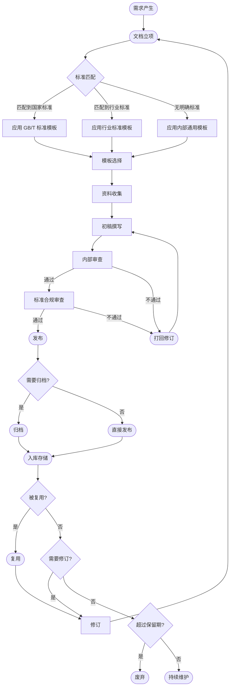
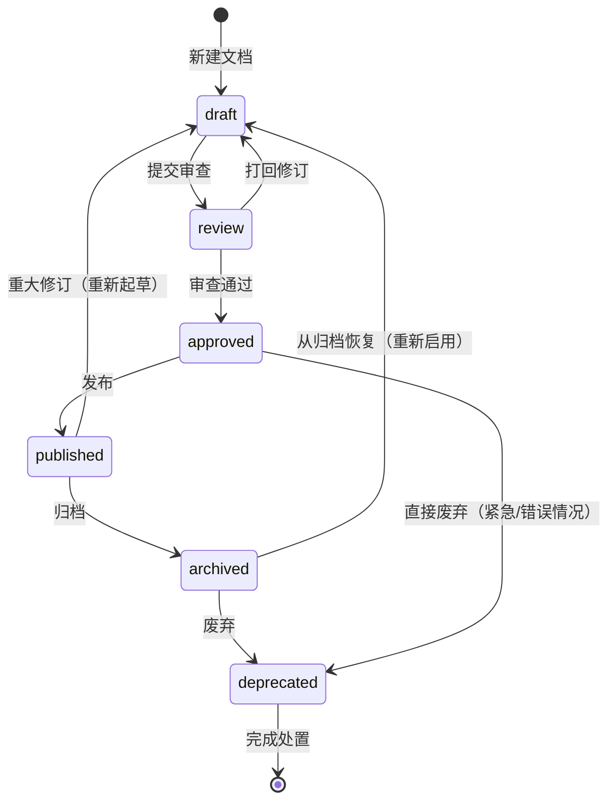
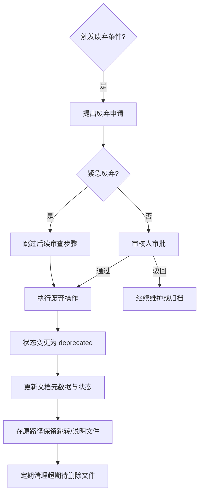

# 文档分类体系与生命周期规范

> 本规范为「国家标准驱动的文档管理与工程化写作规范」Skill 的核心框架，定义文档的分类结构、生命周期流程、状态机、元数据及版本控制规则。所有文档均须遵循本规范进行管理。

---

## 1. 文档分类体系

### 一级分类总览

| 编号 | 一级分类 | 英文名 | 负责角色 | 主要标准依据 |
|:---:|---------|-------|---------|------------|
| A | 学术文档 | Academic | 研究者/作者 | GB/T 7713、GB/T 7714 |
| B | 软件工程文档 | Software Engineering | 开发工程师/架构师 | GB/T 8566、GB/T 9385 |
| C | 产品文档 | Product | 产品经理 | GB/T 35637、ISO/IEC/IEEE 15288 |
| D | 项目管理文档 | Project Management | 项目经理 | GB/T 24353、PMBOK |
| E | 技术知识文档 | Technical Knowledge | 技术专家/运维 | ISO/IEC 27001、IEEE 829 |
| F | 交付验收文档 | Delivery & Acceptance | 交付经理/客户 | GB/T 16260、合同条款 |
| G | 会议协作文档 | Meeting & Collaboration | 主持/记录人 | 组织内部流程 |
| H | 运维与部署文档 | Operations & Deployment | 运维工程师 | ISO/IEC 14764、ITIL |

---

### 二级分类明细

#### A. 学术文档（Academic）

| 二级分类 | 说明 | 模板标准 |
|---------|------|---------|
| A1 研究论文 | 期刊/会议论文、研究报告 | GB/T 7713.1-2006 |
| A2 学位论文 | 学士/硕士/博士学位论文 | GB/T 7713.3-2009 |
| A3 学术报告 | 研究报告、技术报告（内部/外部） | GB/T 7713-1987 |
| A4 文献综述 | 领域调研、综述文章 | GB/T 7714-2015（引用） |
| A5 学术通信 | 会议摘要、海报摘要、给编辑的信 | 期刊/会议投稿要求 |

#### B. 软件工程文档（Software Engineering）

| 二级分类 | 说明 | 模板标准 |
|---------|------|---------|
| B1 需求文档 | 需求规格说明书（SRS）、用户故事、用例规约 | GB/T 9385-2023 |
| B2 设计文档 | 架构设计说明书、详细设计、数据库设计 | GB/T 9386-2023 |
| B3 实现文档 | 代码规范、接口规格说明（IDL）、模块说明 | 组织内编码规范 |
| B4 测试文档 | 测试计划、测试用例、测试报告、缺陷报告 | GB/T 9386-2023 |
| B5 质量文档 | 质量管理计划、评审报告、度量和指标报告 | GB/T 16260 系列 |
| B6 配置管理文档 | 配置管理计划、变更记录、基线报告 | GB/T 8566 |
| B7 安全文档 | 安全设计文档、威胁建模、渗透测试报告 | ISO/IEC 27001 附录A |
| B8 开源合规文档 | 许可证合规报告、第三方组件清单（SBOM） | SPDX 规范 |

#### C. 产品文档（Product）

| 二级分类 | 说明 | 模板标准 |
|---------|------|---------|
| C1 产品需求文档（PRD） | 产品功能需求、非功能需求 | 内部模板 |
| C2 产品路线图 | Roadmap、版本规划、功能优先级 | 内部模板 |
| C3 用户手册 | 操作手册、使用指南、功能说明 | GB/T 19652（参考） |
| C4 帮助文档 | 在线帮助、FAQ、知识库文章 | 内部模板 |
| C5 产品演示文档 | Demo 脚本、产品介绍 PPT | 内部模板 |
| C6 竞品分析文档 | 竞品调研、特性对比分析 | 内部模板 |
| C7 市场需求文档（MRD） | 市场背景、用户画像、场景分析 | 内部模板 |

#### D. 项目管理文档（Project Management）

| 二级分类 | 说明 | 模板标准 |
|---------|------|---------|
| D1 项目启动文档 | 项目章程、可行性分析报告、立项报告 | GB/T 24353-2009 |
| D2 项目计划文档 | 项目计划（含 WBS、日程、资源计划） | PMBOK 2021 |
| D3 进度跟踪文档 | 周报、月报、里程碑报告、风险登记册 | 内部模板 |
| D4 项目收尾文档 | 项目总结、经验教训、移交报告 | PMBOK 2021 |
| D5 沟通管理文档 | 沟通计划、会议纪要、汇报材料 | 内部模板 |
| D6 质量管理文档 | 质量计划、质量报告、验收标准 | GB/T 16260 |
| D7 采购管理文档 | 供应商评估、合同文档、外包管理 | 合同条款 |

#### E. 技术知识文档（Technical Knowledge）

| 二级分类 | 说明 | 模板标准 |
|---------|------|---------|
| E1 技术方案 | 解决方案、技术选型报告、可行性分析 | 内部模板 |
| E2 架构决策记录 | ADR（Architecture Decision Records） | 内部模板 |
| E3 知识库文档 | 技术笔记、最佳实践、故障复盘报告 | 内部模板 |
| E4 API 文档 | OpenAPI/AsyncAPI 规约、SDK 文档 | OpenAPI 3.0/3.1 |
| E5 培训材料 | 技术培训 PPT、实验手册、学习路径 | 内部模板 |
| E6 标准规范文档 | 内部标准、规范、指南（normative） | 内部模板 |

#### F. 交付验收文档（Delivery & Acceptance）

| 二级分类 | 说明 | 模板标准 |
|---------|------|---------|
| F1 交付计划 | 交付范围、里程碑、资源承诺 | 合同条款 |
| F2 验收测试报告 | 系统集成测试报告、用户验收测试报告 | GB/T 16260 |
| F3 交付物清单 | 交付物清单、介质清单、文档清单 | 合同条款 |
| F4 验收确认书 | 验收证书、签字确认单 | 合同条款 |
| F5 培训记录 | 客户培训记录、培训完成证明 | 合同条款 |
| F6 运维交接文档 | 运维手册、应急响应流程、日常操作指南 | ITIL / ISO/IEC 14764 |
| F7 质量保证证书 | 质量保证声明、符合性证明 | 合同条款 |

#### G. 会议协作文档（Meeting & Collaboration）

| 二级分类 | 说明 | 模板标准 |
|---------|------|---------|
| G1 会议纪要 | 例会/专题会纪要、行动项追踪 | 内部模板 |
| G2 决策记录 | 决策清单（Decisions）、RACI 矩阵 | 内部模板 |
| G3 头脑风暴文档 | 研讨会记录、创意收集、投票结果 | 内部模板 |
| G4 评审记录 | 设计评审、代码评审、文档评审记录 | 评审流程规范 |
| G5 状态报告 | 周状态报告、月度报告、同步报告 | 内部模板 |

#### H. 运维与部署文档（Operations & Deployment）

| 二级分类 | 说明 | 模板标准 |
|---------|------|---------|
| H1 部署文档 | 部署手册、升级方案、回滚方案 | 组织内部署规范 |
| H2 运维手册 | 日常运维操作手册、巡检指南 | ITIL 服务设计 |
| H3 应急预案 | 故障响应流程、灾难恢复计划（DRP） | ISO 22301 |
| H4 监控告警文档 | 监控指标定义、告警规则、阈值说明 | 组织内监控规范 |
| H5 容量规划文档 | 容量评估报告、扩容方案、性能报告 | 组织内规范 |
| H6 变更记录 | 变更申请（RFC）、变更审批、变更实施记录 | ISO/IEC 14764 / ITIL 变更管理 |
| H7 环境配置文档 | 环境配置参数、基础设施即代码（IaC）说明 | 组织内 DevOps 规范 |

---

## 2. 文档生命周期流程



### 生命周期关键阶段说明

| 阶段 | 触发条件 | 执行角色 | 产出物 |
|-----|---------|---------|-------|
| 需求产生 | 业务/项目/技术需求提出 | 提出方 | 需求说明 |
| 文档立项 | 确认需要产出正式文档 | 文档负责人 | 立项单 |
| 标准匹配 | 立项后确定适用标准 | 文档负责人 | 标准匹配表 |
| 模板选择 | 按分类选用对应模板 | 文档负责人 | 选定模板 |
| 资料收集 | 收集数据、参考材料 | 文档负责人 | 原始资料包 |
| 初稿撰写 | 按模板填充内容 | 文档负责人 | 初稿 |
| 内部审查 | 团队内部交叉评审 | 评审人 | 评审意见 |
| 标准合规审查 | 对照标准检查合规性 | 标准化专员/审核人 | 合规报告 |
| 发布 | 正式发布给相关方 | 文档负责人 | 正式版本 |
| 归档 | 归档到文档库 | 文档管理员 | 归档记录 |
| 复用 | 被新项目/文档引用 | 引用方 | 引用记录 |
| 修订 | 内容需要更新 | 文档负责人 | 修订版 |
| 废弃 | 超过保留期或被替代 | 文档管理员 | 废弃记录 |

---

## 3. 文档状态机



### 状态说明

| 状态 | 含义 | 可执行操作 |
|-----|------|---------|
| `draft` | 草稿：正在编写，尚未提交审查 | 编辑、提交审查、删除 |
| `review` | 审查中：已提交，等待审查结论 | 查看、审查（通过/打回） |
| `approved` | 已批准：审查通过，等待发布 | 发布、废弃 |
| `published` | 已发布：正式生效，供相关方使用 | 归档、修订、废弃 |
| `archived` | 已归档：转入归档库，不再活跃维护 | 恢复启用、废弃 |
| `deprecated` | 已废弃：正式下线，不再使用 | 查看（保留引用）、删除（超期后） |

---

## 4. 文档元数据规范

每个文档必须在文档头部或文档管理系统中填写以下元数据字段：

| 字段名 | 英文名 | 类型 | 必填 | 说明 | 示例 |
|-------|-------|:---:|:---:|------|-----|
| 标题 | title | string | ✅ | 文档的中文名称 | 《用户管理系统需求规格说明书》 |
| 类型 | doc_type | enum | ✅ | 分类编号，格式 `A1` / `B3` | B1 |
| 作者 | author | string | ✅ | 主要编写者姓名，多人以分号分隔 | 张三;李四 |
| 审核人 | reviewer | string | ✅ | 负责审核的人员姓名 | 王五 |
| 创建日期 | created_at | date | ✅ | ISO 8601 格式，YYYY-MM-DD | 2026-05-12 |
| 更新日期 | updated_at | date | ✅ | 最后一次重大更新的日期 | 2026-06-01 |
| 版本号 | version | string | ✅ | 语义化版本，格式 MAJOR.MINOR.PATCH | 1.3.0 |
| 状态 | status | enum | ✅ | 当前生命周期状态 | draft / review / approved / published / archived / deprecated |
| 适用范围 | scope | string | ⭕ | 适用项目/团队/部门的描述 | 「棱镜」项目组；平台技术部 |
| 关联项目 | project | string | ⭕ | 所归属的项目或产品名称 | 棱镜系统 / 伏羲平台 |
| 参考标准 | standards | string[] | ⭕ | 引用的国家标准/行业标准编号 | GB/T 9385-2023; ISO/IEC 27001:2022 |
| 关联文档 | related_docs | string[] | ⭕ | 相关文档的引用路径或编号列表 | B2-架构设计.md; E4-API文档.md |
| 存储路径 | path | string | ✅ | 文档在文件系统或文档库中的路径 | /docs/requirements/PRD-棱镜-v1.3.md |
| 标签 | tags | string[] | ⭕ | 自由标签，便于检索 | 需求;安全;高优 |
| 变更记录 | changelog | string | ⭕ | 变更历史摘要（详见版本控制规范） | 见文档末尾 Changelog 节 |

> **标注说明：** ✅ = 必填字段；⭕ = 建议填写字段。

### 元数据嵌入格式（YAML Front Matter）

```yaml
---
title: 用户管理系统需求规格说明书
doc_type: B1
author: 张三;李四
reviewer: 王五
created_at: 2026-05-12
updated_at: 2026-06-01
version: 1.3.0
status: published
scope: 「棱镜」项目组
project: 棱镜系统
standards:
  - GB/T 9385-2023
  - ISO/IEC 25010:2011
related_docs:
  - B2-棱镜系统架构设计.md
  - E4-用户服务API文档.md
path: /docs/requirements/棱镜/PRD-棱镜-v1.3.md
tags:
  - 需求
  - 用户管理
  - 高优
changelog: |
  1.3.0 2026-06-01 @张三
    - 新增第三方SSO集成需求章节
  1.2.0 2026-05-20 @李四
    - 补充性能非功能需求
  1.0.0 2026-05-12 @张三
    - 初版发布
---
```

---

## 5. 文档命名规范

### 命名规则

| 规则编号 | 规则描述 | 说明 |
|:-------:|---------|------|
| R1 | 统一使用中文命名 | 便于团队中文环境快速识别 |
| R2 | 格式：`{分类编号}-{文档标题简写}[-{版本号}].{扩展名}` | 分类编号前缀保证唯一性和归类 |
| R3 | 文档标题简写限 4~20 个汉字或 8~40 个英文字符 | 超长标题需精简 |
| R4 | 避免在文件名中出现空格，请使用连字符 `-` 或下划线 `_` 分隔 | 防止跨平台路径解析问题 |
| R5 | 版本号仅在需要多版本并存时在文件名中体现；单版本演进文件主名不加版本号 | 避免版本混乱 |
| R6 | 扩展名小写，与文档类型一致 | `.md` / `.docx` / `.pdf` / `.xlsx` |
| R7 | 禁止使用特殊字符：`\ / : * ? " < > |` | 操作系统限制 |
| R8 | 同一项目/主题的系列文档需保证前缀一致 | 便于分组查看 |

### 命名示例

| 文档类型 | 分类编号 | 示例文件名 |
|---------|:-------:|----------|
| 需求规格说明书 | B1 | `B1-用户管理系统需求规格说明书.md` |
| 架构设计说明书 | B2 | `B2-棱镜系统架构设计说明书-v2.0.md` |
| 测试用例 | B4 | `B4-登录模块测试用例.xlsx` |
| API 接口文档 | E4 | `E4-伏羲平台开放API文档-v3.1.pdf` |
| 会议纪要 | G1 | `G1-棱镜项目第5次周例会纪要-20260512.md` |
| 部署手册 | H1 | `H1-生产环境部署手册-v1.2.md` |
| 项目章程 | D1 | `D1-棱镜项目章程.docx` |
| 验收报告 | F2 | `F2-棱镜系统UAT验收报告.pdf` |
| 变更记录 | H6 | `H6-伏羲平台变更记录-202606.xlsx` |

---

## 6. 文档版本控制规范

### 语义化版本（Semantic Versioning）

文档版本号格式：`MAJOR.MINOR.PATCH`，遵循以下规则：

| 变更类型 | 触发条件 | 版本号变化规则 | 示例 |
|---------|---------|:------------:|-----|
| **PATCH（补丁）** | 修正错别字、格式调整、不影响理解的小幅内容修改 | PATCH +1 | 1.0.0 → 1.0.1 |
| **MINOR（次版本）** | 新增章节/附件、补充说明、细化已有内容，不破坏兼容性 | MINOR +1，PATCH 归零 | 1.0.0 → 1.1.0 |
| **MAJOR（主版本）** | 重大结构调整、删减核心内容、变更适用范围、导致历史版本不兼容 | MAJOR +1，MINOR 和 PATCH 归零 | 1.0.0 → 2.0.0 |

### 版本状态与阶段前缀

在版本号前可标注阶段前缀，适用于预发布版本：

| 前缀 | 含义 | 示例 |
|-----|------|-----|
| `draft-` | 草稿中，尚未完成审查 | `draft-1.0.0` |
| `rc-` | Release Candidate，候选发布版本 | `rc-1.0.0` |
| `正式版本`（无前缀） | 经审查通过，已正式发布 | `1.0.0` |

### 变更记录格式（Changelog）

每个文档必须在末尾包含 Changelog 章节，格式如下：

```markdown
## Changelog

| 版本号 | 日期 | 作者 | 变更说明 |
|:-----:|:----:|:----:|---------|
| 2.1.0 | 2026-06-10 | @张三 | 新增第5章安全需求分析与威胁建模 |
| 2.0.0 | 2026-05-20 | @李四 | 重大重构：调整系统架构，新增微服务拆分方案 |
| 1.3.2 | 2026-05-15 | @王五 | 修正第3.2节性能指标数据错误 |
| 1.3.0 | 2026-05-10 | @张三 | 补充非功能需求章节（可扩展性、兼容性） |
| 1.2.0 | 2026-04-28 | @李四 | 新增第4章数据字典及ER图 |
| 1.1.0 | 2026-04-15 | @张三 | 补充第2章用户角色与权限体系 |
| 1.0.0 | 2026-04-01 | @张三 | 初版发布，完成需求基线定义 |
```

### 版本控制操作规则

| 规则 | 说明 |
|-----|------|
| V1 | 每个文档只能有一个当前有效版本，其他版本归档存储 |
| V2 | 版本升级必须由作者或审核人操作，禁止随意修改版本号 |
| V3 | 重大版本（MAJOR）发布前必须完成标准合规审查 |
| V4 | 变更记录须在版本发布后 24 小时内更新到 Changelog |
| V5 | 归档版本保留完整的 Changelog，不可删除历史记录 |
| V6 | 文档废弃后，最终版本号保持不变，不做递增 |

---

## 7. 文档归档规则

### 归档触发条件

满足以下任一条件时，文档应进入归档流程：

| 触发条件 | 说明 |
|---------|------|
| T1 | 项目正式结项，所有项目文档归档 |
| T2 | 文档新版发布，旧版自动归档（保留最近 2 个主版本） |
| T3 | 文档所对应的功能/系统/标准已正式停用/废弃 |
| T4 | 文档超过规定维护周期且无更新需求 |
| T5 | 组织架构调整，相关项目/部门撤销 |

### 归档操作规范

| 规范项 | 要求 |
|-------|------|
| A1 | 归档前必须完成元数据填写，确保字段完整准确 |
| A2 | 归档文件命名加时间戳后缀，格式：`{原文件名}-归档-{YYYYMM}.{扩展名}` |
| A3 | 归档后原路径保留跳转链接（shortcut/alias），指向归档库新路径 |
| A4 | 归档文档设为 `archived` 状态，移除编辑权限，仅保留只读 |
| A5 | 归档记录须录入文档管理系统，包含：归档日期、归档人、存放路径、保留期限 |
| A6 | 归档后如需恢复使用，须由文档负责人提出申请，经审核后恢复为 `draft` 状态重新走审查流程 |
| A7 | 归档库按一级分类（A/B/C…）组织目录结构，内部按项目或年代进一步细分 |

### 保留期限

| 文档分类 | 最短保留期限 | 说明 |
|---------|:----------:|------|
| 软件工程文档（需求/设计/测试） | 项目生命周期 + 5年 | 涉及系统维护和技术传承 |
| 交付验收文档 | 合同终止后 10 年 | 法律合规与审计要求 |
| 财务相关文档 | 法规规定的最短年限 | 必须符合财务法规 |
| 会议纪要/决策记录 | 5 年 | 组织知识保留 |
| 运维与部署文档 | 系统生命周期内持续保留，系统下线后保留 3 年 | 运维知识保留 |
| 学术文档 | 永久保留或按机构规定 | 知识产权与学术积累 |

---

## 8. 文档废弃规则

### 废弃触发条件

满足以下任一条件时，文档应进入废弃流程：

| 触发条件 | 说明 |
|---------|------|
| D1 | 文档所对应的标准已被废止或被新版标准替代，且无参考价值 |
| D2 | 文档内容已完全被新版本覆盖，且旧版本超过保留期限 |
| D3 | 组织业务终止，文档对应的产品/项目已永久关闭且超过最短保留期 |
| D4 | 文档存在严重信息安全问题（如泄露密钥、敏感个人信息），须立即废弃 |
| D5 | 文档经审查认定为冗余/重复，且无历史参考价值 |

### 废弃流程



### 废弃操作规范

| 规范项 | 要求 |
|-------|------|
| F1 | 废弃申请须说明废弃原因，并提供关联文档（新版本或替代文档）的引用 |
| F2 | 审核人一般为文档的原审核人或文档管理员，紧急情况可由项目经理代签 |
| F3 | 废弃后文档状态更新为 `deprecated`，在文档头部明确标注「已废弃」及废弃日期 |
| F4 | 原存储路径不得立即删除物理文件，应保留跳转说明文件（`README-已废弃.md`）指向废弃库 |
| F5 | 废弃说明文件须包含：原文档标题、废弃日期、废弃原因、替代文档路径或「无替代」标注 |
| F6 | 涉及法律合规要求的重要文档（如合同、验收报告），废弃前须经法务审核 |
| F7 | 信息安全类废弃（泄密）须同时通知安全团队，启动安全事件处置流程 |
| F8 | 超期废弃文件（超过保留期限 + 2年）可执行物理删除，删除前须完成数据备份确认 |
| F9 | 废弃记录须同步更新文档管理系统的台账，确保台账与实际状态一致 |

### 废弃文档保留原则

以下文档**不得废弃**，仅可归档：

- 合同正本及附件
- 法律意见书、合规证明
- 项目结项审计报告
- 涉及知识产权的技术方案（专利申请前的版本）
- 安全评估报告（问题修复完成后仍需保留记录）

---

## 附录：分类编号速查表

| 编号 | 一级分类 | 编号 | 二级分类 |
|:---:|---------|:---:|---------|
| A | 学术文档 | A1-A5 | 研究论文、学位论文、学术报告、文献综述、学术通信 |
| B | 软件工程文档 | B1-B8 | 需求文档、设计文档、实现文档、测试文档、质量文档、配置管理文档、安全文档、开源合规文档 |
| C | 产品文档 | C1-C7 | PRD、路线图、用户手册、帮助文档、产品演示、竞品分析、MRD |
| D | 项目管理文档 | D1-D7 | 启动文档、计划文档、进度跟踪、收尾文档、沟通管理、质量管理、采购管理 |
| E | 技术知识文档 | E1-E6 | 技术方案、ADR、知识库、API文档、培训材料、标准规范 |
| F | 交付验收文档 | F1-F7 | 交付计划、验收测试报告、交付物清单、验收确认书、培训记录、运维交接文档、质量保证证书 |
| G | 会议协作文档 | G1-G5 | 会议纪要、决策记录、头脑风暴文档、评审记录、状态报告 |
| H | 运维与部署文档 | H1-H7 | 部署文档、运维手册、应急预案、监控告警文档、容量规划文档、变更记录、环境配置文档 |

---

*本规范由「文档分类与生命周期 Agent」生成，遵循 GB/T 8566、GB/T 9385、GB/T 9386、GB/T 16260、ISO/IEC 27001 等国家标准及行业最佳实践。*
