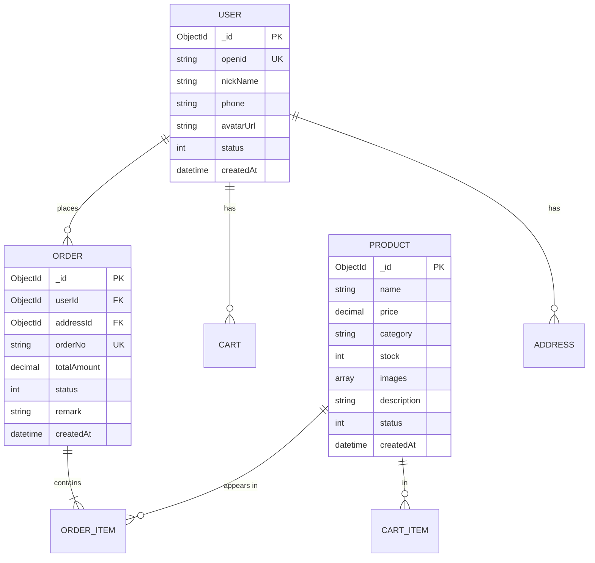

# 数据库设计说明书模板

> 本模板适用于软件工程项目数据库设计，课程项目和毕业设计可使用轻量版。

---

## 文档元数据

```markdown
文档名称：数据库设计说明书
项目名称：[项目名称]
文档版本：v1.0.0
作者：[姓名]
审核人：[姓名]
创建日期：YYYY-MM-DD
关联SRS：[SRS名称和版本]
关联HLD：[HLD名称和版本]
```

---

## 模板正文

```markdown
# 数据库设计说明书 v{版本}

---

## 1. 引言

### 1.1 目的

本文档定义[项目名称]的数据库设计，包括概念模型、逻辑模型、物理模型和详细表结构。

### 1.2 设计原则

1. **规范化**：符合第三范式（3NF），避免数据冗余
2. **可扩展性**：字段设计预留扩展空间
3. **命名规范**：使用统一的命名规范（小写下划线分隔）
4. **索引策略**：对高频查询字段建立索引

---

## 2. 概念模型（E-R图）



---

## 3. 逻辑模型

### 3.1 users 表（用户表）

| 字段名 | 数据类型 | 说明 | 约束 |
|---|---|---|---|
| _id | ObjectId | 主键 | PK, NOT NULL |
| openid | String | 微信openid | UNIQUE, NOT NULL |
| nickName | String | 昵称 | |
| phone | String | 手机号 | |
| avatarUrl | String | 头像URL | |
| status | Number | 状态（1正常/0禁用） | DEFAULT 1 |
| createdAt | Date | 创建时间 | NOT NULL |
| updatedAt | Date | 更新时间 | |

**索引：**

| 索引名称 | 字段 | 类型 | 说明 |
|---|---|---|---|
| idx_openid | openid | UNIQUE | 微信登录 |
| idx_phone | phone | INDEX | 手机号查询 |

### 3.2 products 表（商品表）

| 字段名 | 数据类型 | 说明 | 约束 |
|---|---|---|---|
| _id | ObjectId | 主键 | PK, NOT NULL |
| name | String | 商品名称 | NOT NULL |
| price | Decimal | 价格（元） | NOT NULL, ≥ 0 |
| category | String | 分类 | |
| stock | Number | 库存数量 | NOT NULL, DEFAULT 0 |
| images | Array | 图片URL列表 | |
| description | String | 商品描述 | |
| status | Number | 状态（1上架/0下架） | DEFAULT 1 |
| createdAt | Date | 创建时间 | NOT NULL |
| updatedAt | Date | 更新时间 | |

**索引：**

| 索引名称 | 字段 | 类型 | 说明 |
|---|---|---|---|
| idx_category_status | category, status | COMPOUND | 分类查询 |
| idx_status_created | status, createdAt | COMPOUND | 上架商品排序 |

### 3.3 orders 表（订单表）

| 字段名 | 数据类型 | 说明 | 约束 |
|---|---|---|---|
| _id | ObjectId | 主键 | PK, NOT NULL |
| userId | ObjectId | 用户ID | FK → users._id, NOT NULL |
| orderNo | String | 订单号 | UNIQUE, NOT NULL |
| totalAmount | Decimal | 订单总金额 | NOT NULL |
| status | Number | 订单状态 | NOT NULL |
| remark | String | 订单备注 | |
| paidAt | Date | 支付时间 | |
| createdAt | Date | 创建时间 | NOT NULL |
| updatedAt | Date | 更新时间 | |

**订单状态枚举：**

| 值 | 状态名 | 说明 |
|---|---|---|
| 0 | 已取消 | 用户取消/超时取消 |
| 1 | 待付款 | 等待用户支付 |
| 2 | 已付款 | 支付成功，待发货 |
| 3 | 已发货 | 商家已发货 |
| 4 | 已收货 | 用户确认收货 |
| 5 | 已完成 | 订单完成 |

**索引：**

| 索引名称 | 字段 | 类型 | 说明 |
|---|---|---|---|
| idx_userId_status | userId, status | COMPOUND | 用户订单查询 |
| idx_orderNo | orderNo | UNIQUE | 订单号查询 |
| idx_createdAt | createdAt | INDEX | 时间排序 |

### 3.4 order_items 表（订单项表）

| 字段名 | 数据类型 | 说明 | 约束 |
|---|---|---|---|
| _id | ObjectId | 主键 | PK, NOT NULL |
| orderId | ObjectId | 订单ID | FK → orders._id, NOT NULL |
| productId | ObjectId | 商品ID | FK → products._id, NOT NULL |
| productName | String | 商品名称（冗余） | NOT NULL |
| price | Decimal | 单价（冗余） | NOT NULL |
| quantity | Number | 购买数量 | NOT NULL, ≥ 1 |

### 3.5 carts 表（购物车表）

| 字段名 | 数据类型 | 说明 | 约束 |
|---|---|---|---|
| _id | ObjectId | 主键 | PK, NOT NULL |
| userId | ObjectId | 用户ID | FK → users._id, NOT NULL |
| productId | ObjectId | 商品ID | FK → products._id, NOT NULL |
| quantity | Number | 数量 | NOT NULL, ≥ 1 |
| createdAt | Date | 加入时间 | NOT NULL |
| updatedAt | Date | 更新时间 | |

**索引：**

| 索引名称 | 字段 | 类型 | 说明 |
|---|---|---|---|
| idx_userId | userId | INDEX | 用户购物车查询 |
| idx_userId_productId | userId, productId | COMPOUND, UNIQUE | 防重复添加 |

---

## 4. 命名规范

| 类型 | 命名规则 | 示例 |
|---|---|---|
| 表名 | 英文复数名词，下划线分隔 | users, products, orders |
| 字段名 | 英文名词，下划线分隔 | user_name, created_at |
| 主键 | _id | _id |
| 外键 | 关联表名单数_id | user_id, order_id |
| 索引 | idx_字段名 | idx_user_id |
| 唯一索引 | uk_字段名 | uk_openid |

---

## 检查清单

- [ ] 所有表有一列作为主键
- [ ] 外键关系正确
- [ ] 高频查询字段有索引
- [ ] 金额字段使用 Decimal（不适用 Float）
- [ ] 时间字段有 createdAt/updatedAt
- [ ] 状态字段有明确定义（枚举值表）
- [ ] 敏感字段有加密或脱敏处理
- [ ] 符合第三范式，无数据冗余
```
