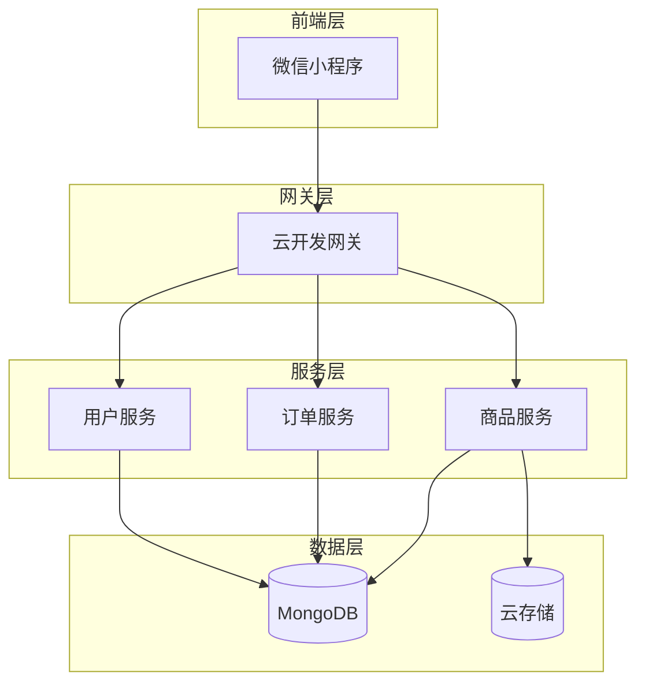
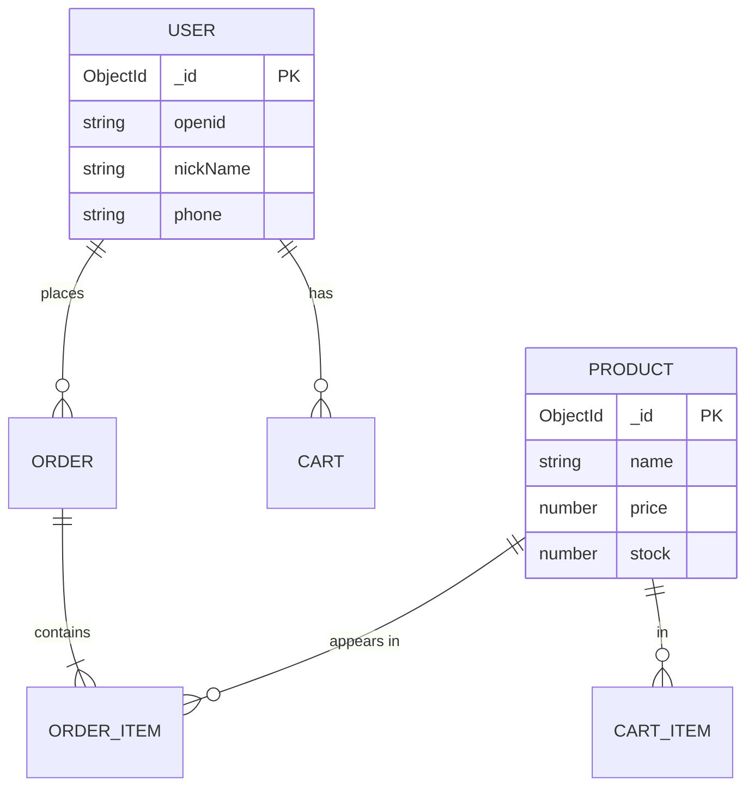
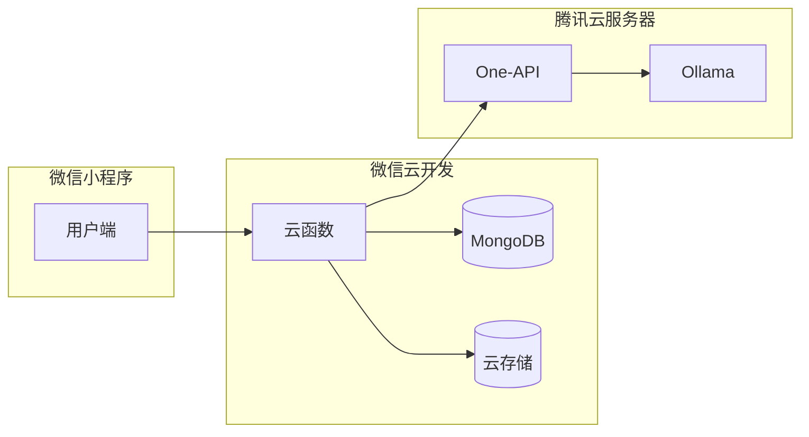

# 概要设计说明书（HLD）模板

> 本模板适用于软件工程项目概要设计，课程项目和毕业设计可使用轻量版。依据 GB/T 8567—2006《计算机软件文档编制规范》。

---

## 文档元数据

| 字段 | 内容 |
|---|---|
| **文档名称** | |
| **项目名称** | |
| **文档版本** | v1.0.0 |
| **作者** | |
| **审核人** | |
| **创建日期** | YYYY-MM-DD |
| **参考标准** | GB/T 8567—2006 |
| **关联SRS** | [SRS文档名称和版本] |

---

## 模板正文

```markdown
# 概要设计说明书 v{版本}

<div align="center">

**项目名称：** [项目名称]
**关联需求：** SRS v{x.x.x}
**文档版本：** v1.0.0
**编写日期：** YYYY-MM-DD
**编写人：** [姓名]
**审核人：** [姓名]

</div>

---

## 1. 引言

### 1.1 目的

> 说明本概要设计说明书的目的和范围。

本文档定义[项目名称]的概要设计，包括系统架构、模块划分、接口设计和数据设计，为详细设计提供依据。

### 1.2 范围

> 简要说明本设计的范围和限制。

### 1.3 定义与缩略语

| 术语 | 定义 |
|---|---|
| HLD | High-Level Design，概要设计 |
| API | Application Programming Interface，应用程序接口 |

### 1.4 参考资料

| 编号 | 资料名称 | 说明 |
|---|---|---|
| [1] | SRS v{x.x.x} | 软件需求规格说明书 |
| [2] | [其他参考] | |

---

## 2. 系统架构设计

### 2.1 总体架构图

> 在此插入系统架构图（Mermaid 或 draw.io 导出图片）



### 2.2 技术选型

| 技术类别 | 选用技术 | 选型依据 |
|---|---|---|
| 前端框架 | 微信小程序原生 | 目标用户群体，跨平台需求 |
| 后端运行时 | 微信云开发 | 降低运维成本，快速上线 |
| 数据库 | MongoDB（云开发） | 灵活的数据模型 |
| 存储 | 微信云存储 | 与小程序深度集成 |
| AI服务 | Ollama + One-API | Token成本可控 |
| 部署 | Docker Compose | 便于本地开发和部署 |

### 2.3 模块划分

| 模块名称 | 模块职责 | 主要类/函数 | 依赖模块 |
|---|---|---|---|
| 用户模块 | 用户注册、登录、认证 | UserService | 无 |
| 商品模块 | 商品管理、分类、搜索 | ProductService | 无 |
| 订单模块 | 订单创建、支付、取消 | OrderService | 用户模块、商品模块 |
| 购物车模块 | 购物车管理 | CartService | 用户模块、商品模块 |
| AI模块 | AI推荐、对话 | AIService | One-API |

### 2.4 分层架构

| 层次 | 说明 | 示例 |
|---|---|---|
| 接入层 | 处理用户请求 | 云函数入口 |
| 业务逻辑层 | 实现核心业务逻辑 | 云函数业务代码 |
| 数据访问层 | 封装数据库操作 | 数据库工具类 |
| 数据存储层 | 实际数据存储 | MongoDB |

---

## 3. 接口设计

### 3.1 接口概览

| 接口编号 | 接口路径 | 方法 | 功能 |
|---|---|---|---|
| API-001 | /api/user/login | POST | 用户登录 |
| API-002 | /api/product/list | GET | 获取商品列表 |
| API-003 | /api/order/create | POST | 创建订单 |
| API-004 | /api/cart/add | POST | 加入购物车 |

### 3.2 详细接口规格

**示例：API-001 用户登录**

```
POST /api/user/login

请求：
{
  "code": "微信登录code"
}

响应（成功）：
{
  "code": 0,
  "message": "success",
  "data": {
    "token": "JWT_TOKEN",
    "userInfo": {
      "openid": "xxx",
      "nickName": "xxx"
    }
  }
}

错误码：
  40001 - 参数错误
  40101 - 微信授权失败
```

**示例：API-003 创建订单**

```
POST /api/order/create

请求头：
  Authorization: Bearer {token}

请求：
{
  "items": [
    {"productId": "xxx", "quantity": 2},
    {"productId": "yyy", "quantity": 1}
  ],
  "addressId": "addr_xxx"
}

响应（成功）：
{
  "code": 0,
  "message": "success",
  "data": {
    "orderId": "ord_xxx",
    "totalAmount": 99.80,
    "status": "pending_payment"
  }
}

错误码：
  40001 - 参数错误
  40101 - 未授权
  40401 - 商品不存在
  40402 - 库存不足
```

---

## 4. 数据库设计（概要）

### 4.1 数据库选型

| 数据库 | 用途 | 选型依据 |
|---|---|---|
| MongoDB | 主数据库 | 灵活的数据模型，支持嵌套文档 |
| 云存储 | 文件存储 | 图片、视频等媒体文件 |

### 4.2 核心集合设计

**users 集合**

| 字段名 | 类型 | 说明 | 约束 |
|---|---|---|---|
| _id | ObjectId | 主键 | NOT NULL |
| openid | String | 微信openid | UNIQUE, NOT NULL |
| nickName | String | 昵称 | |
| avatarUrl | String | 头像URL | |
| phone | String | 手机号 | |
| createdAt | Date | 创建时间 | |

**products 集合**

| 字段名 | 类型 | 说明 | 约束 |
|---|---|---|---|
| _id | ObjectId | 主键 | NOT NULL |
| name | String | 商品名称 | NOT NULL |
| price | Number | 价格（元） | NOT NULL, ≥ 0 |
| category | String | 分类 | |
| stock | Number | 库存 | ≥ 0 |
| images | Array | 图片URL列表 | |
| status | Number | 状态（1上架/0下架） | DEFAULT 1 |
| createdAt | Date | 创建时间 | |

### 4.3 ER 关系图



---

## 5. 安全设计

| 安全措施 | 实现方案 |
|---|---|
| 身份认证 | JWT Token，有效期7天 |
| 数据传输 | HTTPS 强制 |
| 敏感数据 | 手机号加密存储 |
| 接口防护 | 频率限制（每IP 100次/分钟） |
| 输入校验 | 云函数入口参数校验 |

---

## 6. 部署架构



### 环境配置

| 环境 | 配置 |
|---|---|
| 开发环境 | 本地 Docker Compose |
| 测试环境 | 腾讯云测试服务器 |
| 生产环境 | 腾讯云正式服务器 |

---

## 7. 关键技术问题

| 问题 | 描述 | 解决方案 | 风险 |
|---|---|---|---|
| AI Token 成本 | 预估 Token 消耗较高 | 本地 Ollama + One-API 按需调用 | Token 需监控 |
| 高并发 | 订单创建可能并发 | 乐观锁/消息队列 | 后续优化 |

---

## 检查清单

- [ ] 架构设计覆盖所有 SRS 需求
- [ ] 模块划分合理（单一职责、高内聚、低耦合）
- [ ] 接口规格完整（请求/响应/错误码）
- [ ] 数据库设计与需求一致
- [ ] 安全设计覆盖关键风险
- [ ] 关键技术问题有应对方案
