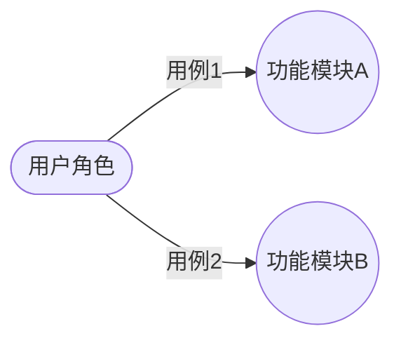

# 软件需求规格说明书（SRS）模板

> 本模板依据 GB/T 9385—2008《计算机软件需求规格说明规范》编写。适用于软件工程项目、轻量版适用于课程项目和毕业设计。

---

## 文档元数据

| 字段 | 内容 |
|---|---|
| **文档名称** | |
| **项目名称** | |
| **文档版本** | v1.0.0 |
| **作者** | |
| **审核人** | |
| **创建日期** | YYYY-MM-DD |
| **最后更新** | YYYY-MM-DD |
| **参考标准** | GB/T 9385—2008 |
| **状态** | draft / review / approved |

---

## 模板正文

```markdown
# 软件需求规格说明书

<div align="center">

**项目名称：** [项目名称]
**文档版本：** v1.0.0
**编写日期：** YYYY-MM-DD
**编写人：** [姓名]
**审核人：** [姓名]
**状态：** [draft/review/approved]

</div>

---

## 1. 引言

### 1.1 目的

> 说明编写本SRS的目的，明确本文档的预期读者。

**示例：**
本文档旨在完整地描述[项目名称]的功能需求和非功能需求，作为软件设计、编码和测试的依据。
本文档的预期读者包括：项目经理、软件架构师、开发人员、测试人员、用户代表。

### 1.2 范围

> 说明软件名称、软件的主要功能、适用领域和目标用户。

**示例：**
本系统名为[系统名称]，是一个[系统功能概述]的[系统类型]。
本系统适用于[目标用户]，用于解决[解决的问题]。

### 1.3 定义与缩略语

| 术语/缩略语 | 定义 |
|---|---|
| SRS | Software Requirements Specification，软件需求规格说明书 |
| [术语] | [定义] |

### 1.4 参考资料

| 编号 | 资料名称 | 来源/URL |
|---|---|---|
| [1] | GB/T 9385—2008 计算机软件需求规格说明规范 | 国家标准 |
| [2] | [其他参考资料] | |

---

## 2. 总体描述

### 2.1 产品前景

> 描述产品的背景、业务价值和市场定位。

### 2.2 用户特征

| 用户类型 | 描述 | 使用频率 | 专业知识水平 |
|---|---|---|---|
| [用户类型A] | [描述] | [高/中/低] | [专业/一般/入门] |
| [用户类型B] | [描述] | [高/中/低] | [专业/一般/入门] |

### 2.3 约束条件

| 约束类型 | 具体约束 |
|---|---|
| 硬件限制 | [如：客户端最低配置要求] |
| 软件限制 | [如：必须支持微信小程序环境] |
| 运行限制 | [如：必须兼容 iOS 12 及以上] |
| 预算限制 | [如：开发预算≤ X万元] |
| 时间限制 | [如：须在 Y 个月内完成] |

### 2.4 假设与依赖

| 假设/依赖 | 内容 | 风险 |
|---|---|---|
| [假设A] | [描述] | [风险说明] |
| [依赖A] | [依赖的外部系统/组件] | [风险说明] |

---

## 3. 需求规格（核心章节）

> **重要：需求规格描述的是"做什么"，不是"怎么做"。不要在此章节描述实现细节。**

### 3.1 功能需求

#### 3.1.1 [功能模块A]

**功能描述：**
> 简要描述此功能的目的和价值。

**用户故事：**
```
作为 [角色]，
我希望 [功能]，
以便 [收益/价值]。
```

**验收标准：**

| 编号 | 场景 | Given（前置条件） | When（操作） | Then（预期结果） | 优先级 |
|---|---|---|---|---|---|
| AC-A-001 | 正常流程 | [条件] | [操作] | [预期结果] | P0 |
| AC-A-002 | 异常流程 | [条件] | [操作] | [预期结果] | P1 |
| AC-A-003 | 边界条件 | [条件] | [操作] | [预期结果] | P2 |

**性能要求：**
- 响应时间：≤ [X] ms
- 并发支持：≥ [X] 用户

---

#### 3.1.2 [功能模块B]

（按同样格式填写）

### 3.2 非功能需求

#### 3.2.1 性能需求

| 指标 | 要求 | 测量方法 |
|---|---|---|
| 页面加载时间 | ≤ 2s（4G网络） | Chrome DevTools |
| API响应时间 | ≤ 500ms（P99） | APM监控 |
| 并发用户数 | ≥ 100 | 压力测试 |
| 系统可用性 | ≥ 99.9% | 监控统计 |

#### 3.2.2 安全性需求

| 需求编号 | 需求描述 |
|---|---|
| SEC-001 | 用户密码须加密存储（bcrypt） |
| SEC-002 | 所有 API 须进行身份认证 |
| SEC-003 | 敏感数据须加密传输（HTTPS） |
| SEC-004 | 须有防 SQL 注入/ XSS 攻击机制 |

#### 3.2.3 可靠性需求

| 指标 | 要求 |
|---|---|
| 系统可用性 | ≥ 99.9% |
| 平均无故障时间（MTBF） | ≥ 720小时 |
| 数据备份 | 每日自动备份，保留30天 |

#### 3.2.4 可维护性需求

| 指标 | 要求 |
|---|---|
| 代码可读性 | 符合编码规范，有完整注释 |
| 可扩展性 | 新增模块不影响现有功能 |
| 可测试性 | 核心模块单元测试覆盖率≥ 80% |

#### 3.2.5 易用性需求

| 指标 | 要求 |
|---|---|
| 操作步骤 | 核心操作≤ 3步完成 |
| 错误提示 | 操作失败须有友好提示 |
| 兼容性 | 须兼容主流浏览器/操作系统 |

---

## 4. 接口需求

### 4.1 用户接口

| 界面编号 | 界面名称 | 入口路径 | 主要功能 |
|---|---|---|---|
| UI-001 | [界面名称] | [页面路径] | [功能说明] |

> 详细说明见原型文档：[链接]

### 4.2 硬件接口

> （如涉及硬件交互，如打印机、扫码枪等）

### 4.3 软件接口

| 接口编号 | 接口名称 | 调用方式 | 用途 |
|---|---|---|---|
| API-001 | [接口名称] | REST API | [用途说明] |

**接口详细规格：**

```
POST /api/v1/[resource]

请求头：
  Content-Type: application/json
  Authorization: Bearer {token}

请求体：
{
  "field1": "string, 必填",
  "field2": "number, 可选"
}

响应（成功 200）：
{
  "code": 0,
  "message": "success",
  "data": { ... }
}

响应（错误）：
{
  "code": 40001,
  "message": "参数错误",
  "data": null
}

错误码说明：
  40001 - 参数错误
  40101 - 未授权
  40401 - 资源不存在
  50001 - 服务器错误
```

### 4.4 通信接口

| 类型 | 说明 |
|---|---|
| 网络协议 | HTTPS |
| 数据格式 | JSON |
| 安全机制 | TLS 1.2+ |

---

## 5. 其他需求

### 5.1 数据需求

| 数据类型 | 存储要求 | 保留期限 |
|---|---|---|
| 用户数据 | 加密存储 | 永久（或按法规） |
| 操作日志 | 审计存储 | ≥ 180天 |
| 业务数据 | 常规存储 | 按业务需求 |

### 5.2 法规与标准

> 涉及的个人信息处理须符合《个人信息保护法》等法规要求。

---

## 6. 附录

### 6.1 用例图



### 6.2 需求追踪矩阵

| 需求编号 | 需求描述 | 对应设计 | 对应测试用例 |
|---|---|---|---|
| FR-A-001 | [需求] | [设计引用] | [用例引用] |
| NFR-SEC-001 | [安全需求] | [设计引用] | [用例引用] |

---

## 检查清单

### 自查项

- [ ] 所有功能需求都有验收标准
- [ ] 非功能需求可量化
- [ ] 无实现细节（实现属于设计阶段）
- [ ] 需求无歧义
- [ ] 接口规格完整（含错误码）
- [ ] 用语前后一致
```

---

## 常见错误

1. **把实现细节写进 SRS**：如写了具体的数据库表名、类名、方法名 → 应只描述功能行为
2. **需求不可测试**：如"系统要快" → 应改为"响应时间≤500ms"
3. **遗漏异常流程**：只写了正常流程 → 应补充异常和边界条件
4. **需求描述模糊**：使用"大约""可能""也许" → 应改为精确描述
