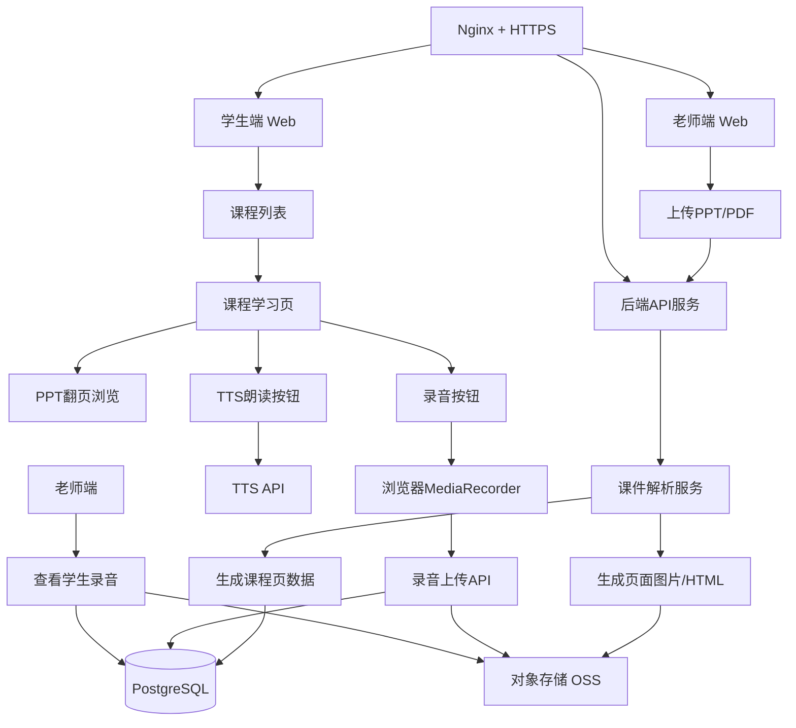
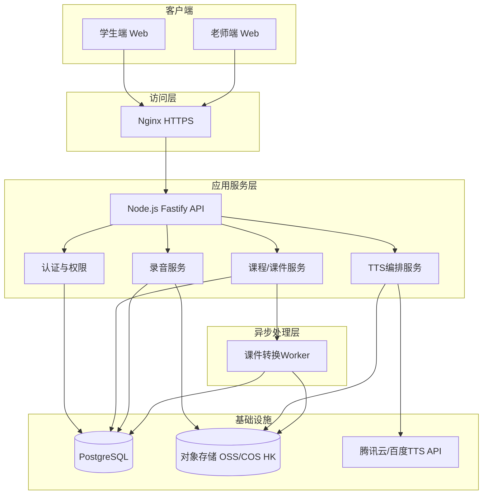

可以进行技术架构评审了，而且现在正是该评审的时候。

但评审重点不是“数据库表怎么设计、接口怎么写”，而是先判断：**架构方向有没有跑偏、MVP 能不能控住、哪些技术能力该做、哪些必须砍掉。**

---

# 1. 总体评审结论

我的判断：

> 当前技术架构可以成立，但必须从“在线教育平台架构”收缩成“PPT 驱动的语言跟读练习工具架构”。

也就是说，不要按“课程管理系统 / SaaS 平台 / 直播教学系统 / AI 教育平台”去设计。你真正要交付的是：

```text
PPT/PDF上传
→ 生成课程页
→ 学生翻页学习
→ TTS朗读中文
→ 学生录音跟读
→ 录音上传/播放/删除/下载
→ 老师查看学生录音
```

PRD 已经明确：MVP 唯一场景就是老师上传 PPT、系统解析课程页、学生 TTS 听读、录音、存储、删除和下载；并且说明“其他一律不做”。

---

# 2. 技术主管意见是对的，但要转化成架构决策

技术主管提了三个核心质疑：

1. 是否必须绑定腾讯会议？
    
2. SaaS 能不能控制住？
    
3. 现在还没到细接口和细数据表设计阶段。
    

这三个问题本质上是在提醒你：

> 不要一开始就把项目架构做重。

所以架构评审第一结论是：

|问题|评审结论|
|---|---|
|腾讯会议是否必须绑定|不要绑定。只做课后学习补充工具|
|是否做 SaaS|不做。只做 CZU 单租户|
|是否现在设计复杂数据表|不要。先做核心实体和主流程|
|是否做实时字幕|MVP 不做|
|是否做 AI 评分|MVP 不做|
|是否做课程管理系统|不做，只做课件驱动学习页|

技术方案评审文档里也明确建议：第一步 MVP 不要想太多，不要顺手设计成课程管理系统，而要围绕语言学习主题去设计。

---

# 3. 推荐目标架构

## MVP 架构图



这套架构的核心是：

```text
前端负责交互
后端负责业务编排
对象存储负责文件
PostgreSQL负责元数据
TTS API负责朗读
浏览器MediaRecorder负责录音
Nginx负责部署入口
```

这和 PRD 中的推荐技术选型基本一致：Next.js + TailwindCSS、Node.js + Express/Fastify、PostgreSQL、阿里云 OSS HK 节点、腾讯云/百度 TTS、Docker Compose + Nginx。

---

# 4. 架构分层评审

## 4.1 前端层

实际选型：

```text
React 18 + TypeScript + Vite       # 核心框架与语言
Tailwind CSS                        # 实用优先的样式框架
Motion (framer-motion)              # 动画动效库
Lucide React                        # 矢量图标库
React Context API                   # 国际化 (i18n) 管理
Google Fonts                        # 字体排版 (Plus Jakarta Sans / Inter / Noto SC)
Glassmorphism                       # 磨砂玻璃设计语言
```

选型理由：

1. **React 18 + TypeScript**：采用函数式组件和 Hooks 体系（useState、useEffect、useContext），TypeScript 静态类型检查保障代码健壮性和可读性，减少运行时错误。

2. **Vite（替代 Next.js SSR）**：本项目的核心场景是课件翻页、TTS 朗读和录音，属于**客户端交互密集型应用**，不需要服务端渲染和 SEO。Vite 提供极速热更新（HMR）和更轻量的构建配置，开发体验和构建速度均优于 Next.js 的客户端渲染模式。

3. **Tailwind CSS**：实用优先的 CSS 框架，通过类名快速实现响应式布局和三端适配（手机/平板/桌面），高效控制内外间距与弹性布局。配合团队协作时样式一致性好，无需编写大量自定义 CSS。

4. **Motion (framer-motion)**：用于页面切换动画、按钮悬浮效果、进度条增长、登录/注册页面的入场动效。MVP 阶段不需要复杂动效，Motion 的声明式 API 可以低成本实现足够的交互质感。

5. **Lucide React**：整洁、一致、轻量的矢量图标库，用于侧边栏导航、状态统计卡片和各类操作按钮。相比 Font Awesome 等方案更现代，Tree-shaking 支持好。

6. **React Context API（国际化 i18n）**：通过 LanguageContext 管理全局语言切换（支持中文、英文、俄语），实现界面实时翻译。MVP 阶段不需要引入 react-intl 或 i18next 等重型国际化方案，Context API 足以胜任三语言切换场景。

7. **状态驱动路由（State-driven Routing）**：本项目未引入 React Router，而是采用基于状态的导航模式——通过顶级组件控制各 View（HomeView、LoginView、DashboardView）的平滑切换。对于 MVP 而言页面层级不深，状态驱动路由足以覆盖需求，且避免了额外依赖的配置开销。

8. **字体与视觉设计**：集成 Google Fonts——Plus Jakarta Sans（标题）、Inter（正文），中文内容适配 Noto Sans SC。侧边栏、登录弹窗和统计卡片大量使用 Glassmorphism（背景模糊 + 半透明边框），体现现代设计感。

关键页面：

```text
/login                          → 登录页（含入场动画）
/student/courses                → 学生课程列表
/student/courses/:id/pages/:pageNo → 课件翻页学习页（核心交互）
/student/recordings             → 学生录音管理
/teacher/courses                → 老师课程管理
/teacher/courses/:id            → 课程详情与录音查看
/teacher/recordings             → 全部录音总览
```

> **与原方案（Next.js + TailwindCSS）的差异分析**：原方案假设使用 Next.js 全栈框架，但实际 MVP 分析表明前端无需 SSR、无需 API Routes、无需文件系统路由——React 18 + Vite 能提供更快的 HMR 和更轻量的构建产物。状态驱动路由替代 React Router 也符合 MVP 的"够用就行"原则。这套选型的核心哲学是：**只要客户端渲染能解决的问题，就不引入服务端框架的复杂度。**

---

## 4.2 后端层

推荐：

```text
Node.js + Fastify / Express
```

如果团队更熟 Node，就用 Node。不要为了“看起来高级”换技术栈。

后端第一阶段只需要提供这些能力：

```text
用户登录
课程创建
PPT/PDF上传
课程页查询
TTS文本请求
录音上传
录音列表
录音删除
录音下载链接
老师查看学生录音
```

不要现在就做复杂接口设计。技术主管说“远远没到数据设计和接口设计阶段”，这句话不是说不用设计，而是说现在不要陷入过早精细化。

---

## 4.3 文件存储层

推荐：

```text
阿里云 OSS HK 节点 / 腾讯云 COS 香港节点
```

你这里最核心的不是服务器，而是文件：

```text
PPT原文件
PPT解析后的页面图片
学生录音文件
老师录播视频
```

所以文件不要全塞进服务器本地磁盘。MVP 可以本地存，但正式演示和后续使用建议直接上对象存储。

PRD 的存储设计也已经明确：PPT 解析后的图片/HTML、学生录音、录播视频放对象存储，结构化数据放 PostgreSQL。

---

## 4.4 数据库层

推荐：

```text
PostgreSQL
```

MVP 阶段只保留五张核心表：

```text
user
course
course_page
recording
lecture_recording
```

不要一开始做完整的：

```text
school
grade
class
student
teacher
tenant
organization
payment
rank
exam
question_bank
```

需求分析文档里虽然出现了学校、年级、班级、学生表，以及学校认证、多学校服务等内容，但这些更像后期平台化设计，不适合作为 MVP 起点。

---

# 5. 当前必须砍掉的架构能力

## 5.1 实时双语字幕：先砍

需求分析里把实时双语字幕列为核心价值和高优先级功能，但 PRD 后来已经把它从 MVP 砍掉，原因是 GPU 推理或大模型 API 成本不可控。

评审结论：

```text
MVP不做实时字幕。
v2.0再讨论。
```

替代方案：

```text
老师课前上传PPT文本
系统对PPT文本做中文/俄语/哈语静态展示
需要朗读的中文句子调用TTS
```

---

## 5.2 SaaS 多租户：先砍

SaaS 是后期商业化架构，不是 MVP 架构。

当前只做：

```text
单学校
单组织
单租户
少量老师
少量学生
```

技术主管也明确建议先跑通单租户版本，后续再谈 SaaS。

数据库里可以预留一个字段：

```text
tenant_id nullable
```

但是不要围绕它设计复杂权限系统。

---

## 5.3 AI 语音评分：先砍

MVP 只做：

```text
听标准发音
自己录音
回放对比
老师查看
```

不做：

```text
自动评分
发音纠错
声调评分
音素级反馈
```

PRD 已经明确：AI 语音评测打分技术复杂度高，MVP 只做录音采集和存储。

---

## 5.4 在线编辑 PPT：坚决不做

系统只消费课件，不生产课件。

技术评审文档也提醒：不要把简单系统做成在线编辑教学材料的系统，文本材料审核应交给文科老师，系统最多做基础敏感词和意识形态审核。

---

# 6. 技术架构风险清单

## 风险 1：PPT 解析不稳定

PPT 解析是整个系统的第一关。

建议第一版不要追求复杂还原：

```text
PPT/PDF → 每页图片
```

不要一开始做：

```text
PPT → 可编辑HTML
PPT动画还原
PPT内嵌视频解析
复杂版式识别
```

MVP 目标是能翻页、能绑定朗读文本、能练习。

---

## 风险 2：录音兼容性

浏览器录音建议使用：

```text
MediaRecorder API
WebM/Opus
```

但 Safari/iOS 兼容性需要测试。学生如果主要用手机，这个风险很大。

建议架构上准备：

```text
优先支持 Chrome / Edge / Android Chrome
iOS Safari 单独测试
必要时引入 polyfill 或降级方案
```

---

## 风险 3：对象存储费用和带宽

技术评审里提到，如果自己搓视频流，云资源会比较大，收费问题要考虑清楚。

所以：

```text
录音文件可以直接存OSS
录播视频先限制大小
视频不要一开始做大规模转码
不要自建视频流平台
```

---

## 风险 4：跨境访问

目标用户是哈萨克斯坦留学生，需求文档已确认产品形态是 Web 自适应，目标用户是哈萨克斯坦留学生。

所以部署要优先考虑：

```text
香港节点
HTTPS
对象存储CDN
页面资源压缩
接口响应时间
```

不要部署在国内备案链路上拖慢项目。

---

# 7. 推荐最终技术选型

|层级|推荐方案|评审意见|
|---|---|---|
|前端|React 18 + TypeScript + Vite + TailwindCSS|客户端交互密集型场景，无需 SSR，Vite HMR 更快|
|后端|Node.js + Fastify|比 Express 更规整，也适合 API|
|数据库|PostgreSQL|保留|
|ORM|Prisma|对 Node 团队友好|
|文件存储|OSS/COS 香港节点|必须尽早接入|
|PPT 解析|LibreOffice Headless + PDF/Image 转换|第一版转图片即可|
|TTS|腾讯云/百度语音合成 API|MVP 用第三方，不自研|
|录音|MediaRecorder + WebM/Opus|注意移动端兼容|
|部署|Docker Compose + Nginx + HTTPS|合理|
|实时字幕|暂不实现|v2.0 再做|
|AI评分|暂不实现|v1.0/v2.0 再做|
|SaaS|暂不实现|只预留字段|

---

# 8. 建议的 MVP 技术里程碑

## Milestone 1：课件链路

```text
老师上传PPT/PDF
→ 后端接收文件
→ 转换为每页图片
→ 存入对象存储
→ 生成course_page
→ 学生端可以翻页查看
```

## Milestone 2：TTS 链路

```text
每页配置audio_text
→ 学生点击朗读
→ 后端调用TTS API
→ 返回音频URL或音频流
→ 前端播放
```

## Milestone 3：录音链路

```text
学生点击录音
→ MediaRecorder采集
→ 上传WebM/Opus
→ 存OSS
→ recording表记录student_id/course_id/page_number/audio_url
→ 学生可播放/下载/删除
```

## Milestone 4：老师查看链路

```text
老师进入课程
→ 按课程/学生/页码筛选
→ 查看学生录音
→ 播放录音
```

## Milestone 5：录播回看，能做就做

```text
老师端getDisplayMedia录屏
→ 保存WebM
→ 上传OSS
→ 学生回看
```

录播不是最小闭环的核心，别让它拖死项目。

---

# 9. 架构评审后的最终版 Mermaid



---

# 10. 最终评审意见

可以进入技术架构评审，但结论必须收敛成这句话：

> **LingoBridge MVP 不是在线教育平台，而是一个“PPT 课件驱动的中文跟读练习工具”。架构只服务于课件解析、TTS、学生录音、录音管理和单租户部署。**

下一步不要急着写大而全的技术方案，应该输出一份更短的：

```text
《LingoBridge MVP 技术架构评审结论》
```

里面只保留：

```text
1. 架构目标
2. 核心链路
3. 技术选型
4. 不做清单
5. 风险与降级方案
6. 两周交付计划
```

这比继续堆功能清单更有价值。