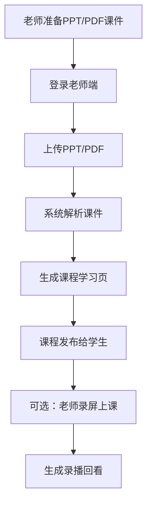
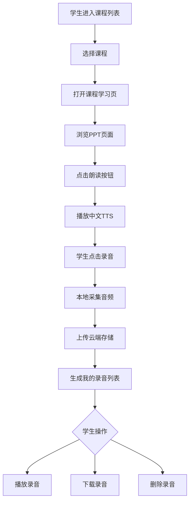
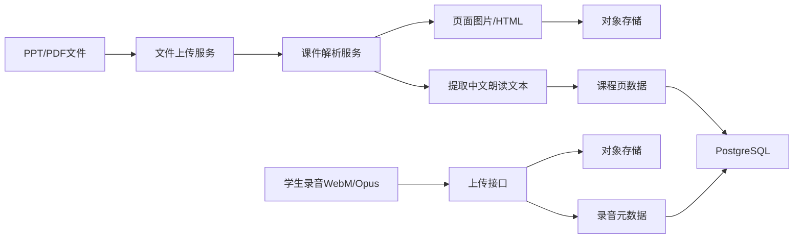
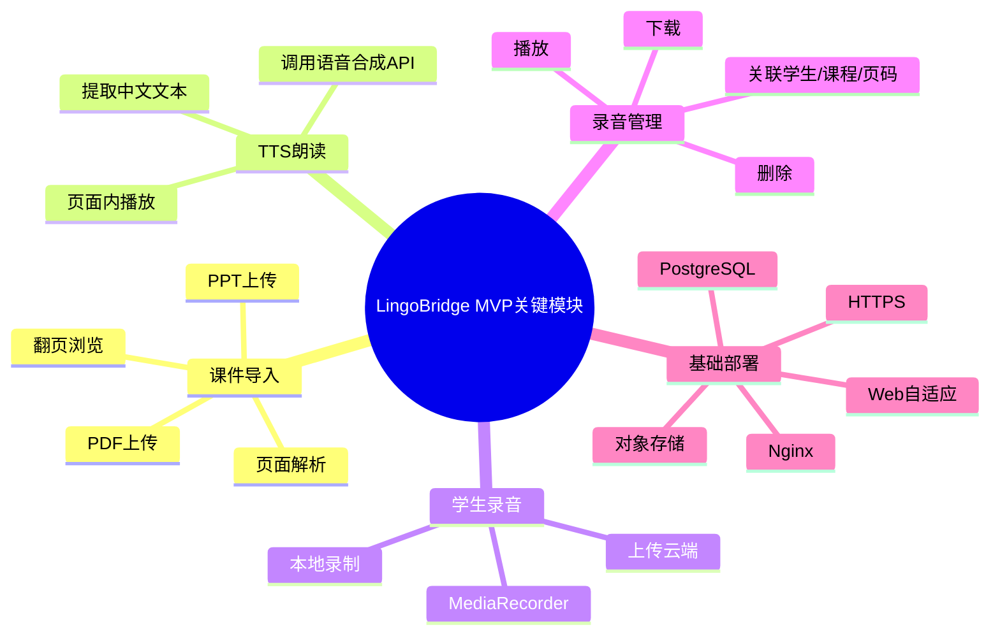
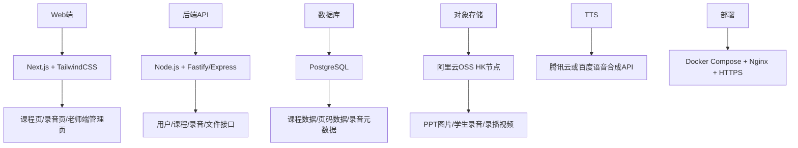
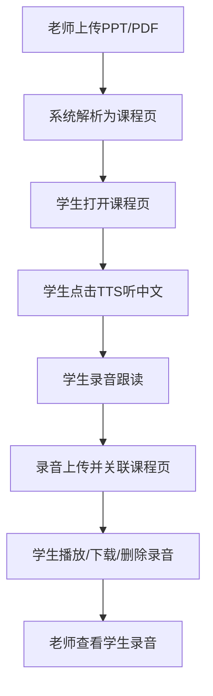

你这两个文档里，真正要抓的不是“功能清单”，而是**一条最短可交付关键路径**。

# LingoBridge 核心关键路径

## 1. 产品主线

LingoBridge 的核心不是课程管理系统，也不是完整在线教育平台，而是：

> **老师上传 PPT → 系统生成课程练习页 → 学生跟着 PPT 听中文发音 → 学生录音跟读 → 系统保存录音 → 老师/学生可回看录音结果。**

PRD 里已经明确说：MVP 唯一需要跑通的链路就是“老师上传PPT → 系统解析生成课程页 → 学生进入练习 → 点击按钮播放中文TTS → 录制本地录音 → 录音存储/同步 → 支持录音删除、下载本地”。这就是当前版本的生命线。

---

# 2. 第一关键路径：老师侧

## 老师端路径

老师端只需要先做三件事：

1. 上传 PPT/PDF
    
2. 系统把课件变成可浏览的课程页
    
3. 发布给学生练习
    

录屏回看是高价值功能，但不是第一刀最核心的验证点。PRD 把“PPT导入、课程练习同步、中文TTS、录音采集、录音存储、录音管理、三语界面、录播回看”列为 MVP 功能，其中真正构成闭环的是 PPT 导入、TTS、录音和录音管理。

---

# 3. 第二关键路径：学生侧

## 学生端路径

学生端的最小闭环是：

> 看课件 → 听标准发音 → 自己跟读录音 → 回放对比 → 保存/删除/下载。

需求分析文档里提到学生的核心场景包括“课后练习发音和音标、韵脚/声母练习、课前预习、当日课程作业、课程练习”等，但 MVP 不应该一次性全做。当前要先抓“课后跟读练习”这个最低成本、最高验证价值的场景。

---

# 4. 第三关键路径：系统侧

## 系统处理路径

系统底层只要解决两类数据：

|数据|存哪里|目的|
|---|---|---|
|结构化数据|PostgreSQL|用户、课程、页码、录音元数据|
|文件数据|对象存储|PPT解析图、录音、录播视频|

PRD 里已经给出核心实体：`user`、`course`、`course_page`、`recording`、`lecture_recording`，这说明你的数据库第一版不需要复杂的学校、年级、班级、多租户结构。

---

# 5. 当前最应该关注的 5 个核心模块

不要被两个文档里的“大功能”带偏。现在只关注这五个：

需求分析文档里有实时双语字幕、电子试卷、班级排名、学校认证、多学校服务、国际付费等功能，但这些应该后置。它们属于平台化扩展，不属于 MVP 的关键路径。

---

# 6. 技术选型应该围绕关键路径定

你的技术选型不要从“未来想做什么”倒推，而要从“当前闭环要跑通什么”倒推。

## 推荐技术路径

PRD 里建议的技术选型是：前端 Next.js + TailwindCSS，后端 Node.js + Express/Fastify，数据库 PostgreSQL，对象存储阿里云 OSS 香港节点，TTS 使用腾讯云或百度语音合成 API，部署使用 Docker Compose + Nginx。

---

# 7. 当前版本不要做什么

现在必须砍掉这些：

|不做|原因|
|---|---|
|实时双语字幕|技术成本高，MVP 不稳定|
|AI语音评分|复杂度高，先录音留痕|
|班级积分排名|会把你带向运营系统|
|电子试卷系统|会把你带向考试系统|
|多学校/多租户|会把你带向 SaaS 架构|
|国际支付|当前没有变现闭环|
|在线编辑 PPT|系统只消费课件，不生产课件|

PRD 里已经明确“不做在线编辑PPT、实时双语字幕、弹幕、多租户SaaS、国际支付、AI语音评测打分”等内容，这个边界非常重要。

---

# 8. 最终关键路径压缩版

你现在只需要盯住这一条：

一句话：

> **先做“PPT驱动的中文跟读练习系统”，不要做“大而全的在线教育平台”。**

这条路径跑通后，再考虑录播、AI评分、双语字幕、班级排名和学校认证。