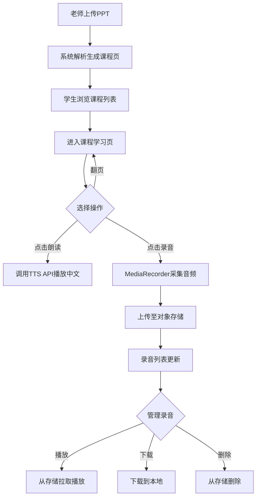

# LingoBridge MVP PRD v2.0

> 基于二次需求访谈重写，聚焦单租户（CZU）最小可行产品
> 编制日期：2026-05-06

---

## 1. 产品定位

**一句话**：哈萨克斯坦留学生的中文学习工具网站，跟着老师PPT走，课后能练发音。

**不是**：课程管理系统、在线编辑器、社交平台、SaaS多租户平台。

---

## 2. MVP核心闭环（唯一场景）

```
老师上传PPT → 系统解析生成课程页 → 学生进入练习
→ 点击按钮播放中文TTS → 录制本地录音 → 录音存储/同步
→ 支持录音删除、下载本地
```

**这是MVP唯一需要跑通的链路，其他一律不做。**

---

## 3. 功能边界（做/不做）

### 做（MVP）

| ID  | 功能     | 说明                         |
| --- | ------ | -------------------------- |
| F01 | PPT导入  | 上传PPT/PDF，系统解析为课程页面，支持翻页浏览 |
| F02 | 课程练习同步 | PPT内容与练习题关联，学生按课程进度练习      |
| F03 | 中文TTS  | 课程页内按钮触发TTS，朗读中文内容（调用API）  |
| F04 | 录音采集   | 学生端MediaRecorder录制本地音频     |
| F05 | 录音存储   | 音频上传至云端对象存储，关联学生-课程-页码     |
| F06 | 录音管理   | 学生可删除、下载自己的录音              |
| F07 | 哈语适配   | UI界面支持哈萨克语切换（中文/俄语/哈语三语）   |
| F08 | 录播回看   | 老师端录屏功能，课程视频存储与回看          |
实现‘老师端录屏功能，课程视频支持存储与回看；学生端可以在谷歌日历中回看对应日期的历史录制视频’；老师的在线live支持两种模式：1.本地模式，通过屏幕复制将本地电脑屏幕投射到直播间；2.多媒体嵌入模式（将pdf上传，支持pdf翻页播放和canvas层进行绘画、支持老师的本地设备摄像头打开）。除此之外，修复权限bug，我一旦点击live里的申请录音、申请本地摄像头，浏览器会提示打开权限，但是我再次点击摄像头应该出现的是申请浏览器关闭本地摄像头调用；但是实践情况是退出后仍然能看到摄像头在被调用，没有关闭，必须手动到浏览器设置摄像头权限才能关闭，需要你修复这个bug

教师端在后台需要新增课件上传按钮，可以选择上传的文件：1.pptx2.pdf3.excel
其中pptx是上课的课件ppt；pdf可以为自己的课程资料，在MVP阶段也可以是pptx的pdf转换版；excel是课后练习或者课前预习的题目表单；系统在识别后会同步到学生端的课程练习进度中去（对应当前课时的进度作业）
在直播时，教师可以选择1.本地投屏2.上传/选择已有pdf课件

### 不做（MVP）

| 功能 | 原因 |
|------|------|
| 在线编辑PPT | 系统只消费内容，不生产内容 |
| 实时双语字幕 | 需要GPU推理/大模型API，MVP阶段成本不可控 |
| 弹幕系统 | 社交功能，偏离核心学习闭环 |
| 多租户SaaS | 单租户CZU先跑通，SaaS架构预留但不实现 |
| ICP备案 | HK服务器不需要，国内访问走HK节点即可 |
| 国际支付 | 无变现需求 |
| AI语音评测打分 | 技术复杂度高，MVP只做录音采集+存储 |
| 老师端虚拟背景 | 浏览器端实现复杂，可后续迭代 |

---

## 4. 用户故事

### US1：学生阿合买提课后练习发音

> 阿合买提上完今天的课，打开LingoBridge，看到老师上传的新PPT课件。
> 他翻到第3页，点击"朗读"按钮听到标准中文发音，然后点击"录音"跟读一遍。
> 系统保存了他的录音，他可以反复播放对比，也可以下载到本地。

### US2：老师王老师上传课件并录课

> 王老师备好PPT，登录LingoBridge上传课件，系统自动生成课程练习页。
> 上课时她打开LingoBridge的录屏模式，边讲边翻PPT，课程结束后录播自动保存。
> 学生课后可以回看录播，跟着PPT练习。

---

## 5. 功能结构

```
LingoBridge MVP
├── 学生端（Web，自适应Mobile/iPad）
│   ├── 课程列表页
│   │   └── 按课次排列，显示课件名称+日期
│   ├── 课程学习页
│   │   ├── PPT翻页浏览
│   │   ├── TTS朗读按钮（中文内容）
│   │   ├── 录音按钮（MediaRecorder）
│   │   ├── 我的录音列表（播放/删除/下载）
│   │   └── 哈语/俄语/中文界面切换
│   └── 录播回看页
│       └── 视频播放器 + PPT时间轴同步
│
├── 老师端（Web）
│   ├── 课件管理
│   │   ├── 上传PPT/PDF
│   │   └── 课件与课程关联
│   ├── 录课控制台
│   │   ├── 屏幕录制（getDisplayMedia）
│   │   ├── 摄像头画面（可选）
│   │   └── 录播管理（查看/删除）
│   └── 学生录音查看
│       └── 按课程/学生筛选，听取录音
│
└── 后台（开发管理用）
    ├── 用户管理（学生/老师账号）
    └── 存储用量监控
```

---

## 6. 业务流程



---

## 7. 交互设计

### 7.1 学生端 - 课程学习页

```
┌──────────────────────────────────────┐
│  ← 返回   第三课：自我介绍    🌐 语言切换  │
├──────────────────────────────────────┤
│                                      │
│         PPT 内容展示区域              │
│      （支持左右滑动/点击翻页）          │
│                                      │
│         第 3 / 12 页                  │
├──────────────────────────────────────┤
│  🔊 朗读此页    🎙️ 录制跟读           │
├──────────────────────────────────────┤
│  📁 我的录音（3条）                    │
│  ├ 🎵 录音1 - 2分前  ▶️ 📥 🗑️        │
│  ├ 🎵 录音2 - 1小时前 ▶️ 📥 🗑️       │
│  └ 🎵 录音3 - 昨天   ▶️ 📥 🗑️        │
└──────────────────────────────────────┘
```

### 7.2 老师端 - 录课控制台

```
┌──────────────────────────────────────┐
│  📹 录课控制台     🔴 录制中 12:34     │
├──────────────────────────────────────┤
│  ┌────────────┐  ┌────────────┐      │
│  │  屏幕共享   │  │  摄像头    │      │
│  │  PPT画面   │  │  (可选)    │      │
│  └────────────┘  └────────────┘      │
├──────────────────────────────────────┤
│  ⏸ 暂停   ⏹ 停止录制   📤 结束并保存  │
└──────────────────────────────────────┘
```

---

## 8. 数据设计

### 8.1 核心实体

```sql
-- 用户
user (id, username, password_hash, role, display_name, language_pref, created_at)

-- 课程
course (id, teacher_id, title, description, created_at)

-- 课件页
course_page (id, course_id, page_number, content_html, audio_text, image_url)

-- 录音
recording (id, student_id, course_id, page_number, audio_url, duration_sec, created_at)

-- 录播
lecture_recording (id, course_id, teacher_id, video_url, duration_sec, created_at)
```

### 8.2 存储设计

| 数据类型 | 存储位置 | 说明 |
|---------|---------|------|
| PPT解析后的图片/HTML | 对象存储 | 按课程/页码组织 |
| 学生录音文件 | 对象存储 | WebM/Opus格式 |
| 录播视频 | 对象存储 | WebM格式 |
| 结构化数据 | PostgreSQL | 用户、课程、录音元数据 |

---

## 9. 技术选型

| 层级   | 选型                        | 理由               |
| ---- | ------------------------- | ---------------- |
| 前端   | Next.js + TailwindCSS     | SSR + 自适应 + 快速开发 |
| 后端   | Node.js + Express/Fastify | 团队技术栈            |
| 数据库  | PostgreSQL                | 关系型，够用           |
| 对象存储 | 阿里云OSS（HK节点）              | 便宜，CN2回程         |
| TTS  | 腾讯云/百度语音合成API             | 中文效果好，按量计费       |
| 服务器  | 阿里云轻量应用服务器（HK）            | 最便宜方案            |
| 部署   | Docker Compose + Nginx    | 一键拉起             |

---

## 10. 验收标准

| ID | 验收项 | 可量化标准 |
|----|--------|-----------|
| A1 | PPT上传 | 支持.pptx/.pdf，单文件≤50MB，解析成功率≥95% |
| A2 | 课程浏览 | 页面加载≤2s，翻页流畅无卡顿 |
| A3 | TTS播放 | 点击后≤1s开始播放，支持中文/俄语 |
| A4 | 录音功能 | 录制/上传/播放/删除/下载全流程可用 |
| A5 | 录课功能 | 屏幕录制+保存+回看全流程可用 |
| A6 | 多语界面 | 中文/俄语/哈语三语切换正常 |
| A7 | 国际访问 | 哈萨克斯坦访问延迟≤500ms |

---

## 11. 迭代路线（MVP → v1.0 → v2.0）

### MVP（当前，2-3周交付）

- PPT上传 + 课程页生成
- TTS朗读 + 录音采集/管理
- 录屏回看（基础版）
- 三语界面
- **单租户CZU**

### v1.0（6月校赛前）

- AI语音评测打分
- 老师端学生数据面板
- 录播PPT时间轴同步
- 移动端体验优化

### v2.0（9月省赛）

- 实时双语字幕（Ollama 3B 或 API）
- 弹幕互动
- 多租户SaaS架构
- 多学校/机构入驻
