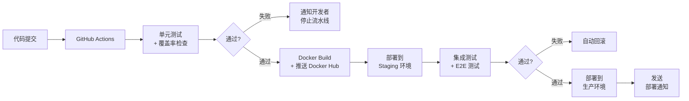
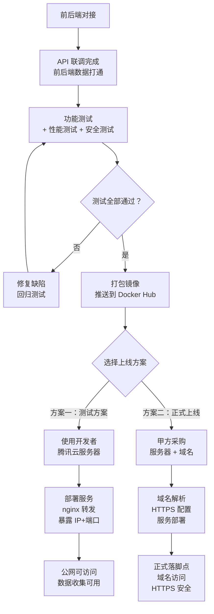

# LingoBridge 测试方案和最终上线方案

> 版本：v0.1 | 日期：2026-05-14 | 状态：草案
> 依据：LingoBridge MVP PRD v2.0、后端架构分析（05）、技术方案评审
> 适用：MVP 交付验收测试 + 方案一/方案二上线部署

---

## 一、测试总览

### 1.1 测试目标

验证 LingoBridge MVP 是否满足 PRD v2.0 定义的 7 项验收标准：

| 验收 ID | 验收项 | 可量化标准 |
|---|---|---|
| A1 | PPT 上传 | 支持 .pptx/.pdf，单文件 ≤50MB，解析成功率 ≥95% |
| A2 | 课程浏览 | 页面加载 ≤2s，翻页流畅无卡顿 |
| A3 | TTS 播放 | 点击后 ≤1s 开始播放，支持中文/俄语 |
| A4 | 录音功能 | 录制/上传/播放/删除/下载全流程可用 |
| A5 | 录课功能 | 屏幕录制+保存+回看全流程可用 |
| A6 | 多语界面 | 中文/俄语/哈语三语切换正常 |
| A7 | 国际访问 | 哈萨克斯坦访问延迟 ≤500ms |

### 1.2 测试类型覆盖

```
┌────────────────────────────────────────────────────────┐
│                   LingoBridge MVP 测试覆盖               │
├────────────────────────────────────────────────────────┤
│  单元测试（UT）  │ 后端 API 路由 · 业务逻辑 · 数据校验     │  覆盖率 ≥ 70%   │
│  集成测试（IT）  │ API 联调（录音+存储 · TTS+播放）      │  核心路径 100% │
│  E2E 测试        │ 完整用户链路（老师上传PPT→学生跟读）    │  关键场景覆盖  │
│  性能测试（PT）  │ 并发 100 用户 · 响应时间 · 带宽占用     │  A1-A7 量化指标 │
│  安全测试        │ JWT 鉴权 · 文件上传限制 · CORS 配置    │  OWASP Top 10  │
│  兼容性测试       │ Chrome/Edge/Safari · iOS/Android     │  MVP 主推 Web   │
│  国际化测试（i18n）│ 中文/俄语/哈语三语切换 · 内容完整性    │  覆盖 F07       │
│  录屏功能专项     │ getDisplayMedia · 文件上传 · 回看播放   │  覆盖 A5        │
│  跨域/网络测试    │ HK 服务器 · 国内访问延迟 · CDN 加速    │  覆盖 A7        │
└────────────────────────────────────────────────────────┘
```

---

## 二、测试用例

### 2.1 功能测试用例

#### TC-001：老师上传 PPT 课件

| 属性 | 内容 |
|---|---|
| **用例编号** | TC-001 |
| **模块** | course-service（课程管理） |
| **前置条件** | 教师账号已登录 |
| **测试步骤** | 1. 进入课件管理页；2. 点击上传按钮；3. 选择 .pptx 文件（≤50MB）；4. 上传完成 |
| **预期结果** | 系统解析成功，课件出现在课程列表中，页面数正确 |
| **验收标准** | A1（解析成功率 ≥95%，单文件 ≤50MB） |
| **优先级** | P0 |

#### TC-002：学生浏览课程并翻页

| 属性 | 内容 |
|---|---|
| **用例编号** | TC-002 |
| **模块** | course-service |
| **前置条件** | 课程已创建且有 ≥5 页课件 |
| **测试步骤** | 1. 学生登录；2. 进入课程列表；3. 点击课程进入；4. 连续翻页 10 次 |
| **预期结果** | 每次翻页加载 ≤2s，PPT 内容正确显示，无白屏或错位 |
| **验收标准** | A2（页面加载 ≤2s） |
| **优先级** | P0 |

#### TC-003：TTS 中文朗读

| 属性 | 内容 |
|---|---|
| **用例编号** | TC-003 |
| **模块** | tts-service |
| **前置条件** | 课程页已加载，显示中文内容 |
| **测试步骤** | 1. 进入课程页；2. 点击"朗读"按钮；3. 记录从点击到声音开始的时间 |
| **预期结果** | ≤1s 内开始播放中文 TTS，声音清晰，支持暂停/继续 |
| **验收标准** | A3（TTS 响应 ≤1s，支持中文/俄语） |
| **优先级** | P0 |

#### TC-004：学生录音并管理

| 属性 | 内容 |
|---|---|
| **用例编号** | TC-004 |
| **模块** | recording-service |
| **前置条件** | 学生账号已登录，麦克风权限已授权 |
| **测试步骤** | 1. 进入课程页；2. 点击"录音"按钮；3. 录音 10 秒；4. 点击停止；5. 录音出现在列表；6. 播放录音；7. 下载录音；8. 删除录音 |
| **预期结果** | 全流程可用，录音格式为 WebM/Opus，文件可下载到本地 |
| **验收标准** | A4（录制/上传/播放/删除/下载全流程） |
| **优先级** | P0 |

#### TC-005：老师录屏并回看

| 属性 | 内容 |
|---|---|
| **用例编号** | TC-005 |
| **模块** | lecture-service |
| **前置条件** | 教师账号已登录，录屏权限已授权 |
| **测试步骤** | 1. 进入录课控制台；2. 点击开始录制；3. 运行 1 分钟；4. 点击停止；5. 系统保存；6. 学生进入录播页；7. 播放录播 |
| **预期结果** | 录屏文件成功保存，学生可回看，视频播放流畅 |
| **验收标准** | A5（录制+保存+回看全流程） |
| **优先级** | P1 |

#### TC-006：录播功能 - 屏幕录制权限

| 属性 | 内容 |
|---|---|
| **用例编号** | TC-006 |
| **模块** | lecture-service |
| **前置条件** | 教师账号已登录 |
| **测试步骤** | 1. 教师点击"申请摄像头"按钮；2. 浏览器弹出权限提示；3. 教师点击拒绝；4. 再次点击"申请摄像头" |
| **预期结果** | 第二次点击时，浏览器提示申请关闭已打开的摄像头，而非再次申请打开 |
| **验收标准** | Bug 修复验证：摄像头权限状态正确响应 |
| **优先级** | P0 |

#### TC-007：三语界面切换

| 属性 | 内容 |
|---|---|
| **用例编号** | TC-007 |
| **模块** | 前端 i18n |
| **前置条件** | — |
| **测试步骤** | 1. 首页切换为哈萨克语；2. 验证全部 UI 文本已翻译；3. 切换为俄语；4. 验证全部 UI 文本已翻译；5. 切换为中文；6. 验证全部 UI 文本正确 |
| **预期结果** | 三语切换无刷新，UI 文本完整无遗漏，切换响应 ≤200ms |
| **验收标准** | A6（中文/俄语/哈语三语切换正常） |
| **优先级** | P1 |

#### TC-008：多格式课件上传（扩展）

| 属性 | 内容 |
|---|---|
| **用例编号** | TC-008 |
| **模块** | courseware-service |
| **前置条件** | 教师账号已登录 |
| **测试步骤** | 1. 上传 .pdf 文件（≤50MB）；2. 上传 .xlsx 文件（含练习题）；3. 验证 .xlsx 题目同步到学生练习进度 |
| **预期结果** | pdf 课件正常展示，xlsx 题目自动同步到对应课时练习 |
| **验收标准** | 功能验证（非 A 列，但为 MVP 关键功能） |
| **优先级** | P1 |

#### TC-009：直播模式 - PDF 翻页 + Canvas 绘画

| 属性 | 内容 |
|---|---|
| **用例编号** | TC-009 |
| **模块** | live-service |
| **前置条件** | 教师和学生同时在线进入同一课程直播 |
| **测试步骤** | 1. 教师上传 PDF 课件；2. 教师点击"下一页"；3. 学生端实时看到 PDF 翻页；4. 教师在 Canvas 层画线；5. 学生端实时看到绘画内容 |
| **预期结果** | WebSocket 同步延迟 ≤500ms，Canvas 绘画跨端同步 |
| **验收标准** | 功能验证（直播模式 2） |
| **优先级** | P1 |

### 2.2 性能测试用例

#### PT-001：100 用户并发访问

| 属性 | 内容 |
|---|---|
| **用例编号** | PT-001 |
| **测试工具** | k6 / JMeter |
| **测试场景** | 100 用户同时进入课程列表 → 进入课程 → 翻页 → 播放 TTS |
| **量化指标** | 响应时间 P95 ≤2s；错误率 <1%；服务器 CPU ≤80% |
| **验收标准** | A1-A3 性能指标在高并发下仍满足 |

#### PT-002：录音文件上传性能

| 属性 | 内容 |
|---|---|
| **用例编号** | PT-002 |
| **测试场景** | 10 用户同时上传 10MB 录音文件 |
| **量化指标** | 上传成功率 ≥99%；平均上传时间 ≤30s |
| **验收标准** | A4 录音功能在高并发下仍可用 |

#### PT-003：哈萨克斯坦访问延迟

| 属性 | 内容 |
|---|---|
| **用例编号** | PT-003 |
| **测试方法** | 使用哈萨克斯坦节点或代理服务器访问 HK 服务器 |
| **量化指标** | 首页加载 ≤3s；API 响应 ≤500ms |
| **验收标准** | A7（国际访问延迟 ≤500ms） |

### 2.3 安全测试用例

| 用例编号 | 测试点 | 方法 | 预期结果 |
|---|---|---|---|
| ST-001 | JWT 鉴权 | 未携带 Token 访问 `/api/recordings` | 返回 401 Unauthorized |
| ST-002 | 文件上传限制 | 上传 80MB 文件 | 拒绝上传，返回 413 Payload Too Large |
| ST-003 | 文件类型限制 | 上传 .exe 文件 | 拒绝上传，返回 415 Unsupported Media Type |
| ST-004 | 越权访问 | 学生尝试删除他人录音 | 返回 403 Forbidden |
| ST-005 | SQL 注入 | 参数中输入 `' OR 1=1 --` | 参数化查询防御，不执行注入 |
| ST-006 | XSS | 在用户名中输入 `<script>` | 内容转义，不执行脚本 |

---

## 三、测试数据

### 3.1 测试账号

| 角色 | 账号 | 密码 | 用途 |
|---|---|---|---|
| 教师 | teacher@test.com | Test@123456 | PPT 上传、录课、学生录音查看 |
| 学生 A | student_a@test.com | Test@123456 | 课程浏览、TTS、录音 |
| 学生 B | student_b@test.com | Test@123456 | 多用户并发测试 |
| 管理员 | admin@test.com | Test@123456 | 用户管理、存储监控 |

### 3.2 测试素材

| 素材类型 | 数量 | 规格 | 存放位置 |
|---|---|---|---|
| PPT 课件 | 3 套 | 每套 10-20 页，.pptx 格式，≤50MB/个 | `/test/fixtures/ppt/` |
| PDF 课件 | 2 份 | ≤50MB/个，含中文内容 | `/test/fixtures/pdf/` |
| Excel 练习题 | 2 份 | 含听力/选择题，≤1MB/个 | `/test/fixtures/excel/` |
| 录音样本 | 5 条 | WebM/Opus，5-30 秒/条 | `/test/fixtures/audio/` |
| 录屏样本 | 1 个 | WebM，1-2 分钟，≤200MB | `/test/fixtures/video/` |

### 3.3 测试环境数据

```sql
-- 测试数据（可一键导入）
INSERT INTO users (email, role, display_name, language_pref) VALUES
  ('teacher@test.com', 'teacher', '王老师', 'zh'),
  ('student_a@test.com', 'student', '阿合买提', 'kk'),
  ('student_b@test.com', 'student', '玛莎', 'ru'),
  ('admin@test.com', 'admin', '系统管理员', 'zh');

-- 1 套测试课程（10 页 PPT）
INSERT INTO courses (title, teacher_id, status) VALUES
  ('第三课：自我介绍（测试用）', 1, 'published');

-- 10 条课件页
INSERT INTO course_pages (course_id, page_number, audio_text) VALUES
  (1, 1, '大家好，我叫阿合买提'),
  (1, 2, '我来自哈萨克斯坦'),
  (1, 3, '我在常州工学院学习'),
  ... -- 共 10 条
```

---

## 四、质量保证

### 4.1 质量门禁

| 检查项 | 标准 | 工具 |
|---|---|---|
| 单元测试覆盖率 | 后端 ≥70%，核心业务逻辑 ≥80% | Jest + Istanbul |
| ESLint | 0 error，0 warning | eslint |
| TypeScript 类型 | 编译通过，无 `any` 遗留 | tsc --strict |
| API 响应格式 | 100% 符合 `{ code, data, message }` | 集成测试断言 |
| CORS 配置 | 仅允许 `https://lingobridge.com`（生产） | 安全扫描 |
| 敏感信息 | `.env` 不提交 Git，密钥不走日志 | git-secrets / pre-commit hook |
| 容器镜像 | 无 `latest` 标签，使用固定版本 | Dockerfile lint |

### 4.2 CI/CD 流水线



**GitHub Actions 工作流（`.github/workflows/ci.yml`）：**

```yaml
name: CI/CD

on:
  push:
    branches: [main]
  pull_request:
    branches: [main]

jobs:
  test:
    runs-on: ubuntu-latest
    steps:
      - uses: actions/checkout@v4
      - uses: actions/setup-node@v4
        with:
          node-version: '20'
      - run: npm ci
      - run: npm run lint
      - run: npm run test:coverage

  build-and-push:
    needs: test
    runs-on: ubuntu-latest
    if: github.ref == 'refs/heads/main'
    steps:
      - uses: actions/checkout@v4
      - uses: docker/setup-buildx-action@v3
      - uses: docker/login-action@v3
        with:
          username: ${{ secrets.DOCKERHUB_USERNAME }}
          password: ${{ secrets.DOCKERHUB_TOKEN }}
      - uses: docker/build-push-action@v5
        with:
          context: ./backend
          push: true
          tags: ${{ secrets.DOCKERHUB_USERNAME }}/lingobridge-backend:latest
```

---

## 五、验收报告

### 5.1 验收标准核对表

| 验收 ID | 验收项                                 | 测试结果  | 测试人 | 日期  | 备注  |
| ----- | ----------------------------------- | ----- | --- | --- | --- |
| A1    | PPT 上传（.pptx/.pdf，≤50MB，解析成功率 ≥95%） | ⬜ 待测试 |     |     |     |
| A2    | 课程浏览（加载 ≤2s，翻页流畅）                   | ⬜ 待测试 |     |     |     |
| A3    | TTS 播放（≤1s，支持中文/俄语）                 | ⬜ 待测试 |     |     |     |
| A4    | 录音功能（录制/上传/播放/删除/下载）                | ⬜ 待测试 |     |     |     |
| A5    | 录课功能（录制+保存+回看）                      | ⬜ 待测试 |     |     |     |
| A6    | 多语界面（中文/俄语/哈语）                      | ⬜ 待测试 |     |     |     |
| A7    | 国际访问（延迟 ≤500ms）                     | ⬜ 待测试 |     |     |     |

### 5.2 缺陷报告模板

```markdown
## 缺陷报告

| 属性 | 内容 |
|---|---|
| **缺陷编号** | BUG-XXX |
| **严重级别** | 🔴 致命 / 🟠 严重 / 🟡 一般 / 🟢 轻微 |
| **所属模块** | |
| **测试环境** | |
| **重现步骤** | 1. 2. 3. |
| **实际结果** | |
| **预期结果** | |
| **截图/录屏** | |
| **优先级** | P0 / P1 / P2 |
| **状态** | 已提交 / 已修复 / 已验证 / 已关闭 |
| **修复人** | |
| **修复日期** | |
```

---

## 六、最终上线方案

### 6.1 总体流程



---

### 6.2 前后端对接规范

#### API 对接检查清单

| 检查项 | 说明 | 状态 |
|---|---|---|
| RESTful 路由对齐 | 前端请求路径与后端 API 路由完全一致 | ⬜ |
| 鉴权 Token 流转 | 登录获取 JWT → 请求头携带 → 401 自动刷新 | ⬜ |
| 文件上传对接 | 前端 `FormData` → 后端 `multer` → MinIO/OSS | ⬜ |
| TTS 对接 | 前端传文本 → 后端调用腾讯云 → 返回音频 URL | ⬜ |
| 录音上传对接 | 前端 `MediaRecorder` → Blob → POST `/api/recordings` | ⬜ |
| 录屏上传对接 | `getDisplayMedia` → MediaRecorder → 大文件上传 | ⬜ |
| WebSocket 对接 | 直播翻页同步：前端 ws 连接 → 后端广播 | ⬜ |
| 错误处理统一 | 前后端错误码表对齐，UI 显示友好提示 | ⬜ |

---

### 6.3 Docker Hub 镜像发布流程

**第一步：本地构建并测试**
```bash
# 在项目根目录
cd backend
docker build -t lingobridge-backend:latest .
docker run --env-file .env lingobridge-backend:latest  # 本地验证
```

**第二步：打标签并推送**
```bash
# 登录 Docker Hub
docker login -u <your-username>

# 打标签（version 使用语义化版本）
docker tag lingobridge-backend:latest <your-username>/lingobridge-backend:v1.0.0

# 推送
docker push <your-username>/lingobridge-backend:v1.0.0
docker push <your-username>/lingobridge-backend:latest
```

**第三步：服务器拉取并启动**
```bash
# 在服务器上
ssh <server-user>@<server-ip>

# 拉取最新镜像
docker pull <your-username>/lingobridge-backend:v1.0.0

# 启动服务
docker-compose up -d

# 查看日志
docker-compose logs -f backend
```

---

### 6.4 方案一：测试方案（开发者腾讯云服务器）

> 适用场景：快速验证 MVP，公网可访问，不申请域名，不走 ICP 备案

#### 部署拓扑

```
公网
  │
  │  IP:端口 访问
  ▼
┌─────────────────────────────┐
│  腾讯云服务器（开发者账号）      │
│  （无需域名，无需 ICP）         │
│                              │
│  ┌─────────────────────┐    │
│  │  Nginx（端口 80/443）  │    │
│  │  反向代理：           │    │
│  │  /api/* → backend    │    │
│  │  /        → frontend │    │
│  └─────────────────────┘    │
│                              │
│  ┌─────────────────────┐    │
│  │  backend:3000        │    │
│  │  frontend (静态构建)  │    │
│  │  PostgreSQL          │    │
│  │  Redis               │    │
│  │  MinIO               │    │
│  └─────────────────────┘    │
└─────────────────────────────┘
```

#### 部署步骤

**步骤 1：服务器准备**

```bash
# 连接到腾讯云服务器
ssh root@<server-ip>

# 安装 Docker（如果未安装）
curl -fsSL https://get.docker.com | bash
systemctl enable docker
systemctl start docker

# 安装 Docker Compose
curl -L "https://github.com/docker/compose/releases/latest/download/docker-compose-$(uname -s)-$(uname -m)" -o /usr/local/bin/docker-compose
chmod +x /usr/local/bin/docker-compose
```

**步骤 2：上传 docker-compose.yml 和环境变量**

```bash
# 在本地打包上传
scp docker-compose.yml .env root@<server-ip>:/opt/lingobridge/
```

**步骤 3：启动服务**

```bash
cd /opt/lingobridge
docker-compose up -d

# 验证服务状态
docker-compose ps
curl http://localhost/api/v1/health  # 应返回 {"code": 0, "data": "ok"}
```

**步骤 4：开放防火墙端口**

```bash
# 在腾讯云控制台安全组中开放
# TCP 80（HTTP）
# TCP 443（HTTPS，可选，后续配置 Let's Encrypt）
# TCP 3000（后端 API，调试用，生产建议仅对内暴露）
```

**步骤 5：验证公网访问**

```bash
# 在本地浏览器访问
http://<server-public-ip>/

# API 验证
curl http://<server-public-ip>/api/v1/health
```

#### 成本分析

| 项目 | 费用 | 说明 |
|---|---|---|
| 腾讯云服务器 | 已有（开发者账号） | 复用现有服务器 |
| 域名 | 0 元 | 不申请，直接用 IP |
| ICP 备案 | 0 元 | HK 服务器无需备案 |
| SSL 证书 | 0 元 | Let's Encrypt 免费（可选） |
| **合计** | **~0 元（复用现有资源）** | 仅花费部署时间 |

#### 风险分析

| 风险 | 等级 | 对策 |
|---|---|---|
| 直接暴露 IP 存在安全风险 | 🔴 高 | 仅用于测试；生产必须用域名+防火墙 |
| 微信/浏览器可能拦截非 HTTPS 网站 | 🟡 中 | 开发阶段用 HTTP；上线前配置 Let's Encrypt |
| 带宽可能不足（多人同时访问） | 🟡 中 | 限流 + 监控，必要时升级带宽 |
| 服务器到期/欠费服务中断 | 🟡 中 | 设置到期提醒 |

#### 方案一落脚点

```
测试落脚点：
http://<服务器公网IP>/

公网可访问：
✅ 前端页面（Web）
✅ API 接口（/api/v1/*）
✅ 数据可录入（录音/课件上传）
✅ 数据可收集（录音列表/课程数据）

限制：
❌ 无 HTTPS（浏览器安全提示）
❌ 无独立域名（无法分享稳定链接）
❌ 不适合正式对外推广
```

---

### 6.5 方案二：正式上线方案（甲方采购服务器）

> 适用场景：正式交付，甲方有预算购买独立服务器和域名，走正规上线流程

#### 前提条件

| 项目 | 要求 | 甲方行动 |
|---|---|---|
| 服务器 | 香港地域，2核4GB，带宽 ≥30Mbps | 甲方自行购买，提供登录凭证 |
| 域名 | .com 域名，指向服务器 IP | 甲方自行购买，完成 DNS 解析 |
| SSL 证书 | HTTPS（Let's Encrypt 免费） | 配置即可 |
| ICP 备案 | **香港服务器无需备案** | 无需处理 |
| 腾讯云账号 | TTS API 密钥（已有） | 提供密钥或甲方自申请 |

#### 服务器配置验证清单

| 检查项 | 最低要求 | 推荐配置 | 验证方法 |
|---|---|---|---|
| CPU | 2 核 | 2 核 | `lscpu \| grep ^CPU(s)` |
| 内存 | 4 GB | 8 GB | `free -h` |
| 磁盘 | 40 GB SSD | 80 GB SSD | `df -h` |
| 带宽 | 30 Mbps | 50 Mbps | `speedtest-cli` |
| 地域 | 香港 | 香港 | — |
| OS | Ubuntu 22.04 LTS | Ubuntu 22.04 LTS | `cat /etc/os-release` |
| Docker | 已安装 | Docker + Docker Compose | `docker --version` |

#### 部署步骤

**步骤 1：域名解析**

```
在域名服务商控制台配置：
A 记录    @    → <服务器公网IP>   （主域名）
A 记录    www  → <服务器公网IP>   （www 子域名）
CNAME     api  → @              （可选，api 子域名）
```

**步骤 2：服务器初始化**

```bash
# SSH 登录（使用甲方提供的账号密码，禁止每次发验证码）
ssh <user>@<服务器IP>

# 安装 Docker + Docker Compose（同方案一步骤1）

# 创建项目目录
mkdir -p /opt/lingobridge
cd /opt/lingobridge

# 拉取 Docker 镜像（已提前推送到 Docker Hub）
docker pull <your-username>/lingobridge-backend:v1.0.0
```

**步骤 3：配置环境变量和启动**

```bash
# 创建 .env 文件
cat > /opt/lingobridge/.env << 'EOF'
NODE_ENV=production
DATABASE_URL=postgres://lingo:<strong-password>@localhost:5432/lingobridge
REDIS_URL=redis://localhost:6379
MINIO_ENDPOINT=localhost:9000
MINIO_ACCESS_KEY=<minio-access-key>
MINIO_SECRET_KEY=<minio-secret-key>
TENCENT_TTS_SECRET_ID=<tts-secret-id>
TENCENT_TTS_SECRET_KEY=<tts-secret-key>
JWT_SECRET=<jwt-secret>
DOMAIN=https://lingobridge.com
EOF

# 启动所有服务
docker-compose -f docker-compose.yml up -d

# 验证
docker-compose ps
curl https://lingobridge.com/api/v1/health
```

**步骤 4：配置 HTTPS（Let's Encrypt）**

```bash
# 安装 Certbot
apt update && apt install -y certbot python3-certbot-nginx

# 申请证书（域名需已解析到服务器）
certbot --nginx -d lingobridge.com -d www.lingobridge.com

# 自动续期（Certbot 会配置 crontab）
systemctl status certbot.timer
```

**步骤 5：配置 Nginx HTTPS 反向代理**

```nginx
# /etc/nginx/sites-available/lingobridge
server {
    listen 80;
    server_name lingobridge.com www.lingobridge.com;
    return 301 https://$server_name$request_uri;
}

server {
    listen 443 ssl http2;
    server_name lingobridge.com www.lingobridge.com;

    ssl_certificate /etc/letsencrypt/live/lingobridge.com/fullchain.pem;
    ssl_certificate_key /etc/letsencrypt/live/lingobridge.com/privkey.pem;

    # 前端静态文件
    location / {
        root /opt/lingobridge/frontend/dist;
        try_files $uri $uri/ /index.html;
        expires 30d;
        add_header Cache-Control "public, immutable";
    }

    # API 反向代理
    location /api/ {
        proxy_pass http://127.0.0.1:3000;
        proxy_http_version 1.1;
        proxy_set_header Host $host;
        proxy_set_header X-Real-IP $remote_addr;
        proxy_set_header X-Forwarded-For $proxy_add_x_forwarded_for;
    }

    # WebSocket（直播）
    location /api/live/ {
        proxy_pass http://127.0.0.1:3000;
        proxy_http_version 1.1;
        proxy_set_header Upgrade $http_upgrade;
        proxy_set_header Connection "upgrade";
        proxy_read_timeout 86400;
    }

    # MinIO Console
    location /minio/ {
        proxy_pass http://127.0.0.1:9000/;
        proxy_set_header Host $host;
    }
}
```

```bash
# 启用配置
ln -s /etc/nginx/sites-available/lingobridge /etc/nginx/sites-enabled/
nginx -t
systemctl reload nginx
```

**步骤 6：设置防火墙（UFW）**

```bash
ufw allow 22/tcp    # SSH
ufw allow 80/tcp    # HTTP
ufw allow 443/tcp   # HTTPS
ufw enable
```

#### 成本分析

| 项目 | 首年（元） | 续费/年（元） | 说明 |
|---|---|---|---|
| 香港云服务器（2核4GB） | 288（阿里云轻量 HK） | ~600 | 甲方承担 |
| .com 域名 | 70 | 70 | 甲方承担 |
| 阿里云 OSS（500GB/年） | 120 | 120 | 录音/视频存储 |
| TTS（腾讯云，免费额度内） | 0 | 0 | MVP 阶段免费 |
| SSL 证书 | 0 | 0 | Let's Encrypt 免费 |
| **合计** | **~480 元/年** | **~800 元/年** | 不含人力成本 |

#### 风险分析

| 风险 | 等级 | 对策 |
|---|---|---|
| 甲方服务器配置不符合要求 | 🔴 高 | 部署前必须对照配置清单逐一验证 |
| 甲方无法提供服务器账号密码 | 🟡 中 | 提前沟通，建议使用 SSH Key 方式授权 |
| HTTPS 证书续期失败 | 🟡 中 | Certbot 自动续期 + 邮件提醒 |
| 带宽不足（活动期间突发流量） | 🟡 中 | 配置 Nginx 限流；云服务器可弹性升级带宽 |
| 服务器迁移/更换 IP | 🟠 严重 | 提前告知甲方域名解析的重要性；建立迁移文档 |

#### 方案二落脚点

```
正式落脚点：
https://lingobridge.com/

✅ HTTPS 安全访问（浏览器信任）
✅ 独立域名（可分享，可 SEO，可公众号绑定）
✅ 香港服务器无需 ICP 备案（合规）
✅ 数据安全（隔离存储，JWT 鉴权）
✅ 可正式对外推广使用

交付物清单：
✅ 前端 Web 应用（https://lingobridge.com）
✅ 后端 API（https://lingobridge.com/api/v1/*）
✅ 管理后台（/admin）
✅ 用户文档（使用手册）
✅ 运维文档（备份/监控/迁移指南）
```

---

### 6.6 两方案对比

| 维度 | 方案一（测试方案） | 方案二（正式上线） |
|---|---|---|
| **目标** | 快速验证 MVP，公网可访问 | 正式交付，甲方投入使用 |
| **域名** | 无，直接 IP 访问 | 有，HTTPS 域名 |
| **ICP 备案** | 无 | 无（HK 服务器） |
| **安全性** | 🔴 低（IP 直接暴露） | 🟢 高（HTTPS + 防火墙） |
| **用户体验** | 🟡 一般（浏览器安全提示） | 🟢 正常 |
| **成本** | ~0 元（复用资源） | ~480 元/年 |
| **适合场景** | 开发测试、演示汇报 | 正式上线、对外推广 |
| **上线周期** | 1-2 天 | 3-7 天（含域名采购/解析） |
| **数据安全** | 🟡 测试数据，不敏感 | 🟢 正式数据，需备份策略 |

---

### 6.7 最终检查清单（上线前必查）

| 检查项 | 方案一 | 方案二 |
|---|---|---|
| Docker 服务全部运行 | ☐ | ☐ |
| `curl http://localhost/api/v1/health` 返回 200 | ☐ | ☐ |
| 前端页面可访问 | ☐ | ☐ |
| PPT 上传成功，解析正确 | ☐ | ☐ |
| TTS 播放正常 | ☐ | ☐ |
| 录音上传/播放/删除全流程 | ☐ | ☐ |
| HTTPS 配置成功（方案二） | N/A | ☐ |
| 域名 DNS 解析生效（方案二） | N/A | ☐ |
| SSL 证书有效（方案二） | N/A | ☐ |
| 防火墙仅开放 80/443（方案二） | N/A | ☐ |
| `.env` 文件未提交 Git | ☐ | ☐ |
| 数据库每日自动备份已配置 | ☐ | ☐ |
| 腾讯云 TTS API 密钥已配置 | ☐ | ☐ |
| 监控告警（CPU/内存/磁盘）已配置 | ☐ | ☐ |
| 文档已交付（使用手册 + 运维指南） | ☐ | ☐ |

---

*本文件为测试方案和上线方案草案，供 LingoBridge MVP 交付参考。*
