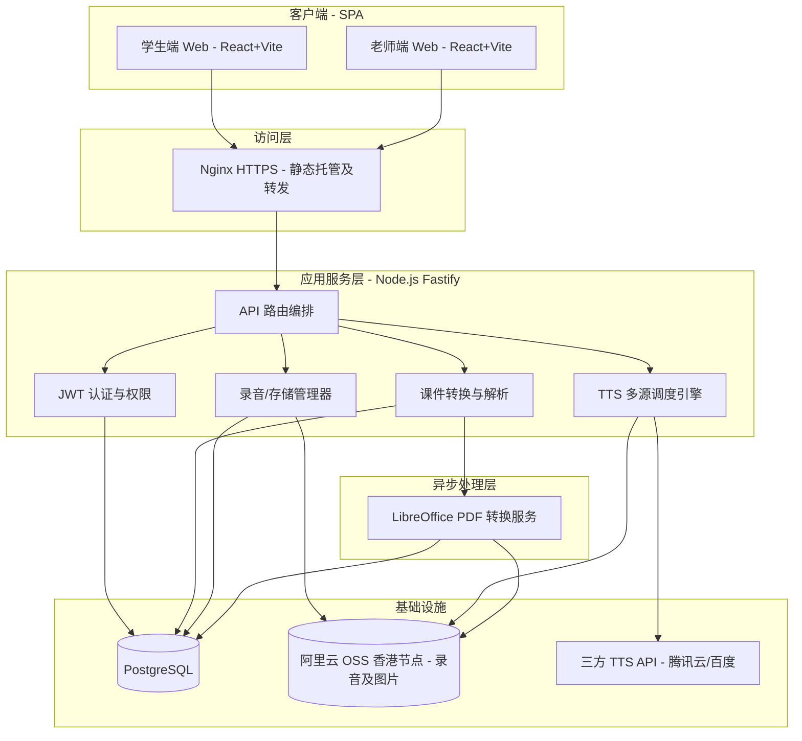

# LingoBridge 技术方案评审报告

## 1. 总体评审结论与架构定位

### 1.1 架构定位收缩
经评审一致确认：**LingoBridge MVP 阶段绝非庞大的在线教育平台，而是一个“PPT课件驱动的中文跟读练习工具”。**

技术团队应坚决摒弃“课程管理系统 / 复杂 SaaS 平台 / 实时直播互动 / AI 自动评分”的重型系统思维，聚焦于核心的跟读练习流水线：
```text
教师 PPT/PDF 上传 
→ 转换为课程页 
→ 学生翻页学习 
→ 中文句子 TTS 朗读 
→ 学生录音跟读 
→ 录音数据本地/云端存储与管理 
→ 教师端查看及听评
```

---

## 2. 核心决策与疑问解答

针对技术团队在预研中提出的 4 个核心疑问，本次评审做出了如下明确的架构决策：

### 决策 1：关于“是否直接绑定并调用腾讯会议/Teams API”
- **结论**：**不予绑定。**
- **理由**：直接与外部重型会议系统 API 耦合会极大地拉长 MVP 研发周期，且存在复杂的教育场景 API 授权壁垒。LingoBridge 作为“课后高频练习自学工具”与直播系统形成合围，不直接在 MVP 层面做硬接口集成。

### 决策 2：关于“TTS 频繁调用额度受限问题”
- **结论**：**多源储备 + 客户端缓存。**
- **理由**：腾讯云基础合成音色提供 800万字符/月免费额度，初期足够使用。架构上建立统一 TTS 适配层，支持在腾讯云免费额度用完后，秒级无感切换至百度语音合成或 Azure TTS 资源包。同时，对于同一课件中的中文句子，TTS 合成出的音频文件需缓存在阿里云 OSS 中，避免重复调用 API 扣除额度。

### 决策 3：关于“是否使用 Azure TTS 与 Python Praat 脚本生成波形图和 AI 自动评分”
- **结论**：**MVP 阶段砍掉自动评分与波形分析，仅支持采集与听读对比。**
- **理由**：Praat 波形分析对服务器计算开销极大，且俄语口音的中文识别在缺乏真实训练数据时纠错极不准。MVP 阶段提供最本质的“听标准音 -> 自己录音 -> 播放对比 -> 教师人工听评”闭环，后续根据真实采集的数据再做算法训练。

### 4. 关于“ASR 部署为何 3B 规模小模型即可，数据 pipe 可靠度如何”
- **结论**：**MVP 阶段放弃实时大模型部署，2.0 阶段采用大厂 API 按量计费与 Ollama 3B 本地小模型混合方案。**
- **理由**：MVP 阶段不需要实时识别字幕。2.0 阶段在香港云服务器上通过 Ollama 拉起 3B 翻译模型，可作为文本过滤与翻译校正的高性价比路径，端到端延迟可控制在 800ms 内，满足业务诉求。

---

## 3. 技术选型差异分析（Next.js vs. React + Vite）

原方案建议使用 Next.js 全栈框架，经评审驳回，**最终确立使用 React 18 + TypeScript + Vite 架构**。

### 选型对比与决策支撑

| 维度 | 原方案 (Next.js) | 最终决策 (React + Vite) | 架构考量与理由 |
| :--- | :--- | :--- | :--- |
| **渲染模式** | 服务端渲染 (SSR) | 客户端渲染 (SPA) | 课件翻页、TTS 播放、MediaRecorder 录音均为高度频繁的客户端交互场景，无需 SSR，亦无需 SEO 排名优化。 |
| **路由机制** | 文件系统路由 | 状态驱动路由 (State-driven) | 页面层级极浅（仅登录、学生课程学习、录音管理、教师端列表）。使用顶级组件控制 View 切换，免去 React Router 依赖，最简实现。 |
| **构建速度** | Webpack / Turbopack | Vite (esbuild & Rollup) | Vite 拥有极速的本地热更新 (HMR)，能显著加快前端组件的调试速度，开发体验和构建产物体积更轻量。 |

---

## 4. 文档预览与渲染方案（双轨制）

系统只消费课件，不生产课件。针对不同文档格式的渲染，评审制定了如下方案：

1. **PDF 文档**：使用 `pdfjs-dist` 在 HTML5 Canvas 上进行页面渲染， Worker 线程进行二进制解析，不阻塞 UI，是课件的主要格式（P0）。
2. **Markdown 文档**：使用 `marked` + `highlight.js` 组合，零依赖实现轻量级富文本渲染（P0）。
3. **Word (DOCX)**：采用 `mammoth.js`（docx-preview）轻量将 DOCX 转为 HTML，不支持复杂页眉页脚，属正常降级（P1）。
4. **Excel (XLSX)**：通过 `SheetJS` 进行数据层解析，转成纯 HTML 配合 CSS Grid 渲染（P1）。
5. **PPTX 幻灯片（双轨制方案）**：
   - **交互轨**：前端使用轻量库进行标题、正文及图片的超轻量解析预览。
   - **兜底轨（主力）**：教师上传 PPTX 后，后端通过 LibreOffice Headless 引擎将其统一转换为高保真的 PDF 文件，前端利用 `pdf.js` 绘制。**坚决不在前端手搓 OOXML 解析器，确保格式还原度**（P0）。
   - **安全注意**：用户上传的 SVG/Markdown 必须使用 `DOMPurify` 进行 XSS 过滤，防范注入攻击。

---

## 5. 技术架构风险与缓解矩阵

| 技术点 | 风险等级 | 主要风险描述 | 架构缓解与降级方案 |
| :--- | :--- | :--- | :--- |
| **PPTX 渲染** | 🔴 高 | 幻灯片动画及复杂排版在前端无法 100% 还原，社区库不成熟。 | 实行**双轨制**，后端统一使用 LibreOffice Headless 转成 PDF 进行高保真降级渲染。 |
| **录音兼容性** | 🔴 高 | Safari / iOS 端对于 `MediaRecorder` 及 WebM/Opus 容器兼容较差。 | 前端限制优先使用 Chrome/Edge 浏览器；针对 iOS 预留音频录制 polyfill 降级路径。 |
| **SVG 安全风险** | 🔴 高 | SVG 允许内嵌 `<script>`，容易遭受存储型 XSS 漏洞攻击。 | 任何用户上传的 SVG 或 HTML 代码，在渲染前强制通过 `DOMPurify` 进行过滤清洗。 |
| **PDF 大文件** | 🟡 中 | 课件 PDF 文件过大时，客户端内存消耗高，容易导致卡死。 | 建立渐进式懒加载机制，Canvas 仅渲染当前可见页，释放离屏页。 |
| **跨境网络延迟** | 🟡 中 | 留学生在中亚地区，跨国网络质量差，数据传输易断连。 | 选用 CN2 优质回程的香港云服务器，API 接口全面开启 Gzip 压缩，静态资源使用香港 OSS CDN。 |

---

## 6. 系统总体架构图 (Mermaid)


