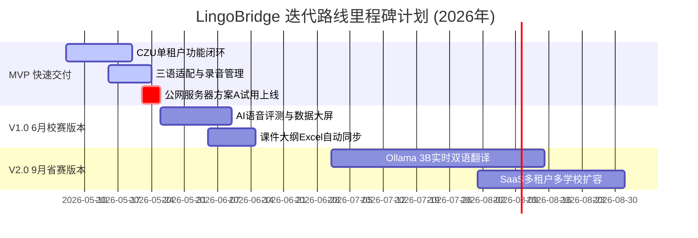

# LingoBridge 功能需求文档 (PRD)

## 1. 文档信息与版本管控

### 1.1 修订历史与审批记录

| 版本号 | 修订日期 | 修订人 | 修订内容概述 | 状态 |
| :--- | :--- | :--- | :--- | :--- |
| **V1.0** | 2026-04-10 | 产品组 | 初始规划，定义大而全的在线教育平台框架。 | 已作废 |
| **V2.0** | 2026-05-06 | 产品组 | 基于二次需求访谈全面重写，收敛至单租户 (CZU) MVP 闭环。 | **当前基线** |

---

## 2. 产品定位

LingoBridge 是一款专为哈萨克斯坦留学生量身定制的**中文学习课后辅助跟读练习工具**。它与教师的实体课程紧密跟随，为学生提供拼音、声母、韵脚与音标的听读对比，同时为教师提供上课屏幕录屏与学生录音数据采集查看。

**核心边界**：本产品定位是**课件消费与发音录制工具**，绝非重型的课程管理系统 (LMS)、在线课件编辑器、实时在线直播室或 SaaS 多学校管理系统。

---

## 3. 功能做与不做边界 (Scope Matrix)

### 3.1 核心支持功能 (做)

| ID | 功能模块 | 功能点描述 | 业务价值 |
| :--- | :--- | :--- | :--- |
| **F01** | PPT/PDF 导入 | 教师可上传 `.pptx`、`.pdf`、`.xlsx` 格式文件，系统后端自动转为高保真 PDF 并在前端 Canvas/Image 容器中进行翻页展示。Excel 文件自动解析生成课后练习表单。 | 数字化课程课件资产沉淀。 |
| **F02** | 课程练习同步 | 课件的页面直接关联当页的跟读练习文字与题目，学生按照老师的课程大纲与课时进度依次学习。 | 紧密跟随教纲，不脱节。 |
| **F03** | 中文 TTS 听读 | 学习页面内置“朗读”按钮，点击后调用云端 API 对页面关联的中文文本进行标准朗读播放。 | 提供标准的普通话课后复习标准音。 |
| **F04** | 录音采集 | 学生使用浏览器 MediaRecorder 接口录制自身普通话跟读发音，音频采用轻量 WebM/Opus 封装。 | 留存发音记录，提供自主回听。 |
| **F05** | 录音存储 | 录音文件自动上传至阿里云香港 OSS 对象存储中，在数据库中关联学生 ID、课程 ID、页码。 | 建立学生学习轨迹库。 |
| **F06** | 个人录音管理 | 学生可在学习页的“我的录音”列表中，直接在线播放、下载到本地或彻底删除已有录音。 | 用户对个人隐私数据具备完全控制权。 |
| **F07** | 哈语/多语适配 | UI 界面完全支持**哈萨克语、俄语、中文**三语一键热切换，默认俄语/哈语。 | 消除留学生的使用障碍。 |
| **F08** | 老师端录课回看 | 直播课期间，教师可一键调用屏幕录制（getDisplayMedia）和本地摄像头设备（带开关及权限关闭机制），录制的视频直接上传至 OSS，学生在谷歌日历或回看列表中按日期回看。 | 沉淀直播课资产，供复习使用。 |

> 💡 **摄像头调用权限 Bug 修复要求**：为解决“退出直播后摄像头依旧被占用”的问题，系统在点击“关闭摄像头”或退出直播视图时，必须显式调用媒体流轨道的 `track.stop()` 并将 `MediaStream` 实例置空，彻底切断硬件占用，严禁依赖浏览器自身权限回收。

### 3.2 明确砍掉功能 (不做)

| 功能项 | MVP 砍掉理由 | 后续迭代规划 |
| :--- | :--- | :--- |
| **在线编辑课件** | 系统充当课件“消费端”即可，编辑交由 Microsoft PowerPoint 等专业工具。 | 暂无 |
| **实时双语字幕** | 跨国直播低延迟双语滚动字幕对大模型 GPU 资源要求极高，成本不可控。 | V2.0（9月省赛）引入 Ollama 3B 模型实现。 |
| **弹幕互动系统** | 社交与实时弹幕会使产品属性偏向娱乐，且存在跨境意识形态合规风险。 | 坚决不做 |
| **多租户 SaaS** | 第一阶段仅跑通单学校、单租户 (CZU) 的 MVP 流程，避免过度架构。 | V2.0 阶段进行 SaaS 架构扩容。 |
| **AI 语音评测打分** | 拼音声调音素级别的自动纠错评分算法难度极高，且俄语口音极易误判。 | V1.0（6月校赛）引入基础 ASR 评测。 |
| **实时在线收单/付费** | MVP 阶段主要用于高校试点及比赛演示，属于 0 元试用状态，无变现闭环。 | V3.0 阶段引入国际信用卡跨境收单。 |

---

## 4. 用户故事与 Given-When-Then 验收规范

### US1：留学生阿合买提课后跟读拼音
- **Given**：学生阿合买提已登录 LingoBridge，且其班级已被老师分配了《第三课：自我介绍》课件。
- **When**：当阿合买提点击进入课程学习页，滑动课件到第 3 页，点击“朗读”按钮；
- **Then**：系统应在 1s 内通过 TTS 播放该页绑定的中文标准音频。
- **When**：接着阿合买提点击“录音跟读”，允许浏览器麦克风权限并说话，15秒后点击“结束”；
- **Then**：系统应在页面“我的录音”列表中立即新增一条记录，允许其点击播放回听，且其个人班级积分增加 10 分。

### US2：王老师上传课件与开课录制
- **Given**：教师王老师在 PC 浏览器中登录了教师控制台。
- **When**：当王老师点击“上传课件”并选中一个 10MB 的 PPTX 文件，点击提交；
- **Then**：系统后台应自动调用 LibreOffice 转为 PDF，并以高保真图片形式保存到 OSS，界面提示“课件导入成功”。
- **When**：王老师在直播授课时开启“录屏上课”并授权屏幕共享，课后点击“结束并保存”；
- **Then**：系统应异步将 WebM 视频流归档至 OSS，并在学生的日历及录播列表中自动按今日日期关联展示该视频链接。

---

## 5. 详细功能树与字段级规格说明

```
LingoBridge MVP 
├── 学生端 (自适应 Web)
│   ├── 课程列表
│   │   ├── 字段：课程 ID (UUID), 课件标题 (String), 上传日期 (DateTime), 学习进度 (Percentage)
│   │   └── 交互：点击课程卡片进入学习页
│   ├── 学习页 (核心)
│   │   ├── PPT 渲染器：Canvas 2D, 支持 gesture 左右划手势, 翻页组件
│   │   ├── TTS 控制器：播放/暂停, 目标文案显示 (String)
│   │   ├── 录音机组件：MediaRecorder, 波形动效 (CSS-based)
│   │   ├── 个人录音列表：录音元数据数组 (id, date, duration, s3_url), 播放、下载、删除按钮
│   │   └── 多语切换器：LanguageContext (zh-CN / ru-RU / kk-KZ)
│   └── 录播回看
│       └── HTML5 视频播放器 (VideoJS), 课件缩略图时间轴同步
│
└── 教师端 (Web)
    ├── 课件中心
    │   ├── 上传组件：支持 .pptx, .pdf, .xlsx, 最大限制 50MB
    │   └── 关联组件：选择分配班级 (Class_ID)
    ├── 录课控制台
    │   ├── 屏幕捕获：getDisplayMedia API, 录制状态计时器
    │   ├── 摄像头配置：本地设备流输入，支持 track.stop() 显式关闭
    │   └── 录播卡片：录播 ID, 视频下载, 删除操作
    └── 学生录音面板
        └── 筛选器：按课程/班级/学生筛选，音频播放列表
```

---

## 6. 数据设计 (5表 DDL)

我们将使用 PostgreSQL 维护 MVP 的核心结构，结构设计遵循单租户规范：

```sql
-- 1. 用户表 (包含教师、学生及管理员)
CREATE TABLE "user" (
    "id" UUID PRIMARY KEY DEFAULT gen_random_uuid(),
    "username" VARCHAR(50) UNIQUE NOT NULL,
    "password_hash" VARCHAR(255) NOT NULL,
    "role" VARCHAR(20) NOT NULL CHECK ("role" IN ('student', 'teacher', 'admin')),
    "display_name" VARCHAR(100) NOT NULL,
    "language_pref" VARCHAR(10) DEFAULT 'ru', -- 默认俄语 'ru', 支持 'kk', 'zh'
    "created_at" TIMESTAMP WITH TIME ZONE DEFAULT CURRENT_TIMESTAMP
);

-- 2. 课程表
CREATE TABLE "course" (
    "id" UUID PRIMARY KEY DEFAULT gen_random_uuid(),
    "teacher_id" UUID REFERENCES "user"("id") ON DELETE SET NULL,
    "title" VARCHAR(255) NOT NULL,
    "description" TEXT,
    "created_at" TIMESTAMP WITH TIME ZONE DEFAULT CURRENT_TIMESTAMP
);

-- 3. 课程具体页面表 (承载解析后的 PPT 页面)
CREATE TABLE "course_page" (
    "id" UUID PRIMARY KEY DEFAULT gen_random_uuid(),
    "course_id" UUID REFERENCES "course"("id") ON DELETE CASCADE,
    "page_number" INTEGER NOT NULL,
    "image_url" VARCHAR(512) NOT NULL, -- 存储在 OSS 中的高保真图片地址
    "audio_text" TEXT NOT NULL,       -- 当页绑定的中文朗读句子文本
    "created_at" TIMESTAMP WITH TIME ZONE DEFAULT CURRENT_TIMESTAMP,
    UNIQUE("course_id", "page_number")
);

-- 4. 学生录音跟读记录表
CREATE TABLE "recording" (
    "id" UUID PRIMARY KEY DEFAULT gen_random_uuid(),
    "student_id" UUID REFERENCES "user"("id") ON DELETE CASCADE,
    "course_id" UUID REFERENCES "course"("id") ON DELETE CASCADE,
    "page_number" INTEGER NOT NULL,
    "audio_url" VARCHAR(512) NOT NULL, -- 存储在 OSS 中的 WebM 音频地址
    "duration_sec" NUMERIC(5, 2) NOT NULL,
    "created_at" TIMESTAMP WITH TIME ZONE DEFAULT CURRENT_TIMESTAMP
);

-- 5. 教师录播课程视频表
CREATE TABLE "lecture_recording" (
    "id" UUID PRIMARY KEY DEFAULT gen_random_uuid(),
    "course_id" UUID REFERENCES "course"("id") ON DELETE CASCADE,
    "teacher_id" UUID REFERENCES "user"("id") ON DELETE SET NULL,
    "video_url" VARCHAR(512) NOT NULL, -- 存储在 OSS 中的 WebM 视频地址
    "duration_sec" INTEGER NOT NULL,
    "created_at" TIMESTAMP WITH TIME ZONE DEFAULT CURRENT_TIMESTAMP
);
```

---

## 7. 验收标准与可测试性指标

| ID | 验收维度 | 核心量化指标 (可测试) |
| :--- | :--- | :--- |
| **A1** | **PPT/PDF 课件上传** | 支持最大 50MB 格式文件。后端解析转换为图片的成功率要求 **≥95%**，高频 PPT 转换排队时长不得超过 15 秒。 |
| **A2** | **响应式翻页加载** | 学生端在翻页时，CDN 静态课件图分发加载延迟 **≤2.0s**，翻页过渡无抖动卡顿。 |
| **A3** | **TTS 响应速度** | 触发“朗读此页”后，流式或缓存音频拉取播放延迟 **≤1.0s**。 |
| **A4** | **录音采集管理** | MediaRecorder 封装录音完好率 **100%**。上传/回听/下载/删除功能闭环可用，接口响应 **≤1.5s**。 |
| **A5** | **安全合规测试** | 任何上传至系统的课件标题、关联文本和文件名在写入数据库前，必须通过 XSS 校验。 |
| **A6** | **多语言一致性** | 界面语言从俄文/哈文/中文切换后，所有标题、导航、卡片内容瞬间翻译，无残留漏翻译。 |
| **A7** | **弱网跨国连通性** | 香港部署节点下，中亚留学生（哈萨克斯坦等）本地网络加载 LingoBridge 静态页整体耗时 **≤500ms**。 |

---

## 8. 迭代里程碑计划 (Timeline)


